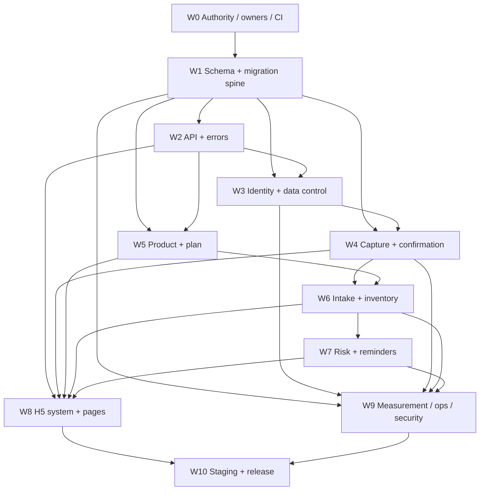

# R1 Implementation Plan

Status: active implementation plan
Contract: `../prd/PRD.md`
Last updated: 2026-09-26

## 1. Outcome

R1 delivers the first production-acceptable trusted supplement-management
loop, not the entire R1–R4 product at once:

```text
isolated Demo or invited account
→ independent front / facts / expiry capture or manual entry
→ persisted recognition evidence and human confirmation
→ supplement cabinet + versioned plan + opening inventory
→ Today/Records intake, backfill, ad hoc entry, correction, and exact undo
→ multi-batch FEFO inventory and deterministic risk
→ persisted in-app reminders
→ account/data-deletion boundaries and production evidence
```

R1 is complete only when its applicable RG0–RG9 gates pass. This document does
not reclassify the current Launch RC as implemented R1.

## 2. Scope boundary

### Included in R1

- Identity, isolated Demo, invitations, sessions, account controls, and deletion.
- Three independent capture slots, manual fallback, durable jobs/evidence, and
  atomic human confirmation.
- Supplement cabinet, profile versions, images, four independent state domains,
  archive/restore, and product deletion.
- Weekly/day/long-cycle schedules, dose slots, plan-state intervals, occurrences,
  timezone versions, and current/future plan views.
- Scheduled, backfilled, ad hoc, corrected, superseded, and revoked intake facts.
- Multi-batch inventory, FEFO, exact allocation restoration, adjustment, expiry,
  low-stock, and unfinishable risk.
- Service-persisted in-app reminder preferences/events, unread/read/resolved state,
  dedupe, timezone behavior, and deterministic deep links.
- ClientAction idempotency, DomainChange/outbox, required projections, deletion
  jobs, telemetry foundations, security, migration, and release evidence.
- R1 H5 UI using the confirmed navigation and the active `DESIGN.md` direction.

### Not implemented in R1, but retained in the complete PRD

- R2 cost ledger, full ingredient calendar/understanding, exports, and manual notes.
- R3 controlled supplement AI and purpose-bound health context.
- R4 external notification channels, WeChat identity/upload, and mini-program UI.
- Prescription/OTC management, personalized dosage advice, clinical judgment,
  collaboration, commerce, payments, and public self-registration.

## 3. Current baseline and target delta

| Area | Current verified baseline | R1 target delta |
| --- | --- | --- |
| Identity | Demo, invitation, email/password/code, sessions, deletion | Capability-scoped admin, step-up, target ClientAction, target retention/audit |
| Capture | One set with three images, persisted jobs/evidence, human confirmation | Independent SlotVersion lifecycle, mixed manual/recognition flow, multi-ingredient confirmation |
| Product | Current product rows, basic edits, one combined status vocabulary | Profile versions, four state domains, archive/delete target semantics |
| Plan | Weekly/day/long-cycle and some history | Full ScheduleVersion, DoseSlot, PlanStateInterval, occurrence and timezone contracts |
| Intake | Scheduled/ad hoc/backfill, FEFO, exact undo | Explicit correction/supersede states, result lookup, target snapshots and event chain |
| Inventory | Batches, FEFO allocations, adjustments, risk foundation | Complete immutable ledger contract, month/year expiry precision, target projections |
| Reminder | reminder times and H5 summary | Independent preferences, ReminderEvent/Target/Cursor and server compensation |
| UI | Launch-Beta Today/Records/Add/Cabinet/Me | Confirmed Record/Plan/Add/Ingredient/Cabinet IA, R1 subset, full state/error/accessibility contract |
| Ops | Local Compose, readiness/metrics, backup scripts, CI definition | Active root CI, target metrics/alerts, restore evidence, production-like staging and Gate pack |
| Production | Not deployed | Same-digest staging→canary→accepted production evidence |

## 4. Delivery principles

1. Expand the target data/API contract before building pages against old combined
   status fields.
2. Keep current Launch-Beta behavior available behind compatibility reads while
   target tables/backfills are validated.
3. Implement vertical slices that end in persisted facts and observable failure
   states, not frontend-only mock completion.
4. Keep manual input usable before enabling any live recognition provider.
5. A page cannot invent deterministic plan, inventory, risk, cost, or ingredient
   results; it reads versioned server facts/projections.
6. Each slice ships tests, telemetry, migration/rollback handling, and current
   status documentation together.
7. Do not implement R2/R3/R4 presentation on top of incomplete R1 facts.

## 5. Workstreams

| ID | Workstream | Main deliverables | Depends on | Exit condition |
| --- | --- | --- | --- | --- |
| W0 | Authority and execution bootstrap | Document authority, owner mapping, task IDs, CI-root decision, ChangeSpec template | Confirmed PRD | RG0 ownership and evidence locations are explicit |
| W1 | Target schema and migration spine | Expand migrations, version/state tables, ClientAction, DomainChange/outbox, migration inventory and reconciliation queries | W0 | Fresh/current snapshot upgrades and invariant dry-run pass |
| W2 | API and error contracts | Target OpenAPI additions, capabilities, decimal/time/version/error semantics, N/N-1 client rules | W1 | Contract tests pass; no target endpoint is documented as implemented early |
| W3 | Identity and data-control hardening | Capability-scoped admin, step-up boundaries, session/deletion compatibility, audit hooks | W1–W2 | Tenant/deletion/security tests and target lifecycle pass |
| W4 | Capture and confirmation | CaptureDraft, independent slots, FileObject links, RecognitionJob/Evidence, merge/conflict UI, atomic confirmation | W1–W3 | Manual and each mixed slot path pass; Q5 remains zero |
| W5 | Product and plan | ProductProfileVersion, state split, ScheduleVersion, DoseSlot, PlanStateInterval, occurrence service, timezone confirmation | W1–W2 | Past/future version and DST/property tests pass |
| W6 | Intake and inventory | ClientAction writes, scheduled/ad hoc/backfill/correction/revoke, Batch/Event/Allocation, FEFO and exact restore | W1–W5 | Q1–Q3 pass under integration, concurrency, restart and migration |
| W7 | Risk and in-app reminder | Projection revisions, low/expiry/unfinishable episodes, preferences/events/targets/cursors, compensation | W5–W6 | Deterministic risk/reminder E2E and queue recovery pass |
| W8 | H5 design-system and page migration | Tokens, shell/navigation, shared states/components, R1 screens, responsive/accessibility/visual review | W2–W7 incrementally | Supported browser, keyboard/reader, 320px/200%, visual gates pass |
| W9 | Measurement, operations, and security | Event/outbox consumers, applicable Q1–Q9 checks, route metrics/logs/traces, alert/runbook, abuse/secret/upload controls | W1–W8 | RG3/RG5 evidence is reproducible without user content leakage |
| W10 | Staging, migration, and release | Same digest, migration rehearsal, provider/SMTP/storage evidence, restore drill, canary, evidence pack | W0–W9 | Applicable RG0–RG9 and Wave 0–3 pass |

## 6. Dependency sequence



Parallel work is allowed only after shared contracts are frozen. In particular,
W4/W5/W6 teams must not invent separate product, schedule, intake, or inventory
representations.

## 7. Executable slices

| Slice | Demonstrable result | Required evidence | Status |
| --- | --- | --- | --- |
| S0 | Active docs, owners, work IDs, CI path and evidence directories are clear | Document/link audit, RG0 checklist | In progress; standalone repository and hosted CI active, owner names and branch protection open |
| S1 | Target expand migrations apply to empty DB and a current snapshot without destructive cutover | Migration report, counts, lock time, rollback point | Expand phase E1–E6 verified locally; C1 target-read comparison/cutover remains open |
| S2 | ClientAction/result lookup and DomainChange/outbox support one harmless write end to end | Contract + integration + duplicate/restart tests | Not started |
| S3 | Identity/Demo/admin/deletion run on compatibility schema with target audit and authorization | Cross-tenant, step-up, deletion residue tests | Not started |
| S4 | One independent capture slot can upload, process, be replaced, become stale, and fall back manually | File/job/evidence integration + H5 state test | Not started |
| S5 | Three mixed slots merge into an editable multi-ingredient candidate and confirm atomically | Q5, conflict, late-result and rollback tests | Not started |
| S6 | Product profile/state and plan versions produce correct occurrences across history/timezone | Property/integration/API/H5 tests | Not started |
| S7 | Today/Records creates, corrects, revokes and safely retries facts with FEFO/exact restore | Q1–Q3, restart, concurrency and E2E | E5 data/compatibility foundation verified locally; correction, adjustment, ClientAction/result lookup, target API/read and H5 E2E remain open |
| S8 | Risk projections and in-app reminders converge after plan/inventory/timezone changes | Projection revision, dedupe, retry and E2E | E6 data/evaluator foundation verified locally; materializer, API/read cutover, center/settings UI and H5 E2E remain open |
| S9 | R1 H5 visual system and all core states pass supported mobile/desktop accessibility review | Screenshot matrix, axe, keyboard, reader, real devices | Not started |
| S10 | Production-like migration, dependencies, restore and canary use the same immutable digest | RG0–RG9 evidence pack | Not started |

Platform-spine evidence for standalone implementation commit `d45dae5` is recorded in
`../reports/r1/2026-09-19-s1-platform-spine/README.md`. It closes only S1-03 and
the synthetic local rehearsal portion of S1-04; it does not close S1 or RG2.
E2 Product/Profile evidence for implementation commit `e667a08` is recorded in
`../reports/r1/2026-09-20-s1-product-profile/README.md`. It closes the local E2
expand/backfill/compatibility sub-slice only. E3 ProductPlan/ScheduleVersion
evidence for implementation commit `fcc9dda` is recorded in
`../reports/r1/2026-09-20-s1-product-plan/README.md`. E4 Capture/Evidence
evidence for implementation commit `1cc7f0c` is recorded in
`../reports/r1/2026-09-25-s1-capture-evidence/README.md`. E5 Intake/Inventory
evidence for implementation commit `14b0178` is recorded in
`../reports/r1/2026-09-26-s1-intake-inventory/README.md`. E6 Risk/Reminder
foundation evidence for implementation commit `0a54f1e` is recorded in
`../reports/r1/2026-09-26-s1-risk-reminders/README.md`. Scale rehearsal,
target-read cutover, staging, and production evidence remain open.

## 8. Schema and migration deliverables

Before S1 implementation, write a versioned technical schema spec that maps the
PRD objects to physical tables and constraints. At minimum it must cover:

- catalogState, planState interval, stock/risk projections, and legacy status mapping;
- ProductProfileVersion, IngredientProfileVersion, ScheduleVersion, DoseSlot,
  WorkspaceTimezoneVersion, Occurrence identity, and historical snapshots;
- ClientAction/requestHash/resultRef and exactly-once business-side constraints;
- DomainChange/outbox, consumer receipt, ProjectionRevision, and replay cursor;
- CaptureDraft, CaptureSlot/SlotVersion, FileObject/media links, RecognitionJob,
  Evidence, Candidate and confirmation source versions;
- IntakeRecord state chain, InventoryBatch/Event, IntakeAllocation and exact
  compensation relationships;
- ReminderPreference/override, ReminderEvent/Target/Cursor and dedupe keys;
- deletion/tombstone/job ordering and target retention fields.

The first migration slice must include source inventory queries, quarantine rules,
batch/cursor strategy, lock budget, reconciliation SQL, and a current-snapshot
fixture. A migration command returning zero is not sufficient evidence.

## 9. API implementation order

1. Common envelope, capabilities, request/version headers, decimal/time rules,
   stable errors, ClientAction, and result lookup.
2. Identity/session/account compatibility and capability-scoped admin.
3. Capture drafts, slot versions, file links, jobs/evidence, candidate reads,
   retry/cancel, and atomic confirm.
4. Product profile/state, schedule versions, occurrences, and timezone.
5. Intake/correction/revoke, batch/event/adjustment, allocation, and risks.
6. Reminder preferences/events/read/resolve and projection freshness.
7. Operational read models required for R1-applicable Q1–Q9 checks and release
   evidence.

`contracts/openapi.yaml` changes land with the implemented slice and tests. A
target-only endpoint may be described in the schema design, but it must not be
added to the implemented OpenAPI as though it were available.

## 10. H5 and design workstream

`docs/DESIGN.md` is the user-provided visual direction. R1 implementation uses
`docs/DESIGN_IMPLEMENTATION_R1.md` to adapt it to the product rather than
copying a marketing website literally.

The H5 order is:

1. Tokens, Chinese typography/fallbacks, focus, motion, spacing, and state colors.
2. Responsive app shell and the complete product's fixed five-entry navigation
   contract; until Ingredient is genuinely available, R1 hides that entry through
   the real capability response rather than presenting a fake or dead entrance.
3. Shared Button/Input/Card/List/Status/Async/Empty/Error/Conflict components.
4. Record/Today, Add/Capture/Confirm, Cabinet/Product, Plan, Reminder, Auth, and
   Settings/Data-control page groups.
5. 320px/200%, touch, keyboard, reader, reduced-motion, Safari/Chrome/Firefox/
   Edge and visual regression evidence.

Visual implementation does not begin from the old Uni CSS. It begins from the
confirmed PRD information hierarchy plus the active design direction, then
checks any retained MVP/Web interaction pattern against current state and
accessibility requirements.

## 11. Test and evidence ownership

| Evidence | Primary owner | Runs when |
| --- | --- | --- |
| Unit/property/fuzz for schedule, FEFO, decimal, timezone and state | Domain/Data + Engineering | Every relevant PR |
| Migration fresh/current/failure/retry/lock/reconciliation | Engineering + QA | Every migration PR and release |
| PostgreSQL/object/SMTP/provider integration | Engineering + Security | Every adapter/contract change |
| OpenAPI/error/N/N-1 contract | Engineering + QA | Every API PR |
| H5 component/E2E/visual/accessibility/browser | UX + QA | Every page group; full at release |
| R1-applicable Q1–Q9 facts and security probes | Domain/Data + Security + QA | Merge/release; production monitoring |
| Real-label recognition | Recognition/AI + Security + QA | Provider/model/prompt/policy change |
| Performance/failure/recovery/restore | Operations + QA | Staging release and scheduled drills |
| Production smoke/canary/deletion | QA + Operations + Product | Every production release |

Synthetic, Fake, manual, real-provider, staging, and production evidence remain
separate. The acceptance report records commit, artifact digest, environment,
dataset, result, skip/N/A reason, and evidence location.

## 12. First implementation queue

| Priority | Task | Workstream | Blocking output |
| --- | --- | --- | --- |
| 1 | Assign actual role owners and evidence locations | W0 | OD-01 / RG0 |
| 2 | Configure branch protection and require the active hosted CI checks | W0 | RG1 enforcement path |
| 3 | Write target physical schema + current-snapshot inventory | W1 | S1 migration PR readiness |
| 4 | Write target OpenAPI delta and error additions without claiming implementation | W2 | S2–S8 contract readiness |
| 5 | Produce R1 wireframes/component states from the active design inputs | W8 | S4–S9 UI readiness |
| 6 | Implement expand migrations and reconciliation harness | W1 | S1 |
| 7 | Implement ClientAction/DomainChange spine | W1–W2 | S2 |
| 8 | Migrate identity/data-control compatibility | W3 | S3 |
| 9 | Implement independent slot vertical slice | W4 + W8 | S4 |
| 10 | Continue S5–S10 only after each predecessor exit is evidenced | All | Prevent dependency inversion |

## 13. Definition of R1 complete

R1 is complete only when:

- every included capability maps to implemented code, schema, OpenAPI, tests,
  telemetry, failure/degradation, privacy lifecycle, and user-visible state;
- Q1–Q5/Q8 and applicable Q9 are zero-violation on the release evidence set;
- unsupported OTC/prescription rows are inventoried and quarantined;
- live recognition is either accepted through RG6 or disabled with the R1
  release explicitly not promoted as full R1;
- the active design/adaptation contract passes RG4;
- migration, alert, backup/restore, real SMTP/storage/provider, and canary
  evidence close applicable RG0–RG9;
- `PROJECT_STATUS.md`, `HANDOFF.md`, OpenAPI, and the Gate checklist describe the
  same commit and actual status.

Until then, report the exact slice and gate status instead of “R1 done”.
