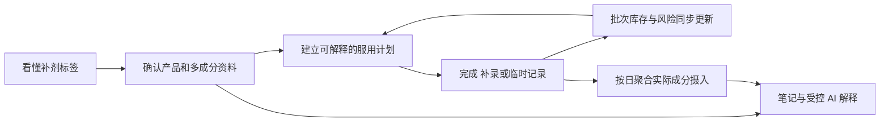

# 小补Q PRD

| 字段 | 内容 |
| --- | --- |
| 产品类型 | 个人补剂记录、执行、库存与摄入理解 H5 |
| 版本 | v0.1 |
| 日期 | 2026-09-13 |
| 状态 | 草稿 |

## 修改记录

| 日期 | 版本 | 变更 | 修改人 |
| --- | --- | --- | --- |
| 2026-09-13 | v0.1 | 初始化 PRD | [待确认] |

---

## 0. 文档基线

### 0.1 文档目的

本 PRD 定义小补Q完整产品目标，以及该目标在 `uni/` 正式工程上的实现合同。它用于统一产品、设计、前端、后端、测试和上线验收，不用于记录某一轮代码已经完成了什么。

本 PRD 与仓库内其他文档的关系如下：

- `uni/prd/PRD.md`：从本轮开始逐模块生成的完整目标 PRD，是未来需求评审的主文档。
- `uni/PRD.md`：Uni launch-beta 的历史范围和当前工程基线，不覆盖、不删除，也不再作为完整产品范围上限。
- `mvp/PRD.md`：完整产品思想、旧业务规则与交互设计的重要输入，但其中“药剂/药物/处方药”等历史表达不自动进入本 PRD。
- `uni/shaping/`：用户已确认的产品定型、版本裁决、功能差距和视觉基线，是本 PRD 的直接上游。

### 0.2 产品名称与当前形态

| 项目 | 当前定义 | 状态 |
| --- | --- | --- |
| 产品名 | 小补Q / Supp Q | `CONFIRMED` 暂用名；尚未完成公开品牌核验 |
| 产品类别 | 个人补剂记录、执行、库存与摄入理解产品 | `CONFIRMED` |
| 首发载体 | 移动优先 H5，桌面浏览器可用 | `CONFIRMED` |
| 后续载体 | 微信小程序可作为后续扩展，但当前不宣称可用 | `DEFERRED-ORDER` |
| 当前产品边界 | 只做补剂；不提供处方药能力或不可用的假入口 | `CONFIRMED` |
| 正式工程目录 | `uni/` | `CONFIRMED` |

### 0.3 证据状态

| 标签 | 使用条件 | PRD 中的处理方式 |
| --- | --- | --- |
| `CONFIRMED` | 用户已经明确确认 | 可写入产品合同；修改前必须重新确认 |
| `CODE-VERIFIED` | 已从当前代码、测试或可观察行为核对 | 可描述为当前实现事实，但不能自动等同于生产可用 |
| `DOCUMENTED` | 仅由已有文档声明 | 作为输入；落地前仍需代码或验收证据 |
| `DRAFT` | 为推进评审提出的方案 | 不能当作用户已经接受 |
| `OPEN` | 会改变范围、规则、数据或安全边界的问题 | 保留明确问题，不能自行补写答案 |
| `DEFERRED-ORDER` | 完整目标中的后续交付项 | 只改变顺序，不等于取消 |

### 0.4 来源裁决顺序

| 优先级 | 来源 | 本 PRD 中的用途 |
| --- | --- | --- |
| S1 | 用户明确确认 | 裁决最终意图、产品边界和冲突 |
| S2 | MVP 当前实现 | 完整用户功能、页面行为和交互母版 |
| S3 | `mvp/PRD.md` | 业务规则、对象、场景和历史边界 |
| S4 | MVP/Web 样式与页面 | 用户认可的视觉语言、信息层级和密度 |
| S5 | Uni 当前代码、契约和迁移 | 正式工程能力、数据权威及当前实现事实 |
| S6 | `uni/PRD.md` 与 `uni/docs/` | launch-beta 历史范围、架构和验收记录 |
| S7 | README、历史测试报告等 | 解释演进，不作为当前生产可用证明 |

发生冲突时遵循以下规则：

1. 用户已确认的当前决定覆盖旧目录名和旧文档表达。
2. MVP 代码与 MVP PRD 一致的能力进入完整目标候选；不一致的内容必须单独评审。
3. Uni 当前未实现的目标能力记为产品差距，不能据此删除。
4. Uni 已具备的更强工程语义原则上保留，除非它改变了用户已确认的产品行为。
5. 历史测试、健康检查、截图和 Mock/Fake 流程不能被表述为线上生产证明。

### 0.5 核心术语

| 术语 | 定义 |
| --- | --- |
| 补剂 | 用户主动记录的营养补充产品；当前产品不以药品分类、处方管理或治疗用途为目标 |
| 产品 | 药剂柜中的一项补剂主档，包含已确认资料、成分、计划、图片及状态 |
| 识别候选 | OCR/视觉/文本结构化产生、尚未经过用户确认的字段集合；不是产品事实 |
| 已确认资料 | 用户在确认页接受或编辑后保存的产品、成分、计划与初始库存数据 |
| 计划 | 决定指定日期是否产生待执行任务，以及时段/餐食提示的规则集合 |
| 今日任务 | 由指定日期有效计划派生的执行项，不单独成为第二套计划事实 |
| 服用记录 | 用户确认已经发生的摄入事实，包括计划完成、历史补录和临时服用 |
| 批次 | 一次初始库存或补货形成的独立库存单位，保留数量、有效期和成本信息 |
| FEFO | 优先从有效期更早的可用批次扣减，可按一次服用跨批次拆分 |
| 精确撤销 | 使用原服用记录的批次分配逐笔恢复库存，而不是重新推测应恢复哪个批次 |
| 摄入聚合 | 从有效服用记录、当时适用的已确认成分及手工成分记录派生的每日汇总 |
| 站内提醒 | 在小补Q界面内呈现的计划、漏服、低库存或临期提醒，不等于系统级消息已经送达 |
| 受控 AI | 只读取用户授权的已确认数据和明确参考资料，负责汇总解释而不拥有确定性规则的 AI 能力 |

## 1. 项目背景

### 1.1 用户问题

多补剂长期使用并不是单次“识别一张标签”的问题，而是一条持续变化的管理链路：

1. 新产品标签可能是英文，产品名、成分、每份含量、建议用法、总数量和有效期散落在不同位置。
2. 用户拥有多个产品时，周规则、间隔周期、服停周期、时段和餐食条件会形成持续记忆负担。
3. 实际生活中会发生按计划服用、漏记后补录、临时服用、误操作后撤销，静态清单无法保持真实历史。
4. 一项服用可能跨多个批次扣减；补货、余量、有效期和成本若不与记录联动，会迅速失真。
5. 同一成分可能来自多个产品，名称和单位不同，用户难以凭肉眼回答“某天实际摄入了多少、分别来自哪里”。
6. 搜索、通用 AI、相册、闹钟、备忘录和表格各自解决一个碎片，用户仍需重复录入和人工对账。

因此，单纯提升 OCR 准确率、增加一个产品列表或制作更漂亮的首页，都不能独立解决核心问题。产品必须让一份经过用户确认的数据在计划、今日执行、历史、库存、成分和解释中持续复用，并保持一致。

### 1.2 产品机会

小补Q的机会在于把当前分散在多个工具中的工作连成一个闭环：

这条链路的产品价值不来自功能数量本身，而来自四个连续性：

- **数据连续**：识别结果只确认一次，之后成为计划、库存和成分分析的共同输入。
- **时间连续**：计划变化保留版本，过去事实不会被未来设置改写。
- **操作连续**：完成、补录、临时服用和撤销都进入同一账本。
- **证据连续**：候选值、用户确认值、来源图片和后续修改可以区分并追溯。

### 1.3 为什么不是继续维护 MVP 或 Web

| 版本 | 已证明的价值 | 不能承担正式产品的原因 | 在目标方案中的角色 |
| --- | --- | --- | --- |
| MVP | 功能和页面最完整；承载用户的完整产品思想 | 主要是单机/localStorage 原型，无法成为可信的多设备和服务端数据基础 | 产品功能、交互和视觉母版 |
| Web | 与 MVP 保持相同主要前端和样式；证明旧界面可以运行在 Web 环境 | 核心仍是客户端状态加整包 JSON 同步，身份、并发、私有文件与领域事务不足 | 视觉/交互参照，不继续独立演进 |
| Uni | 已形成 H5、Go API/Worker、PostgreSQL、私有文件、身份隔离和事务化账本 | 当前用户侧能力比 MVP 窄，视觉也不是用户认可的目标 | 唯一正式工程底座，承接完整产品重建 |

所以，本项目不是“给 Uni 换皮”，也不是“把 MVP 搬到服务器”。正确任务是：在不退化 Uni 工程能力的前提下，恢复并重构 MVP 的完整用户价值和 MVP/Web 的视觉体验。

### 1.4 当前工程起点

根据当前代码和 Uni 历史文档，可把起点分为三类：

| 类型 | 当前事实 | 本 PRD 的处理 |
| --- | --- | --- |
| 可复用骨架 | 身份与邀请、隔离 Demo、服务端产品/计划/批次、异步识别任务、私有文件、FEFO、幂等、精确撤销、账户清理和运行监控已有基础 | 后续功能必须在这些能力上扩展，不退回客户端整包状态 |
| 明显产品差距 | 多成分确认、完整计划视图、成分日历/导出、成本账本界面、补剂 AI、笔记和健康上下文尚未完整覆盖 | 作为完整目标模块逐项定义，不因当前缺失而延期到“无计划” |
| 仍需外部验收 | 真实标签识别质量、生产域名/基础设施、真实邮件和通知送达、生产备份恢复等 | 在上线模块定义证据门槛；不得用历史 Fake/Mock 流程代替 |

### 1.5 本轮建设目标

本轮 PRD 要建立的是完整目标合同，而不是立即承诺一次性交付所有模块。后续研发可以按依赖关系分阶段，但必须满足：

- 每项完整目标能力都能追溯到明确模块、状态和验收标准。
- 阶段性版本明确说明“已实现、未实现、Mock/Fake、依赖外部条件”的区别。
- 用户侧体验以 MVP/Web 为基线，工程与数据语义以 Uni 为基础。
- 确定性计划、库存、聚合和风险规则由代码与数据保证，不能交给 LLM 猜测。
- 修改已经确认的范围、安全边界、公式、权限或状态流转前，必须重新评审。

### 1.6 高层非目标

以下内容不进入当前产品合同：

- 处方药管理、处方合理性判断、诊断、治疗建议或自动剂量推荐。
- 为未来药品能力放置不可用的假入口。
- 由 AI 输出确定服用计划、库存数字、单位换算或风险结论。
- 医生端、家庭成员协作、社区内容流、电商购买闭环和支付会员体系。
- 在当前阶段声称微信小程序、系统级外部推送或生产环境已经可用。
- 为追求视觉一致而复制 MVP/Web 的 localStorage、整包同步或其他旧工程限制。

### 1.7 本模块确认结果

- 本模块没有新增产品范围；它只把用户已经确认的版本关系、补剂边界和工程方向写成 PRD 基线。
- 本模块没有把 Uni 历史 launch-beta 的 Deferred 清单当成完整产品范围。
- 本模块无新增待决问题。
