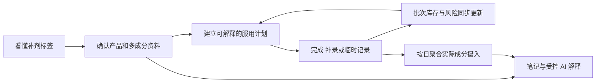
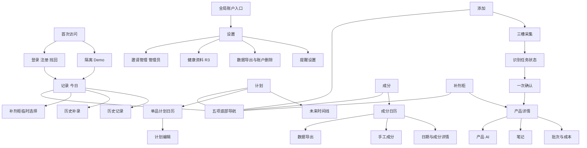
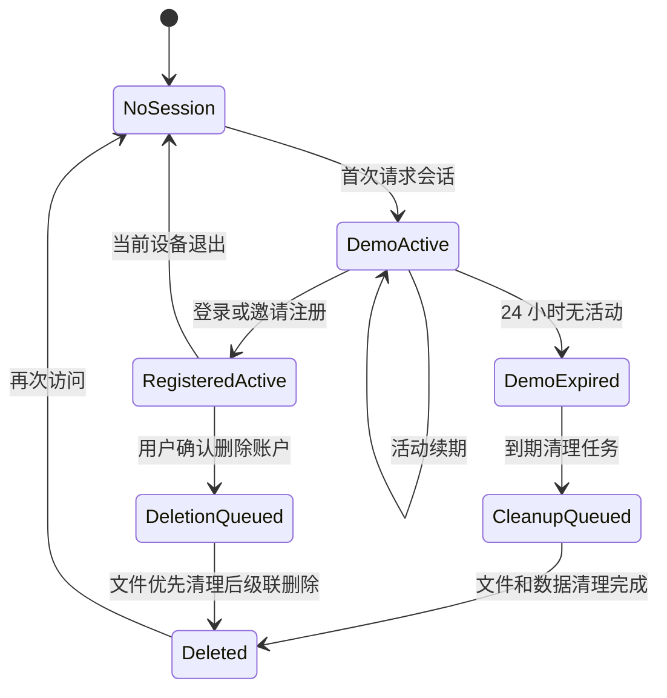
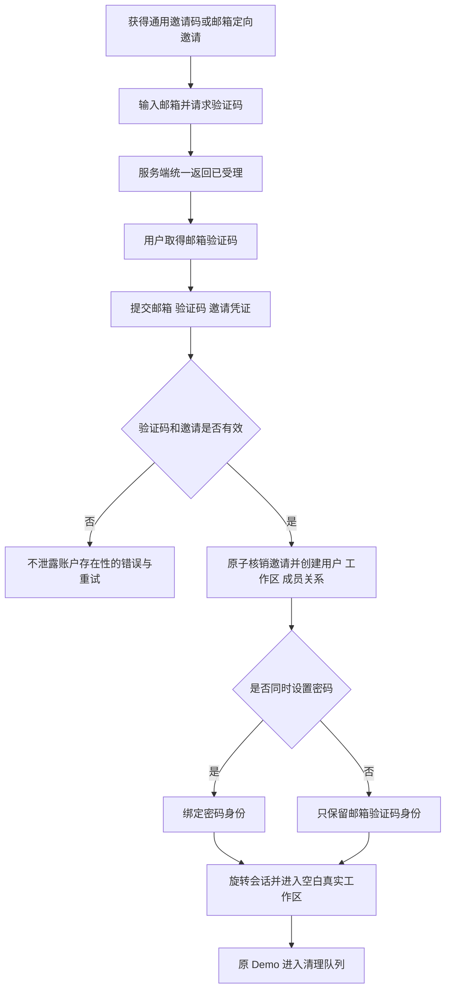
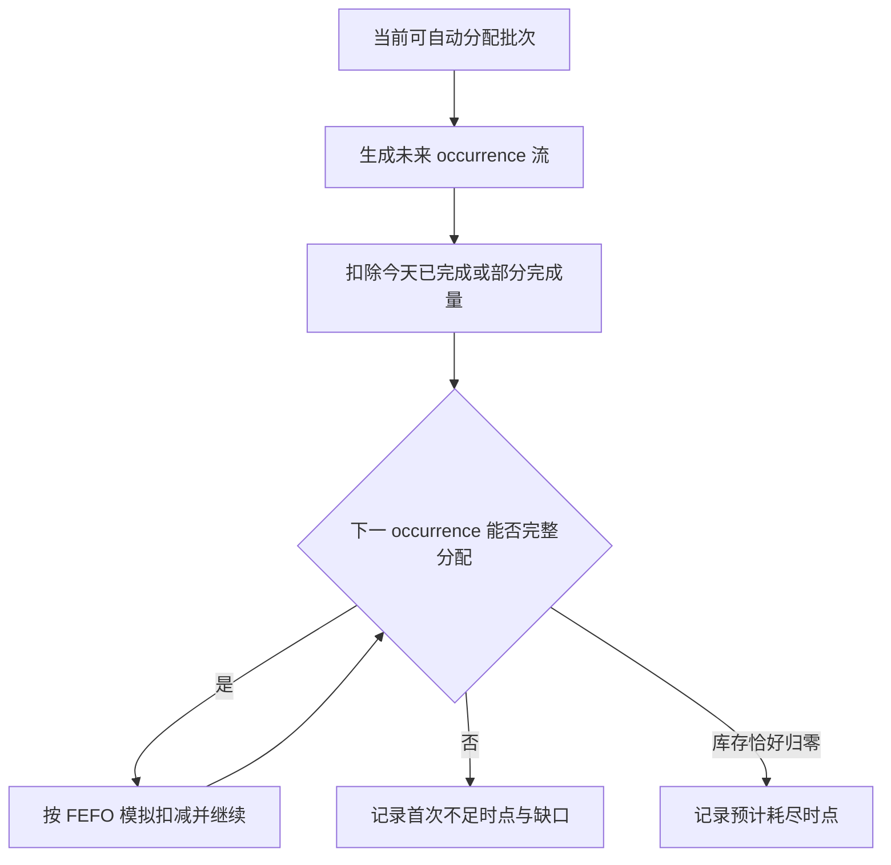

# 小补Q PRD

| 字段 | 内容 |
| --- | --- |
| 产品类型 | 个人补剂记录、执行、库存与摄入理解 H5 |
| 版本 | v0.1 |
| 日期 | 2026-09-13 |
| 状态 | 草稿 |

## 修改记录

| 日期 | 版本 | 变更 | 修改人 |
| --- | --- | --- | --- |
| 2026-09-13 | v0.1 | 初始化 PRD | [待确认] |

---

## 0. 文档基线

### 0.1 文档目的

本 PRD 定义小补Q完整产品目标，以及该目标在 `uni/` 正式工程上的实现合同。它用于统一产品、设计、前端、后端、测试和上线验收，不用于记录某一轮代码已经完成了什么。

本 PRD 与仓库内其他文档的关系如下：

- `uni/prd/PRD.md`：从本轮开始逐模块生成的完整目标 PRD，是未来需求评审的主文档。
- `uni/PRD.md`：Uni launch-beta 的历史范围和当前工程基线，不覆盖、不删除，也不再作为完整产品范围上限。
- `mvp/PRD.md`：完整产品思想、旧业务规则与交互设计的重要输入，但其中“药剂/药物/处方药”等历史表达不自动进入本 PRD。
- `uni/shaping/`：用户已确认的产品定型、版本裁决、功能差距和视觉基线，是本 PRD 的直接上游。

### 0.2 产品名称与当前形态

| 项目 | 当前定义 | 状态 |
| --- | --- | --- |
| 产品名 | 小补Q / Supp Q | `CONFIRMED` 暂用名；尚未完成公开品牌核验 |
| 产品类别 | 个人补剂记录、执行、库存与摄入理解产品 | `CONFIRMED` |
| 首发载体 | 移动优先 H5，桌面浏览器可用 | `CONFIRMED` |
| 后续载体 | 微信小程序可作为后续扩展，但当前不宣称可用 | `DEFERRED-ORDER` |
| 当前产品边界 | 只做补剂；不提供处方药能力或不可用的假入口 | `CONFIRMED` |
| 正式工程目录 | `uni/` | `CONFIRMED` |

### 0.3 证据状态

| 标签 | 使用条件 | PRD 中的处理方式 |
| --- | --- | --- |
| `CONFIRMED` | 用户已经明确确认 | 可写入产品合同；修改前必须重新确认 |
| `CODE-VERIFIED` | 已从当前代码、测试或可观察行为核对 | 可描述为当前实现事实，但不能自动等同于生产可用 |
| `DOCUMENTED` | 仅由已有文档声明 | 作为输入；落地前仍需代码或验收证据 |
| `DRAFT` | 为推进评审提出的方案 | 不能当作用户已经接受 |
| `OPEN` | 会改变范围、规则、数据或安全边界的问题 | 保留明确问题，不能自行补写答案 |
| `DEFERRED-ORDER` | 完整目标中的后续交付项 | 只改变顺序，不等于取消 |

### 0.4 来源裁决顺序

| 优先级 | 来源 | 本 PRD 中的用途 |
| --- | --- | --- |
| S1 | 用户明确确认 | 裁决最终意图、产品边界和冲突 |
| S2 | MVP 当前实现 | 完整用户功能、页面行为和交互母版 |
| S3 | `mvp/PRD.md` | 业务规则、对象、场景和历史边界 |
| S4 | MVP/Web 样式与页面 | 用户认可的视觉语言、信息层级和密度 |
| S5 | Uni 当前代码、契约和迁移 | 正式工程能力、数据权威及当前实现事实 |
| S6 | `uni/PRD.md` 与 `uni/docs/` | launch-beta 历史范围、架构和验收记录 |
| S7 | README、历史测试报告等 | 解释演进，不作为当前生产可用证明 |

发生冲突时遵循以下规则：

1. 用户已确认的当前决定覆盖旧目录名和旧文档表达。
2. MVP 代码与 MVP PRD 一致的能力进入完整目标候选；不一致的内容必须单独评审。
3. Uni 当前未实现的目标能力记为产品差距，不能据此删除。
4. Uni 已具备的更强工程语义原则上保留，除非它改变了用户已确认的产品行为。
5. 历史测试、健康检查、截图和 Mock/Fake 流程不能被表述为线上生产证明。

### 0.5 核心术语

| 术语 | 定义 |
| --- | --- |
| 补剂 | 用户主动记录的营养补充产品；当前产品不以药品分类、处方管理或治疗用途为目标 |
| 产品 | 补剂柜中的一项补剂主档，包含已确认资料、成分、计划、图片及状态 |
| 识别候选 | OCR/视觉/文本结构化产生、尚未经过用户确认的字段集合；不是产品事实 |
| 已确认资料 | 用户在确认页接受或编辑后保存的产品、成分、计划与初始库存数据 |
| 计划 | 决定指定日期是否产生待执行任务，以及时段/餐食提示的规则集合 |
| 今日任务 | 由指定日期有效计划派生的执行项，不单独成为第二套计划事实 |
| 服用记录 | 用户确认已经发生的摄入事实，包括计划完成、历史补录和临时服用 |
| 批次 | 一次初始库存或补货形成的独立库存单位，保留数量、有效期和成本信息 |
| FEFO | 优先从有效期更早的可用批次扣减，可按一次服用跨批次拆分 |
| 精确撤销 | 使用原服用记录的批次分配逐笔恢复库存，而不是重新推测应恢复哪个批次 |
| 摄入聚合 | 从有效服用记录、当时适用的已确认成分及手工成分记录派生的每日汇总 |
| 站内提醒 | 在小补Q界面内呈现的计划、漏服、低库存或临期提醒，不等于系统级消息已经送达 |
| 受控 AI | 只读取用户授权的已确认数据和明确参考资料，负责汇总解释而不拥有确定性规则的 AI 能力 |

## 1. 项目背景

### 1.1 用户问题

多补剂长期使用并不是单次“识别一张标签”的问题，而是一条持续变化的管理链路：

1. 新产品标签可能是英文，产品名、成分、每份含量、建议用法、总数量和有效期散落在不同位置。
2. 用户拥有多个产品时，周规则、间隔周期、服停周期、时段和餐食条件会形成持续记忆负担。
3. 实际生活中会发生按计划服用、漏记后补录、临时服用、误操作后撤销，静态清单无法保持真实历史。
4. 一项服用可能跨多个批次扣减；补货、余量、有效期和成本若不与记录联动，会迅速失真。
5. 同一成分可能来自多个产品，名称和单位不同，用户难以凭肉眼回答“某天实际摄入了多少、分别来自哪里”。
6. 搜索、通用 AI、相册、闹钟、备忘录和表格各自解决一个碎片，用户仍需重复录入和人工对账。

因此，单纯提升 OCR 准确率、增加一个产品列表或制作更漂亮的首页，都不能独立解决核心问题。产品必须让一份经过用户确认的数据在计划、今日执行、历史、库存、成分和解释中持续复用，并保持一致。

### 1.2 产品机会

小补Q的机会在于把当前分散在多个工具中的工作连成一个闭环：



这条链路的产品价值不来自功能数量本身，而来自四个连续性：

- **数据连续**：识别结果只确认一次，之后成为计划、库存和成分分析的共同输入。
- **时间连续**：计划变化保留版本，过去事实不会被未来设置改写。
- **操作连续**：完成、补录、临时服用和撤销都进入同一账本。
- **证据连续**：候选值、用户确认值、来源图片和后续修改可以区分并追溯。

### 1.3 为什么不是继续维护 MVP 或 Web

| 版本 | 已证明的价值 | 不能承担正式产品的原因 | 在目标方案中的角色 |
| --- | --- | --- | --- |
| MVP | 功能和页面最完整；承载用户的完整产品思想 | 主要是单机/localStorage 原型，无法成为可信的多设备和服务端数据基础 | 产品功能、交互和视觉母版 |
| Web | 与 MVP 保持相同主要前端和样式；证明旧界面可以运行在 Web 环境 | 核心仍是客户端状态加整包 JSON 同步，身份、并发、私有文件与领域事务不足 | 视觉/交互参照，不继续独立演进 |
| Uni | 已形成 H5、Go API/Worker、PostgreSQL、私有文件、身份隔离和事务化账本 | 当前用户侧能力比 MVP 窄，视觉也不是用户认可的目标 | 唯一正式工程底座，承接完整产品重建 |

所以，本项目不是“给 Uni 换皮”，也不是“把 MVP 搬到服务器”。正确任务是：在不退化 Uni 工程能力的前提下，恢复并重构 MVP 的完整用户价值和 MVP/Web 的视觉体验。

### 1.4 当前工程起点

根据当前代码和 Uni 历史文档，可把起点分为三类：

| 类型 | 当前事实 | 本 PRD 的处理 |
| --- | --- | --- |
| 可复用骨架 | 身份与邀请、隔离 Demo、服务端产品/计划/批次、异步识别任务、私有文件、FEFO、幂等、精确撤销、账户清理和运行监控已有基础 | 后续功能必须在这些能力上扩展，不退回客户端整包状态 |
| 明显产品差距 | 多成分确认、完整计划视图、成分日历/导出、成本账本界面、补剂 AI、笔记和健康上下文尚未完整覆盖 | 作为完整目标模块逐项定义，不因当前缺失而延期到“无计划” |
| 仍需外部验收 | 真实标签识别质量、生产域名/基础设施、真实邮件和通知送达、生产备份恢复等 | 在上线模块定义证据门槛；不得用历史 Fake/Mock 流程代替 |

### 1.5 本轮建设目标

本轮 PRD 要建立的是完整目标合同，而不是立即承诺一次性交付所有模块。后续研发可以按依赖关系分阶段，但必须满足：

- 每项完整目标能力都能追溯到明确模块、状态和验收标准。
- 阶段性版本明确说明“已实现、未实现、Mock/Fake、依赖外部条件”的区别。
- 用户侧体验以 MVP/Web 为基线，工程与数据语义以 Uni 为基础。
- 确定性计划、库存、聚合和风险规则由代码与数据保证，不能交给 LLM 猜测。
- 修改已经确认的范围、安全边界、公式、权限或状态流转前，必须重新评审。

### 1.6 高层非目标

以下内容不进入当前产品合同：

- 处方药管理、处方合理性判断、诊断、治疗建议或自动剂量推荐。
- 为未来药品能力放置不可用的假入口。
- 由 AI 输出确定服用计划、库存数字、单位换算或风险结论。
- 医生端、家庭成员协作、社区内容流、电商购买闭环和支付会员体系。
- 在当前阶段声称微信小程序、系统级外部推送或生产环境已经可用。
- 为追求视觉一致而复制 MVP/Web 的 localStorage、整包同步或其他旧工程限制。

### 1.7 本模块确认结果

- 本模块没有新增产品范围；它只把用户已经确认的版本关系、补剂边界和工程方向写成 PRD 基线。
- 本模块没有把 Uni 历史 launch-beta 的 Deferred 清单当成完整产品范围。
- 本模块无新增待决问题。

## 2. 用户、JTBD 与核心场景

### 2.1 用户定义原则

小补Q不以年龄、性别或消费水平划分核心用户，而以用户正在承担的管理复杂度划分。真正决定产品价值的变量是：同时管理的补剂数量、计划差异、持续周期、标签理解成本、库存批次数量，以及用户是否需要回看实际摄入。

因此，“买过补剂的人”过于宽泛；“同时长期管理多种补剂，并希望记录与库存保持一致的人”才是本产品应优先优化的对象。

### 2.2 用户优先级

| 层级 | 用户类型 | 行为特征 | 主要问题 | 小补Q承担的任务 | 证据状态 |
| --- | --- | --- | --- | --- | --- |
| P0 核心用户 | 多补剂长期自我管理者 | 同时使用多个补剂；计划、时段或周期不同；需要持续执行和回看 | 靠记忆容易漏记；计划、记录、库存和成分信息彼此分散 | 建档后持续生成今日任务，把实际记录与库存、摄入聚合联动 | `DOCUMENTED`，尚无真实用户研究或行为数据 |
| P1 进入型用户 | 外文/复杂标签补剂使用者 | 新购产品标签为英文，关键信息分布在正面、成分表和有效期区域 | 手工录入慢，翻译与字段理解容易出错 | 三槽采集、识别、翻译、证据和一次人工确认 | `DOCUMENTED`，已有产品流程，无真实转化基线 |
| P1 深度用户 | 库存与批次敏感使用者 | 有多瓶或多批次；关心余量、临期、补货和成本 | 只记总数会丢失批次、消耗顺序与真实成本 | FEFO、精确撤销、预计耗尽、临期和成本账本 | `CODE-VERIFIED` 有领域基础，使用价值待验证 |
| 使用情境 | 首次 Demo 体验者 | 尚未注册或不愿立即上传真实资料 | 无法在空白状态理解完整产品价值 | 使用隔离示例数据体验主流程，随后决定是否注册 | `CODE-VERIFIED` Uni 已有隔离 Demo；不是独立商业客群 |

### 2.3 非优先用户

| 用户/场景 | 当前处理 |
| --- | --- |
| 只偶尔服用一种简单补剂、无需提醒或回看的人 | 可以使用基础记录，但其痛点不足以驱动完整产品设计 |
| 处方药管理者 | 当前不服务，不展示入口；未来若扩展必须重新评审记录和 AI 边界 |
| 医生、药师、营养师等专业工作者 | 当前没有专业端、患者管理、处方审核或协作工作流 |
| 家庭负责人替多人管理 | 当前没有成员、代理操作和成员级权限模型 |
| 只想获得购买推荐或完成交易的人 | 当前不做商品推荐、电商导购和支付闭环 |

“非优先”不等于技术上必须阻止使用，而是不得为了这些场景牺牲 P0 用户的执行效率和数据一致性。

### 2.4 核心 Job Story

> 当我开始或持续使用多种补剂时，我想用尽可能少的手工操作建立产品资料、服用计划和库存，并在每天的真实变化中持续校正，从而确信自己今天做对了、过去有记录、接下来不会毫无准备。

核心工作不是“保存产品”，而是维持一个随时间变化、仍然可信的个人补剂事实系统。

### 2.5 Job Map

| 阶段 | 触发情境 | 用户想完成的工作 | 期望进展 | 可观察成功状态 |
| --- | --- | --- | --- | --- |
| 看懂 | 拿到一瓶新补剂，标签复杂或为英文 | 快速获得可检查的结构化资料 | 不必逐项抄写，也不会被识别结果强迫接受错误信息 | 原文、中文、结构字段和证据可对照；错误可改；失败可手工继续 |
| 建档 | 确认产品资料后准备开始使用 | 同时建立计划和初始库存 | 一次输入可以支撑之后的执行、库存和聚合 | 产品、多成分、计划和批次在一次确认后保持关联 |
| 规划 | 多个产品的日期、周期、时段或餐食条件不同 | 把复杂规则表达清楚 | 以后只需查看今天，而不是每天重新计算 | 指定日期产生稳定、可解释的任务；修改未来不改写过去 |
| 执行 | 到达某个时段或打开今日页 | 快速知道该做什么并记录事实 | 低注意力成本完成当天动作 | 一次操作创建服用记录并更新对应批次库存 |
| 修正 | 忘记记录、临时服用或误点完成 | 补记真实发生的事情或撤销错误 | 历史、库存和成分结果重新一致 | 补录归属正确日期；临时服用进入同一账本；撤销精确恢复原批次 |
| 持续 | 新开一瓶、库存减少或接近有效期 | 保持供应连续并降低浪费 | 在断货或过期前获得可执行信号 | 新批次可追加；FEFO 消耗；耗尽和临期风险可解释 |
| 理解 | 想回看某天实际摄入了哪些成分 | 跨产品汇总并追溯来源 | 不再逐瓶心算或混淆不同单位 | 可兼容单位正确合并；不可兼容单位分开展示；来源可展开 |
| 沉淀 | 对某产品有体验、疑问或需要解释 | 将个人记录与资料解释留在同一上下文 | 下次无需重新描述整个背景 | 笔记可持续编辑；AI 区分用户事实、参考资料和解释 |
| 控制 | 换设备、导出或停止使用 | 保留对个人数据的控制 | 不被单一浏览器状态锁定 | 登录后数据连续；可以导出；删除账户后相关数据和文件按合同清理 |

### 2.6 任务分层

| 任务类型 | 用户目标 | 产品含义 |
| --- | --- | --- |
| 功能任务 | 建档、规划、提醒、执行、补录、临时服用、撤销、批次管理、成本记录、临期管理、成分聚合、导出、笔记和解释 | 必须形成可执行流程和可验收状态，不能只作为信息展示 |
| 情感任务 | 降低“是不是漏了、记错了、快没了、信息是否可信”的持续不确定感 | 可编辑、证据、明确反馈、精确撤销和风险说明是核心体验，不是附属文案 |
| 社会任务 | 在需要向未来的自己或可信任的人说明时，能拿出整洁、可追溯的事实记录 | 当前只要求记录和导出，不因此扩张到家庭协作或专业工作台 |

### 2.7 核心场景

#### 场景 A：用三类资料建立一个新产品

用户购买一瓶英文补剂，通过产品正面、成分表和有效期区域提供资料。系统分别处理图片，保留识别原文、中文、结构化候选、置信状态与证据。用户可以替换某一张图、手工填写某一部分，并在一个确认页完成产品、多成分、计划与初始批次的检查。

成功不是“模型返回了 JSON”，而是用户在可理解、可修正的情况下完成了可信建档；识别失败时，手工路径仍可完成相同结果。

#### 场景 B：每天按时段完成计划

用户打开今日页，先看到指定日期、完成进度、下一时段和需要处理的产品。列表只展示完成当前决策所需的名称、服用量、时段/餐食、状态、余量和风险。用户点击完成后，系统在同一事务语义下创建记录并扣减批次库存。

这个场景决定长期使用价值。页面的首要目标是快速扫描与低摩擦执行，不是展示完整产品配置。

#### 场景 C：补录、临时服用和撤销

用户事后想起昨天已经服用，选择历史日期补录；或今天临时服用一个未命中计划的产品，从补剂柜选择并记录；若误操作，再撤销最近记录。三种操作都进入同一服用账本，并同步影响库存和成分聚合。

成功标准是“修正后重新一致”，而不是简单地在界面上增删一行。

#### 场景 D：补货、换批次和提前处理风险

用户新开一瓶或补货时追加批次，而不是覆盖总库存。系统按 FEFO 消耗，在库存不足、预计耗尽早于下一补货时间或批次可能过期时给出明确提示。撤销历史服用时恢复原先使用过的批次。

#### 场景 E：回看某日实际摄入

用户进入成分日历，选择某天查看实际摄入。系统从有效服用记录和产品成分派生汇总，并合并手工成分记录。用户可以展开每个成分的产品来源、次数和换算过程，也能识别哪些单位不能直接合并。

#### 场景 F：基于确认数据获取解释并沉淀笔记

用户从产品或成分进入 AI，对已确认标签、实际摄入或个人笔记提出问题。系统只能做机械汇总、资料解释和来源提示；不得判断用户应该改变剂量、给出诊断或形成相互作用结论。用户可以把有价值的解释保存为带来源的笔记。

#### 场景 G：先用 Demo 理解，再建立自己的空白账户

首次访问者进入彼此隔离的 Demo 工作区，以示例产品体验今日、记录、库存和识别确认。注册或登录后进入独立真实工作区，Demo 数据不自动迁移，避免把示例或试验数据混入个人记录。

### 2.8 用户旅程与价值递进


| 旅程阶段 | 用户判断 | 产品必须证明什么 | 失败后果 |
| --- | --- | --- | --- |
| 进入 | “它是否值得我录入资料？” | Demo 能展示闭环；新增入口清晰 | 用户在空白页离开 |
| 首次建档 | “识别结果可信吗、改起来麻烦吗？” | 候选不是强制事实；错误可改；手工可完成 | 用户不敢保存或录入成本过高 |
| 首次执行 | “今天页面真的能替我记住吗？” | 任务与计划一致，完成反馈明确 | 产品退化为一次性 OCR 工具 |
| 真实修正 | “漏记或误点后会不会全乱？” | 补录、临时记录、撤销和库存保持一致 | 信任一旦破坏，很难恢复 |
| 长期使用 | “它能否提前告诉我问题并帮助回顾？” | 预测、临期、成分日历和导出可追溯 | 用户重新回到表格、闹钟和心算 |

### 2.9 替代方案与四力

用户当前并不是在小补Q与某一个直接竞品之间选择，而是在小补Q与“相册 + 翻译/搜索 + 备忘录 + 闹钟 + 表格 + 通用 AI + 记忆”这一组合之间选择。

| Push：旧方法的推力 | Pull：小补Q的吸引力 | Anxiety：采用顾虑 | Habit：维持现状的惯性 |
| --- | --- | --- | --- |
| 多瓶、多时段和多周期带来记忆负担；信息分散；库存靠感觉；历史难回看 | 拍照降低建档成本；今日一屏执行；记录和库存联动；摄入可聚合；解释连接个人上下文 | OCR/AI 是否会错；资料是否安全；误点能否恢复；计划和库存算法是否可信；迁移后原功能是否丢失 | 继续拍照不整理；使用系统闹钟；在备忘录或表格手工记；临时向通用 AI 提问 |

### 2.10 产品价值层级判断

`CONFIRMED`：采用以下价值层级，后续功能优先级和指标均以此为基础：

1. **进入引擎：拍照识别与翻译。** 它显著降低首次建档成本，是让用户愿意开始的关键，但使用频率天然较低。
2. **留存引擎：今日执行 + 记录/撤销 + 库存联动。** 它处理每天反复发生的任务，是产品能否持续使用的核心。
3. **信任底座：人工确认、证据、确定性规则、历史版本和精确恢复。** 它不一定直接获客，却决定用户是否敢长期依赖数据。
4. **长期增值：成分日历、成本、笔记、健康上下文和受控 AI。** 它让长期积累的数据产生复利，而不是停留在打卡工具。

这意味着产品对外可以用“拍照看懂并快速建档”降低理解门槛，但产品内部不能用 OCR 成功率代替长期价值。真正的核心结果是用户持续依赖今日清单，且在真实修正后仍相信记录与库存。

### 2.11 待验证假设

当前仓库没有真实用户访谈、行为分析或规模化使用数据。以下判断仍需通过用户研究或上线数据验证，不能写成已经成立：

| 编号 | 假设 | 失败信号 | 建议验证方式 |
| --- | --- | --- | --- |
| H1 | 用户愿意在首次建档时完成一次结构化确认，以换取后续低摩擦执行 | 大量用户在确认页退出或只保存极少字段 | 漏斗埋点 + 5–8 名目标用户可用性测试 |
| H2 | 今日执行与库存联动比单次识别更能驱动持续使用 | 建档后很少再次打开今日页，但反复使用识别 | 建档后 7/30 天分功能留存与访谈 |
| H3 | 证据、可编辑和精确撤销能够建立对自动化结果的信任 | 用户频繁线下复核或因一次错误弃用 | 错误修正任务测试 + 弃用原因访谈 |
| H4 | 成分聚合和来源追溯能为长期用户提供额外价值 | 用户很少打开成分页或不理解换算结果 | 概念测试 + 页面任务完成率 |
| H5 | 隔离 Demo 能帮助理解产品，而不会使用户误以为示例是自己的数据 | Demo 访问后无法理解如何开始真实建档 | 首次访问测试 + Demo 到注册/建档转化 |

样本数和目标阈值将在模块 3 与模块 17 中结合指标和埋点进一步定义；这里的 `5–8 名`仅是发现主要可用性问题的首轮研究建议，不是统计性结论。

### 2.12 本模块确认点

本模块的产品判断已于 2026-09-13 确认：

> 是否接受“拍照识别是进入引擎，今日执行 + 记录/撤销 + 库存联动是留存引擎”这一价值优先级？

后续目标指标、首页结构和交付优先级均按此推进。

## 3. 产品目标、成功指标、完整范围与交付顺序

### 3.1 已确认的价值优先级

模块 2 已确认以下产品判断：

1. 拍照识别与翻译是**进入引擎**，负责降低首次建档门槛。
2. 今日执行、记录/撤销与库存联动是**留存引擎**，负责日常重复价值。
3. 人工确认、证据、确定性规则、历史版本与精确恢复是**信任底座**。
4. 成分、成本、笔记、健康上下文与受控 AI 是**长期增值层**。

后续目标、指标和交付顺序必须服务这一层级，不能只因为识别更容易演示，就把项目重新缩成 OCR 工具。

### 3.2 产品目标

| 编号 | 产品目标 | 用户结果 | 产品必须做到 | 不等于 |
| --- | --- | --- | --- | --- |
| G1 | 降低可信建档成本 | 用户可以从中英文、多区域标签建立完整产品，而不必逐字段抄写 | 三槽混合输入、异步处理、原文/译文/证据、多成分编辑、手工兜底和一次确认 | 模型能返回 JSON |
| G2 | 让复杂计划变成每日明确行动 | 用户打开今日页即可知道指定日期要做什么 | 计划组合可解释、版本不追溯改写、按时段扫读、补录和临时服用可达 | 只保存一个提醒时间 |
| G3 | 保持记录与库存长期一致 | 真实操作和修正不会让库存、历史与风险互相矛盾 | 幂等记录、事务化 FEFO、精确撤销、批次调整和可审计事件 | 页面数字看起来合理 |
| G4 | 让累计数据产生理解价值 | 用户能知道某天实际记录了哪些成分、来自哪里、如何换算 | 成分标准化、版本、按日聚合、来源明细、手工记录和一致导出 | AI 生成一段总结 |
| G5 | 提前暴露持续使用风险 | 用户在断货或过期前看到可解释信号 | 预计耗尽、最晚启用、低库存、临期及站内提醒 | 无条件发送更多通知 |
| G6 | 形成受控的个人补剂上下文 | 用户的笔记和解释可以积累，但不会覆盖事实或越过边界 | 字段授权、事实快照、引用、拒答、模型失败降级和 AI 转笔记 | 自动决定剂量、诊断或相互作用结论 |
| G7 | 保证个人数据可控 | 用户能跨设备连续使用，并能导出或删除自己的数据 | 服务端权威、租户隔离、私有文件、导出和可验证清理 | 浏览器里有一份 localStorage |

### 3.3 目标约束

所有产品目标同时受以下约束：

- 当前产品只处理补剂，不设置处方药或药品假入口。
- 用户确认值和确定性业务规则高于识别/AI 候选。
- 计划、库存、成本、单位换算和风险计算必须可重复验证。
- H5 是当前第一载体；小程序和外部通知未实现前不得宣称可用。
- 用户侧体验向 MVP/Web 对齐，工程和数据语义在 Uni 上演进。
- 完整目标与交付批次分别管理；任何批次不得把未完成写成“不需要”。

### 3.4 成功指标设计原则

当前没有经过验证的真实用户基线。旧 MVP PRD 中的建档完成率、识别接受率和 7 日使用率数字属于历史提案，并非已经达成或经样本验证的正式目标。

本 PRD 采用两类不同指标：

1. **产品效果指标**：必须先埋点、采集基线，再确认目标值；当前只确认定义、分母、观察窗口和决策用途。
2. **正确性与安全门槛**：属于系统不变量，可以在没有用户基线时要求 100% 或零越权。

禁止用识别请求数、注册数、页面浏览量等规模数字代替用户是否完成可信管理闭环。

### 3.5 核心结果指标

#### 3.5.1 主指标：有效管理周

`CONFIRMED` 定义：一个注册用户在一个连续 7 日窗口内，至少存在一个会在该窗口生成任务的有效计划，并在窗口内对自己的补剂执行过有效管理动作。有效管理动作包括：创建有效服用记录、补录、临时服用、撤销错误记录、调整计划、补货或修正产品资料。

主指标同时展示两个数，不压缩成单一百分比：

| 指标 | 公式 | 解释限制 |
| --- | --- | --- |
| 有效管理用户周数 | 满足上述条件的 user-week 去重计数 | 衡量产品是否进入真实管理过程，不等于医学依从性 |
| 有效管理周占比 | 有效管理用户周数 ÷ 当周拥有有效计划的 eligible user-week | 分母排除没有任何生效计划的账户，但不能排除失败或零动作用户 |

选择“周”而不是“日”，是因为补剂计划可能包含间隔日、每周特定日期或服停周期；日活会错误惩罚合法的非每日计划。

#### 3.5.2 辅助结果指标

| 编号 | 指标 | 严格定义 | 用途 | 当前目标状态 |
| --- | --- | --- | --- | --- |
| M1 | 建档激活率 | 首次进入新增流程的注册用户中，在 24 小时内完成“已确认产品 + 至少一个成分或明确确认暂无结构化成分 + 有效计划 + 初始批次”的比例 | 判断用户是否建立了可执行的个人数据，而不只完成识别 | `DRAFT`；先测基线 |
| M2 | 首次执行激活率 | 首个有效计划实际生成任务的用户中，在规定记录/补录窗口内形成首条有效计划服用记录的比例 | 判断用户是否从建档进入日常执行；窗口在模块 9 定义 | `DRAFT`；先测基线 |
| M3 | 识别辅助完成率 | 成功上传至少一个识别槽且最终确认产品的流程中，至少一个确认字段沿用识别候选的比例 | 衡量识别是否实际降低输入，不把“请求成功”当价值 | `DRAFT`；先测基线 |
| M4 | 手工兜底完成率 | 出现任一识别失败/超时的添加流程中，最终仍确认产品的比例 | 验证失败是否阻断建档 | `DRAFT`；先测基线 |
| M5 | 计划周记录覆盖率 | 有效计划在 7 日内生成的任务中，存在有效计划服用记录的任务比例 | 观察用户是否依赖今日执行；不得对外解释为真实服用率 | `DRAFT`；按计划类型分层看基线 |
| M6 | 修正成功率 | 发起撤销、补录或产品/计划修正后，操作成功且相关派生视图一致的比例 | 衡量产品在真实变化中的可恢复性 | 产品操作目标待基线；数据一致性受 100% 门槛约束 |
| M7 | 4 周持续管理率 | 完成闭环激活的用户中，第 4 个 7 日窗口仍形成有效管理周的比例 | 衡量是否从进入转为持续使用 | `DRAFT`；先测基线 |
| M8 | 风险行动率 | 打开低库存/临期提醒的用户中，在定义窗口内完成补货、调整或确认忽略的比例 | 判断提醒是否促成处理，而非只产生点击 | `DRAFT`；动作和窗口在提醒模块确定 |
| M9 | 成分理解使用率 | 形成有效管理周的用户中，在 28 日内查看成分日详情、来源或完成导出的比例 | 验证长期增值层 | `DRAFT`；功能完成后建立基线 |
| M10 | AI 有效沉淀率 | 完成 AI 会话的用户中，将内容保存为笔记或继续查看引用来源的会话比例 | 避免只用消息量衡量 AI 价值 | `DRAFT`；AI 上线后建立基线 |

### 3.6 正确性、安全与信任门槛

以下不是“优化方向”，而是发布门槛：

| 编号 | 门槛 | 目标 | 验证方式 |
| --- | --- | --- | --- |
| Q1 | 库存账本可重放一致率 | 100% | 从 opening/restock/adjustment/intake/undo 事件重算并与批次当前值对账 |
| Q2 | 精确撤销恢复正确率 | 100% | 自动化覆盖单批次、跨批次、重复撤销、并发和失败回滚 |
| Q3 | 重复请求副作用 | 0 个重复记录、0 次重复扣减 | 幂等键、事务测试和 API 重试测试 |
| Q4 | 跨租户数据可见或可修改事件 | 0 | API、文件、任务、导出和管理操作的权限测试 |
| Q5 | 未经确认的识别候选成为产品事实 | 0 | 确认事务测试、状态机测试和审计字段核对 |
| Q6 | AI 写入确定性计划/库存/聚合结果 | 0 | 工具权限、接口权限和端到端拒绝测试 |
| Q7 | AI 对剂量、诊断或相互作用给出裁决性结论 | 0 个评测集违规结果 | 安全评测集、拒答断言与人工复核 |
| Q8 | 账户删除完成后仍可访问的所属文件或业务数据 | 0 | 清理任务、对象存储核对与删除后访问测试 |
| Q9 | 不兼容单位被静默相加 | 0 | 单位矩阵测试与成分详情显示测试 |

识别字段准确率、假高置信率、未识别率、人工修正率和延迟是单独的模型/供应商质量门槛，将在模块 6 和模块 18 定义；不能只用“任务成功”判定识别可上线。

### 3.7 基线与目标设定流程

`CONFIRMED` 采用以下流程，避免继续沿用没有证据的百分比：

1. 在内部和受控测试阶段先验证事件是否完整、分母是否可重放、Demo/测试数据是否被排除。
2. 开放小规模真实用户试用，至少覆盖完整建档、一个有效管理周和一次真实修正场景。
3. 先报告分布、分层与失败原因，不只报告总平均值；至少按新老用户、计划类型、识别/手工路径区分。
4. 获得稳定基线后，再为下一阶段确认改善目标和观察窗口。
5. 每个目标同时配置护栏，防止通过强制提醒、隐藏失败或减少可编辑字段制造表面提升。

在基线形成前，产品效果指标统一标为 `UNMEASURED`；只有 Q1–Q9 等系统不变量可以直接作为硬门槛。

### 3.8 完整目标范围

| 领域 | 完整目标能力 | 当前 Uni 起点 | 是否属于最终范围 |
| --- | --- | --- | --- |
| 采集与识别 | 三槽独立输入、拍摄/相册/手工混用、中英文识别、翻译、证据、置信度、重试和一次确认 | 异步集合与证据基础较强，槽位独立和完整确认不足 | 是 |
| 产品与补剂柜 | 搜索筛选、状态、完整资料/图片/多成分编辑、停用/删除和风险入口 | 基础列表、详情、编辑和补货已存在 | 是 |
| 计划 | 周规则、间隔天、长期服停、时段、餐食、历史版本、计划总览和单品日历 | 三层规则和部分历史已存在，完整视图不足 | 是 |
| 今日与记录 | 指定日期任务、时段分组、完成、补录、临时服用、历史筛选、幂等和精确撤销 | 基础今日、记录、补录和服务端 intake 已存在 | 是 |
| 库存与成本 | 多批次 FEFO、调整、精确撤销、预计耗尽、最晚启用、低库存、临期及成本账本 | 事务账本与预测较强，成本与完整管理 UI 不足 | 是 |
| 成分与导出 | 多成分、别名、单位/IU 换算、版本、日历、来源、手工摄入和 CSV | 数据表有基础，完整聚合产品层缺失 | 是 |
| 提醒 | 全局/单品设置、时段、遗漏、低库存、临期和站内状态 | 有 reminder time 与摘要基础 | 是；外部通知为后续交付 |
| AI 与沉淀 | 产品/成分受控 AI、引用、拒答、AI 转笔记、健康上下文授权 | 当前完整产品能力缺失 | 是；必须晚于数据和安全合同 |
| 身份与数据控制 | 邀请、登录、隔离 Demo、多设备、私有文件、导出和账户删除 | 大部分工程基础已存在，完整导出不足 | 是 |
| 运营与可靠性 | 管理邀请、任务监控、错误码、指标、备份恢复、部署与生产验收 | Uni 已有较强基础，真实外部环境仍待验证 | 是 |
| 多端扩展 | 微信小程序、外部通知渠道 | 当前未实现或明确延后 | 是，`DEFERRED-ORDER` |

### 3.9 当前明确不做

- 处方药管理、药品假入口、处方判断、诊断、治疗建议和自动剂量推荐。
- 由 AI 给出相互作用结论或替用户修改确定性数据。
- 家庭成员、医生端、社区、电商购买、支付和订阅商业化。
- 日文、韩文及其他语言的标签识别，除非后续单独扩展语言范围。
- 没有成分特定依据的 IU 强制换算，以及不可兼容单位的静默合并。
- 在本地或 Fake/Mock 验收完成后直接宣称生产可用。

### 3.10 交付原则

完整目标不等于一次性大爆炸上线。交付批次按“先建立可信事实，再让事实日常运转，再产生长期增值，最后扩大渠道”的依赖顺序组织。


### 3.11 建议交付批次

#### R0：产品合同与视觉基线

当前 PRD 阶段完成：冻结来源优先级、完整范围、视觉原则、规则合同、页面和验收方法。R0 不以新增用户功能作为完成标准。

#### R1：可信建档与日常核心闭环

目标：让真实用户可以在 Uni 上完成一条不丢字段、可持续执行、出错可恢复的主链路。

- 统一视觉壳、五入口和核心组件基线。
- 保留身份、邀请、Demo 隔离和服务端权威数据。
- 补齐三槽独立输入、混合手工、识别状态、字段证据和多成分确认。
- 补齐产品完整编辑和必要的产品状态。
- 完成可解释计划设置、指定日期今日任务、时段/餐食展示。
- 完成计划记录、补录、临时服用、幂等、FEFO 与精确撤销。
- 展示基本低库存、预计耗尽和临期风险。

R1 退出条件：用户可以从空白账户完成“建档—计划—今日执行—库存扣减—撤销恢复”，且 Q1–Q6、Q8 的适用门槛全部通过。

#### R2：完整管理与摄入理解

目标：恢复完整产品思想中的计划、库存、成本、成分和数据控制能力。

- 计划总览、未来时间线和单品日历。
- 完整记录筛选与历史查看。
- 批次管理、库存调整、风险解释和成本账本。
- 成分标准化、别名、单位/IU 规则和成分版本。
- 成分日历、来源明细、手工成分记录和 CSV 导出。
- 全局/单品站内提醒与权限模型。
- 产品笔记。健康资料此阶段不采集，只完成后续用途和字段授权方案评审。
- 完整用户数据导出。

R2 退出条件：计划、记录、库存、成本和成分聚合可从同一事实链重放；Q1–Q6、Q8–Q9 全部通过。

#### R3：受控智能与个人沉淀

目标：在可靠数据和明确边界之上开放补剂产品/成分 AI。

- 产品级与成分级会话。
- 用户授权的确认数据快照和参考资料引用。
- 机械汇总工具、拒答边界、供应商失败降级和成本控制。
- AI 内容保存为带来源笔记。
- 健康资料的最小必要字段、用途说明、字段级授权和撤回机制；没有已上线用途的字段不采集。
- 专门安全评测集与人工审阅流程。

R3 退出条件：AI 不写入确定性事实，Q6–Q7 通过；无引用、越界、供应商失败和费用上限场景均有可验收结果。

#### R4：外部通知与多端扩展

目标：在 H5 闭环稳定后扩展触达和载体。

- 选择并实现外部通知渠道，单独验证权限、到达率和退订。
- 微信登录/绑定、上传与小程序界面。
- 多端行为一致性、文件能力差异和端到端验收。

R4 退出条件：目标渠道的真实授权、真实送达和关键主流程通过；未实现渠道继续明确显示为不可用，而不是假入口。

### 3.12 依赖与禁止并行关系

| 后置能力 | 必须先完成 | 原因 |
| --- | --- | --- |
| 成分日历 | 多成分确认、成分版本、有效 intake | 否则历史聚合会随产品编辑漂移 |
| 成本账本 | 批次、allocation 和库存事件 | 否则无法追溯实际消耗成本 |
| 受控 AI | 确认数据、聚合工具、引用和权限 | 否则模型会用不可靠上下文回答 |
| 健康上下文进入 AI | 字段级授权和用途说明 | 敏感字段不能仅因“未来可能用”就默认上传 |
| 外部通知 | 站内提醒规则和权限模型 | 先证明提醒内容与触发正确，再扩大触达 |
| 小程序 | H5 API 契约和文件流程稳定 | 避免在两端同时复制尚未收敛的状态机 |

识别、今日和库存不能被三个互不相干的团队平行实现后再对接；它们共享产品确认、计划版本、intake 和 allocation 合同，必须先固定跨模块数据流。

### 3.13 本模块确认点

本模块的两项决策已于 2026-09-19 确认：

1. 产品效果指标先建立真实基线再定百分比；账本、撤销、隔离和 AI 越界等系统不变量直接要求 100%/0 违规。
2. 采用 R1 可信闭环 → R2 完整管理与摄入理解 → R3 受控 AI → R4 外部通知与多端的交付顺序。

确认后，模块 4 将在这一范围和顺序上定义体验原则、信息架构与五入口导航。

## 4. 体验原则、信息架构与全局导航

### 4.1 体验目标

小补Q的界面不是用来“展示系统有多少能力”，而是帮助用户在当前时刻完成一个明确判断或动作。每个页面首先回答三个问题：

1. 我现在处于什么状态？
2. 我现在最需要处理什么？
3. 完成或修改后，哪些记录、库存或后续任务会受到影响？

视觉延续 MVP/Web 已确认方向，信息与状态能力由 Uni 工程承载。目标不是逐行复制旧 HTML/CSS，而是在不丢失信息密度和用户心智的前提下，补齐真实网络、异步任务、权限和失败恢复状态。

### 4.2 全局体验原则

| 编号 | 原则 | 产品要求 | 反例 |
| --- | --- | --- | --- |
| UX-01 | 行动先于装饰 | 今日首屏先展示日期、进度、下一项和风险；空白页先给下一步 | 欢迎语、插画或品牌占据首屏，任务被推到下方 |
| UX-02 | 先扫读，再展开 | 高频列表使用稳定列位；复杂规则、证据和历史渐进披露 | 每张卡片结构不同；所有细节一次性展开 |
| UX-03 | 空间服从任务复杂度 | 简单动作紧凑；确认、周期和成分换算获得足够纵深 | 用相同大卡片包装所有信息，既松散又难比较 |
| UX-04 | 一屏一个主动作 | 页面只设置一个明确的最高优先级动作，其余降级 | “保存、确认、下一步、完成”同时使用同等视觉权重 |
| UX-05 | 状态必须说清楚 | 颜色必须配合文字、图标或数值；等待和失败给出原因与下一步 | 只用红绿颜色表达风险；错误只显示“失败” |
| UX-06 | 结果必须可追溯 | 识别、库存、风险和聚合结果能进入证据或计算来源 | 把 AI/OCR 候选直接当事实；只展示一个无法解释的总数 |
| UX-07 | 错误可以恢复 | 手工兜底、重试、补录和精确撤销是主流程的一部分 | 失败后要求从头开始；撤销只改界面不恢复账本 |
| UX-08 | 系统不得假装成功 | 服务端尚未确认时显示提交中；失败时保留用户输入 | 先显示“已完成”，后台失败后静默回滚 |
| UX-09 | 高频入口稳定 | 五个一级入口位置、名称和选中态跨页面保持一致 | 不同页面改变底栏顺序或把设置塞进高频入口 |
| UX-10 | 敏感能力按需出现 | 健康资料和 AI 授权只在有明确用途时呈现 | 提前要求填写一套当前功能不使用的健康档案 |

### 4.3 视觉基线

| 维度 | 已确认基线 | 实现约束 |
| --- | --- | --- |
| 整体气质 | 白/米白、平静、克制、高信息价值，接近 Notion-like 工具感 | 不使用大面积高饱和渐变、玻璃拟态或“泛健康 App”装饰模板 |
| 页面背景 | 外层 `#f7f7f5`，主要内容面 `#ffffff`，辅助面 `#fafafa` | 颜色变量化，禁止页面内散落近似但不一致的色值 |
| 主文字 | `#191919`；弱文字 `#6f6f6f` | 弱文字仍需可读，不用过浅灰制造“高级感” |
| 分隔 | `#e3e3e0` 细边界，阴影克制 | 主要靠排版和边界分层，不用重阴影堆卡片 |
| 圆角 | 基础半径 4px | 输入、按钮和卡片保持同一低圆角体系；特殊控件需说明理由 |
| 字体 | Inter/SF/PingFang 优先；正文基准 14px、行高 1.5 | 系统字体降级稳定；数值、单位和中文不能错位 |
| 标题 | 主标题约 28px/700；eyebrow 约 13px | 主标题只定位页面，不挤压高频操作 |
| 页面间距 | 左右 16px、顶部约 24px，底部为导航和安全区留空间 | 避免因为组件默认 padding 造成无效空白 |
| 主动作 | 黑色/近黑；弱动作使用中性浅底 | 同屏主按钮不超过一个；危险操作使用独立红色语义 |
| 语义色 | 蓝/琥珀/橙/紫/绿/红均使用文字、soft 背景和 border 三阶 | 颜色只表达时段、周期、状态和风险，不作为无意义装饰 |

语义色的目标用途：

- 蓝：早晨、周规则、普通信息。
- 琥珀：中午、日周期、待处理或注意。
- 橙：下午、临近风险。
- 紫：晚上或特定长期阶段。
- 绿：成功、有效、长期周期或库存健康。
- 红：错误、过期、高风险和危险操作。

同一语义必须跨页面复用同一颜色；例如“临期”不能在补剂柜使用橙色、在详情页又变成绿色。

### 4.4 响应式壳层

`CONFIRMED`：核心产品继续采用移动优先、最大约 430px 的单列 AppShell。桌面浏览器显示居中的移动产品壳，外侧使用米白背景，不为核心产品另造一套宽屏信息架构。

| 视口 | 布局行为 |
| --- | --- |
| ≤ 430px | 内容占满可用宽度；处理刘海、底部安全区和软键盘遮挡 |
| > 430px | AppShell 居中，最大约 430px；不拉伸卡片和表单，不改成左侧栏 |
| 管理员页面 | 邀请列表等确有表格需求的内部页面可以使用独立宽屏布局，但不得影响普通用户壳层 |

当前 Uni 的桌面左侧导航不是目标视觉基线。R1–R3 先统一移动壳，未来若真实桌面使用数据证明有必要，再单独设计桌面增强版，而不是提前维护两套 IA。

### 4.5 一级导航

普通用户登录后使用五个固定一级入口：

| 顺序 | 导航名 | 默认落点 | 核心任务 | 不放入的内容 |
| --- | --- | --- | --- | --- |
| 1 | 记录 | 今日执行页 | 看今天、完成、撤销、切日期、补录、临时服用、进入历史 | 完整计划编辑、账户设置 |
| 2 | 计划 | 计划总览 | 查看未来安排、阶段、单品日历并进入编辑 | 实际摄入成分统计 |
| 3 | 添加 | 新增产品 | 三槽采集、手工录入、识别进度和一次确认 | 补货；补货属于已有产品 |
| 4 | 成分 | 成分日历 | 按日查看实际摄入、来源、手工成分和导出 | 产品原始成分编辑 |
| 5 | 补剂柜 | 产品列表 | 查找产品、查看详情、计划、库存、批次、成本、笔记和 AI | 今日批量执行 |

导航规则：

1. 五项顺序和名称全局固定；`添加`保持居中且视觉可识别，但不使用与整体风格冲突的悬浮大圆按钮。
2. `记录`是登录后的默认入口，其默认子视图是今天；历史是记录域内的次级视图，不再独占一级导航。
3. 当前 Uni 的“我的”移出底栏，通过全局账户入口进入设置；当前 Uni 的“服用记录”与“今日”合并到记录域。
4. 计划和成分恢复为一级入口，因为它们分别承担未来安排与实际摄入理解，不能藏在产品详情或设置中。
5. 识别任务在后台运行时，用户可以切换一级入口；底栏或添加入口显示明确状态，但不得阻塞整个应用。
6. 未保存表单离开前提示；已上传的识别草稿和任务状态由服务端持久化，返回时继续。

### 4.6 全局信息架构



### 4.7 页面层级

| 层级 | 页面类型 | 导航表现 | 返回规则 |
| --- | --- | --- | --- |
| L0 | 登录、注册、找回、Demo 说明 | 不显示普通底栏 | 完成身份动作进入记录；取消返回合法上一页 |
| L1 | 记录、计划、添加、成分、补剂柜 | 显示固定五项底栏 | 切换入口保留当前会话内的筛选、日期和滚动位置 |
| L2 | 历史、补录、计划日历、产品详情、成分详情、设置 | 视任务决定隐藏底栏，顶部提供明确返回 | 返回发起页面及其上下文，不一律跳回首页 |
| L3 | 编辑、确认、批次、成本、导出、AI、笔记 | 隐藏底栏，专注单任务 | 保存后回到来源详情；取消不产生业务副作用 |
| 系统层 | 全局提示、任务状态、权限、账户清理 | 不改变导航层级 | 允许查看详情、重试或安全退出 |

### 4.8 一级入口的首屏合同

| 入口 | 首屏必须出现 | 次级内容 | 禁止占据首屏的内容 |
| --- | --- | --- | --- |
| 记录 | 日期、完成进度、下一项/当前时段、待处理任务、风险摘要 | 已完成、临时服用、补录和历史入口 | 大面积欢迎语、完整周期说明、无行动价值的统计图 |
| 计划 | 当前阶段、近期安排、下一次变化、进入单品日历 | 12 周时间线、过滤和历史版本 | 实际摄入统计与库存账本明细 |
| 添加 | 三个资料槽及各自状态、手工继续方式 | 拍照说明、示例和识别证据 | 强制用户先阅读长教程或等待单槽完成 |
| 成分 | 当前选择日期、当日成分摘要、异常单位提示 | 日历、来源、手工记录和导出 | 泛化健康建议或无来源风险评分 |
| 补剂柜 | 搜索/筛选、产品状态、余量和风险 | 分类、批次、成本和详情入口 | 把每个产品全部字段塞进列表卡片 |

### 4.9 全局账户与辅助入口

账户头像或简洁文字入口位于 TopBar 右侧，并在所有 L1 页面保持位置一致。进入后包含：

- 账户身份、退出和会话管理。
- 全局提醒设置。
- 数据导出、隐私说明和账户删除。
- R3 启用后的健康资料与 AI 授权。
- 管理员可见的邀请管理入口。

低频辅助能力不进入底栏，但不能深藏到无法发现；设置首页需直接展示数据控制与提醒状态摘要。

### 4.10 跨页面导航与草稿规则

| 场景 | 规则 |
| --- | --- |
| 切换一级入口 | 保留当前会话内各入口最后选择的日期、筛选和滚动位置；服务端事实重新校验 |
| 添加过程中切走 | 本地未上传文件不得假装已保存；已上传文件、草稿 ID 和任务状态可恢复；入口显示处理中/待确认 |
| 编辑未保存离开 | 若存在用户修改，必须询问继续编辑或放弃；放弃只丢弃草稿，不回滚已确认事实 |
| 服务端提交中离开 | 显示可理解的处理中状态；禁止重复提交；完成后可从任务入口查看结果 |
| 从列表进入详情再返回 | 恢复原筛选、日期和滚动位置 |
| 身份失效 | 保留不含敏感内容的安全返回信息，引导重新登录；不得继续显示缓存的私有内容 |
| Demo 登录/注册 | 明确说明 Demo 数据不迁移；进入新的空白真实工作区 |

### 4.11 通用页面状态

每个读取或写入页面至少定义以下适用状态：

| 状态 | 展示要求 | 允许操作 |
| --- | --- | --- |
| 初始加载 | 保留页面结构的骨架或明确加载文案，避免布局跳动 | 返回；不允许对未知数据执行动作 |
| 空状态 | 说明为什么为空，并给一个与当前任务直接相关的下一步 | 添加、调整筛选或返回；不只展示插画 |
| 正常 | 关键信息与主动作优先 | 按权限操作 |
| 提交中 | 标明正在处理的对象，防止重复操作 | 安全离开或取消仅在业务允许时提供 |
| 后台处理中 | 显示排队/处理/部分成功/失败，并允许继续浏览其他页面 | 查看详情、重试、手工继续 |
| 部分失败 | 成功数据与失败项分开，不能整页只显示失败 | 重试失败项或采用手工路径 |
| 网络失败 | 保留用户输入；说明尚未保存 | 重试、复制内容或安全返回；不得显示成功 |
| 权限不足 | 说明需要的身份/角色，不泄露目标资源是否存在 | 登录、返回或联系管理员 |
| 数据已变化 | 提示当前视图过期并重新获取，避免静默覆盖 | 刷新、对比或重新应用修改 |
| 危险确认 | 明确对象、影响范围和不可逆部分 | 二次确认；账户删除等高风险动作使用精确输入确认 |

### 4.12 核心组件体系

| 组件 | 责任 | 禁止承载 |
| --- | --- | --- |
| `AppShell` | 430px 壳、外层背景、安全区和页面高度 | 具体业务数据请求 |
| `TopBar` | eyebrow、标题、返回、账户或唯一辅助动作 | 多个同权重操作 |
| `BottomNav` | 五入口、选中态、添加/任务状态提示 | 低频设置和管理入口 |
| `SectionHeader` | 区块标题、摘要与一个辅助动作 | 大段说明文字 |
| `CompactCard` | 可扫描的状态和动作组合 | 用大面积留白隐藏信息不足 |
| `ProductRow` | 名称、服用信息、余量、状态和风险的稳定列位 | 完整周期或所有产品字段 |
| `TimeSlotGroup` | 早/中/下午/晚分组和完成进度 | 任意自定义颜色体系 |
| `StatusChip` | 文字 + 语义色表达单一状态 | 单独依赖颜色 |
| `MetricPair` | 数值、单位、标签和必要来源入口 | 无口径的装饰性大数字 |
| `EvidenceDisclosure` | 原图、原文、译文、置信度和字段来源 | 把候选包装成权威结论 |
| `IngredientRows` | 多成分增删、名称、含量、单位和验证反馈 | 把整段识别文本塞进一行成分 |
| `InlineNotice` | 降级、错误、权限和恢复建议 | 无操作建议的泛化警告 |
| `EmptyState` | 空因、下一步和必要示例 | 大型无关插画 |
| `ConfirmBar` | 移动端固定主动作、安全区和提交状态 | 多个主按钮或遮挡表单错误 |

组件只统一表现和交互模式，不创建第二套业务状态；所有业务状态仍来自对应领域对象和服务端结果。

### 4.13 可用性与无障碍底线

- 主要触控目标至少 44 × 44 CSS px；相邻危险操作需要足够间距。
- 所有表单具有可见标签、错误定位、必填/选填说明和提交后的焦点反馈。
- 颜色不能成为唯一信息通道；状态至少同时包含文字或图标语义。
- 支持系统字体缩放后的关键流程，不因文字变大遮挡确认按钮或字段值。
- 键盘操作可到达 Web 端交互元素，焦点样式可见，弹层关闭后焦点回到触发点。
- 图片具有用途说明；识别证据缩略图可进入原图查看，但私有 URL 不长期暴露。
- 动画只用于状态关系和反馈，并尊重减少动态效果设置；不得延迟高频操作。
- 错误文案说明“发生了什么、数据是否已保存、下一步是什么”，不直接展示内部堆栈或供应商错误。

### 4.14 视觉迁移与验收方法

每个页面组开发前建立三栏对比：MVP/Web 基线、Uni 当前实现、拟实现稿；开发后追加实际实现截图。评审不以“看起来差不多”结束，而按以下四类逐项确认：

| 类别 | 验收问题 |
| --- | --- |
| 信息完整 | MVP 目标功能和字段是否保留；Uni 的真实状态是否补入 |
| 层级一致 | 高频信息是否在首屏；主次操作是否清楚；复杂内容是否渐进展开 |
| 视觉一致 | 字体、颜色、圆角、边界、间距和语义色是否使用统一 token |
| 行为可靠 | 等待、失败、重试、离开、返回、重复提交和服务端冲突是否可验证 |

页面迁移顺序：

1. AppShell、TopBar、BottomNav 和基础 token。
2. 记录/今日、补剂柜与通用列表组件。
3. 添加、识别状态和一次确认。
4. 产品详情、计划、批次与成本。
5. 成分、导出、笔记、设置和 R3 AI 页面。

禁止直接全局替换 CSS 后宣称迁移完成。每个页面组必须有页面状态清单、对比证据和关键触控路径验收。

### 4.15 当前 Uni 导航迁移

| 当前 Uni 入口 | 目标处理 |
| --- | --- |
| 今日 | 合并进“记录”默认视图 |
| 服用记录 | 合并进“记录”域的历史视图 |
| 添加产品 | 保留为居中“添加”一级入口，扩展为完整三槽流程 |
| 补充柜 | 更名并对齐为“补剂柜” |
| 我的 | 移出底栏，改为全局账户/设置入口 |
| 邀请管理 | 只对管理员显示在设置中 |
| 缺失的计划 | 恢复为一级入口 |
| 缺失的成分 | 恢复为一级入口 |

迁移时不能只调整菜单：深链接、返回来源、权限判断、草稿恢复和埋点名称必须同步更新。

### 4.16 本模块确认点

本模块没有引入新的功能范围，但把已确认的 MVP/Web 视觉方向落实成两个全局界面合同：

1. 普通用户采用“记录 / 计划 / 添加 / 成分 / 补剂柜”五项固定底栏；今日和历史合并在记录域，账户设置移出底栏。
2. 核心产品在桌面浏览器仍使用居中的约 430px 移动壳，不继承 Uni 当前桌面左侧栏；仅管理员表格页可以使用独立宽屏布局。

上述两个全局界面合同已于 2026-09-19 确认，术语统一为“补剂柜”。

## 5. 身份、注册、Demo 与数据控制

### 5.1 模块目标

身份系统的目标不是增加登录步骤，而是同时满足四件事：

1. 首次访问者无需注册即可理解产品价值。
2. 每个 Demo 访问者拥有独立、可清理的数据空间，不共享可写账户。
3. 注册用户在多设备上访问同一份服务端权威数据。
4. 用户能够知道数据存在哪里、何时发送给第三方，并能够导出或删除自己的数据。

身份、工作区和权限必须由服务端判定。浏览器 device ID、前端路由隐藏和不可猜测 UUID 都不能充当授权机制。

### 5.2 参与者

| 参与者 | 定义 | 数据范围 | 主要能力 | 明确限制 |
| --- | --- | --- | --- | --- |
| 匿名 Demo 访客 | 未登录浏览器获得的临时身份 | 仅自己的隔离 Demo 工作区 | 使用示例产品，体验记录、计划、补剂柜和受配额限制的识别 | 不能管理邀请；不能访问其他 Demo 或注册用户数据；不迁移数据 |
| 注册用户 | 通过邀请注册或已有身份登录的个人 | 自己的 registered 工作区 | 完整产品能力、跨设备会话、导出和删除账户 | 不能读取其他用户数据或管理邀请 |
| 管理员 | 被授权管理封闭测试访问的注册用户 | 自己的工作区 + 邀请元数据 | 创建、查看、撤销邀请 | 管理员身份不自动获得用户产品、图片、记录或 AI 内容读取权限 |
| 后台 Worker | 处理识别、清理、导出等受控任务的系统身份 | 任务明确引用且通过服务端授权的数据 | 执行异步任务、记录状态、重试失败 | 不使用普通用户 Cookie；不能任意遍历或导出用户内容 |

角色与数据所有权分离：`admin`是管理邀请的权限，不是读取所有用户内容的“超级用户”。若未来确需客服代查，必须另行设计授权、审计和用户知情机制。

### 5.3 访问模式

`DRAFT`：R1–R3 维持“Demo 可直接体验、真实账户邀请制注册、已有账户可直接登录”的封闭访问模式。当前不把公开自助注册加入完整产品范围。

理由：

- 真实识别供应商、隐私文本、成本和质量门槛尚未完成生产验收。
- 邀请制能控制测试规模，并让问题调查对应到明确账户。
- 当前产品没有支付、配额套餐、公开获客或滥用处置体系；开放注册会提前扩大运营责任。

邀请制不是把邀请码做成永久商业壁垒。若后续决定公开发布，应另行确认注册策略、滥用防护、供应商成本和隐私条款，再移除邀请要求。

### 5.4 首次访问与 Demo 生命周期



Demo 规则：

| 编号 | 规则 |
| --- | --- |
| DEMO-01 | 无有效会话时，服务端创建唯一 `demo_ephemeral` 用户、Demo 工作区和 HttpOnly 会话 |
| DEMO-02 | 每个 Demo 工作区独立；禁止使用全站共享可写 Demo 账户 |
| DEMO-03 | Demo 预置少量示例补剂和计划，服用记录初始为空，使用户能亲自完成动作 |
| DEMO-04 | 用户对 Demo 的编辑、记录和识别结果在该 Demo 有效期内保留，不因刷新自动复位 |
| DEMO-05 | Demo 工作区在 24 小时无活动后到期；活动只延长当前 Demo，不改变注册账户策略 |
| DEMO-06 | Demo 对识别、AI、文件数量和总存储设置可配置配额；达到配额时说明限制并允许注册或等待，不伪装供应商故障 |
| DEMO-07 | 登录或注册成功后，原 Demo 会话立即失效并进入清理队列；真实账户打开独立工作区 |
| DEMO-08 | Demo 数据不迁移到真实账户；登录前明确说明，避免示例、试验记录污染真实数据 |
| DEMO-09 | 到期或转正清理先删除私有对象，再删除数据库元数据；失败任务持久化并重试 |
| DEMO-10 | Demo 内容必须有持续可见的“演示”标识，示例数值不得被误认为用户自己的记录 |

Demo 的产品入口不是传统营销落地页。用户进入后直接看到带示例数据的记录/今日页面，并能从明确入口查看“这是演示数据、何时清理、如何建立真实账户”。

### 5.5 注册与登录方式

#### 5.5.1 新用户邀请注册



注册规则：

- 新账户必须提供有效邀请；已有账户请求邮箱验证码时可以不提供邀请。
- 邮箱在比较和存储前进行一致规范化，但界面仍显示用户可识别的地址。
- 验证码单用途、短时有效、限制尝试次数和请求频率；服务端存储摘要而非明文。
- 邀请核销和账户创建必须在同一事务中完成，避免一次性邀请被并发重复使用。
- 设置密码是可选项；未设置密码的用户仍可使用邮箱验证码登录。
- 密码必须满足服务端规则；前端不得声称“安全”而与服务端规则不一致。
- 注册成功后进入空白真实工作区，不复制 Demo 产品、图片、计划或记录。

#### 5.5.2 已有账户登录

| 方式 | 用户输入 | 成功结果 | 失败原则 |
| --- | --- | --- | --- |
| 邮箱验证码 | 邮箱 + 单次验证码 | 旋转会话，进入该用户工作区 | 请求阶段不暴露邮箱是否注册；验证阶段使用可行动但不过度泄露的信息 |
| 密码 | 邮箱 + 密码 | 旋转会话，进入该用户工作区 | 错误不区分“邮箱不存在”和“密码错误” |

界面默认展示邮箱验证码与密码两个清晰选项，不把“注册”和“登录”拆成重复表单：邮箱验证码流程根据账户与邀请状态决定是登录还是注册。

#### 5.5.3 密码重置

1. 用户输入邮箱并请求重置验证码。
2. 服务端返回统一受理结果，避免枚举账户。
3. 用户提交验证码与新密码。
4. 成功后旧密码失效，所有现有注册会话全部失效。
5. 用户使用新密码或新邮箱验证码重新登录。

密码重置不是“只改一列密码”；全设备会话失效属于不可省略的安全结果。

### 5.6 邀请生命周期

| 邀请类型 | 适用场景 | 核心约束 |
| --- | --- | --- |
| 通用邀请码 | 小范围测试、线下分发 | 配置最大使用次数和到期时间；每次核销原子递增 |
| 邮箱定向邀请 | 邀请特定邮箱 | 绑定规范化邮箱、单次使用、到期和可撤销 |

管理员能力：

- 创建两种邀请，设置到期时间和通用码最大使用次数。
- 创建时只显示一次明文 secret；之后列表只显示类型、绑定邮箱、使用次数、状态、到期和创建时间。
- 查看有效、已耗尽、已过期和已撤销状态。
- 撤销尚未使用完的邀请；撤销不影响已经注册的账户。
- 邀请列表不展示用户补剂、记录或文件内容。

当前邮箱定向邀请由管理员取得一次性链接/secret 后自行发送。自动邀请邮件只有在生产邮件服务、模板、退信和滥用处理完成后才可宣称可用。

### 5.7 会话规则

| 编号 | 规则 |
| --- | --- |
| SES-01 | H5 使用服务端会话和 HttpOnly Cookie；前端 JavaScript 不读取原始会话 token |
| SES-02 | 生产 Cookie 使用 Secure、HttpOnly、SameSite=Lax；跨域和可信代理配置必须受控 |
| SES-03 | 登录、注册和权限提升后旋转会话，旧会话不能继续使用 |
| SES-04 | 注册用户可在多个设备保持各自会话，所有设备读取同一服务端工作区 |
| SES-05 | 普通退出只结束当前设备会话；密码重置和账户删除结束全部会话 |
| SES-06 | 会话过期后不继续展示缓存的私有内容；保留安全返回地址，引导重新登录 |
| SES-07 | 状态修改请求只接受约定内容类型和同源凭证；CORS 不允许任意来源携带 Cookie |
| SES-08 | 会话有效期由服务端配置和安全策略决定；界面不得硬编码与服务端不一致的天数 |

### 5.8 权限矩阵

| 能力 | Demo | 注册用户 | 管理员 | Worker |
| --- | --- | --- | --- | --- |
| 查看/修改自己的产品、计划、记录 | 是，限 Demo 工作区 | 是 | 是，仅自己的普通工作区 | 仅任务处理所需 |
| 上传私有标签图片 | 是，受配额 | 是 | 是 | 否；只处理已授权对象 |
| 使用真实识别供应商 | 可配置并受严格配额/环境限制 | 是，需满足隐私与供应商配置 | 同注册用户 | 代表已授权任务调用 |
| 使用 R3 AI | 默认不开放或严格示例化 | 是，需单独授权上下文 | 同注册用户 | 代表已授权任务调用 |
| 导出账户数据 | 否；Demo 可查看自身示例和变化 | 是 | 是，仅自己的账户 | 生成用户发起的导出 |
| 删除当前身份数据 | Demo 允许重置/结束 Demo | 是，执行账户删除 | 是，仅删除自己的账户 | 执行清理任务 |
| 创建/撤销邀请 | 否 | 否 | 是 | 否 |
| 查看其他用户业务数据 | 否 | 否 | 否 | 否；只有明确任务引用的数据例外 |

所有资源读取和写入都必须同时校验有效用户与工作区。资源 ID 难以猜测不构成授权，404/403 的选择不得泄露其他租户资源存在性。

### 5.9 数据归属与类别

| 数据类别 | 示例 | 权威位置 | 用户控制 |
| --- | --- | --- | --- |
| 身份数据 | 邮箱、登录身份、会话、角色 | 服务端身份库 | 登录、重置密码、退出、删除账户 |
| 业务主数据 | 产品、成分、计划、批次、提醒配置 | PostgreSQL | 查看、编辑、导出、删除账户 |
| 行为事实 | 服用记录、allocation、库存事件、撤销 | PostgreSQL 账本 | 查看、补录、受规则约束的撤销、导出 |
| 私有文件 | 标签正面、成分表、有效期图片 | 私有对象存储 + 授权元数据 | 查看、替换/删除规则、账户删除 |
| 识别证据 | OCR 原文、译文、候选、供应商/模型/时间信息 | 服务端识别记录 | 确认、查看来源、导出、账户删除 |
| 用户沉淀 | 笔记、健康资料、AI 会话和引用 | PostgreSQL/受控对象 | 字段授权、编辑、导出、删除 |
| 运维元数据 | 请求 ID、任务状态、错误类别、指标 | 受限日志/指标系统 | 不记录原图、Cookie、完整提示词或不必要的健康内容 |

浏览器缓存只能保存渲染和草稿所需的最小数据，不能成为注册用户业务事实的唯一来源。

### 5.10 第三方处理与用户知情

在首次把真实用户图片或健康上下文发送给外部供应商前，界面必须明确说明：

- 将发送什么数据，例如标签图片、OCR 文本或用户选择的健康字段。
- 发送给哪一类服务及具体服务方名称。
- 用于什么目的，例如标签转录、结构化或受控解释。
- 是否保存、保存多久，以及产品侧保留哪些证据。
- 用户拒绝后的替代路径；识别拒绝后仍可手工建档，AI 拒绝后核心记录功能不受影响。

OCR/识别授权与 R3 AI 健康上下文授权分开，不得用一次笼统同意永久覆盖不同数据和目的。供应商、目的或数据范围发生实质变化时重新提示。

### 5.11 账户数据导出

账户级导出属于 R2 完整目标，与成分页 CSV 导出区分：

| 项目 | 账户级导出要求 |
| --- | --- |
| 范围 | 产品、成分、计划及版本、批次、库存事件、服用记录、提醒、笔记、健康资料授权状态、AI 会话与引用元数据 |
| 文件 | 机器可读的 JSON/CSV 清单；原始私有图片是否包含由导出选项明确决定 |
| 生成 | 大数据量采用异步 ExportJob；用户可查看状态，失败可重试 |
| 下载 | 短时授权、私有、不可公开猜测；过期后删除导出文件 |
| 一致性 | 标明导出时间、时区、版本和撤销状态；不能与界面统计采用不同口径 |
| 排除 | 密码摘要、会话/邀请/验证码摘要、内部密钥、其他用户或内部安全字段 |

导出不是数据库表直接倾倒。字段名称、单位、日期和关联 ID 要稳定且有版本说明。

### 5.12 删除账户

#### 用户流程

1. 用户从设置进入“删除账户”，先看到影响范围和不可恢复说明。
2. 用户完成近期身份再验证，并准确输入账户邮箱确认。
3. 服务端接受后立即使该用户全部会话失效，返回删除任务已受理。
4. 后台先删除私有对象，再级联删除产品、记录、身份和账户数据。
5. 失败任务持久化、记录非敏感错误并自动重试；不能因页面关闭而丢失。

#### 删除规则

| 编号 | 规则 |
| --- | --- |
| DEL-01 | 删除账户不得只做前端隐藏、软删除标记或停止登录 |
| DEL-02 | 所有设备会话在请求受理时立即失效 |
| DEL-03 | 私有对象先于数据库最终级联删除，避免丢失对象定位信息形成孤儿文件 |
| DEL-04 | 清理任务具备 pending/running/failed/completed 状态、租约和重试 |
| DEL-05 | 删除完成后，该邮箱如再次通过有效邀请注册，按全新账户处理，不恢复旧数据 |
| DEL-06 | 备份中的过期策略必须在生产隐私说明中披露；备份数据不得恢复进线上账户供日常访问 |
| DEL-07 | 删除任务和运维日志只保留完成清理所需的最少标识，不长期保存已删除内容 |

当前 Uni 已实现“精确邮箱确认 + 立即注销所有会话 + 持久化对象优先清理”。目标版本增加近期身份再验证及完整用户文案，不能降低现有清理保证。

### 5.13 设置与身份页面

| 页面/区域 | 核心信息 | 主要操作 | 关键状态 |
| --- | --- | --- | --- |
| Demo 说明 | 演示标识、独立性、24 小时无活动清理、不迁移 | 继续体验、登录/注册 | 正常、接近到期、配额达到 |
| 登录/注册 | 邮箱、邀请码、验证码或密码 | 请求验证码、验证、密码登录 | 发送中、已发送、频率限制、过期、错误 |
| 密码重置 | 邮箱、验证码、新密码 | 请求、验证并重置 | 发送中、过期、尝试过多、成功后需重登 |
| 设置首页 | 当前身份、提醒、数据控制、隐私摘要 | 进入子页、退出 | Demo、member、admin、会话失效 |
| 邀请管理 | 类型、邮箱、使用数、状态、到期 | 创建、一次复制、撤销 | 有效、耗尽、过期、撤销 |
| 数据导出 | 范围、格式、状态、过期 | 创建、下载、重试 | 排队、生成中、完成、失败、过期 |
| 删除账户 | 影响范围、邮箱、再验证 | 提交永久删除 | 未验证、确认中、已受理、失败 |

身份页面继续使用模块 4 的 430px 壳和视觉 token；管理员邀请列表可以使用独立宽屏表格，但权限和状态语义必须一致。

### 5.14 异常与防滥用

| 异常 | 用户结果 | 系统要求 |
| --- | --- | --- |
| 邮件供应商不可用 | 告知暂时无法发送，不声称验证码已送达 | 不创建无法交付的成功假象；记录依赖错误并告警 |
| 验证码过期或错误 | 保留邮箱和邀请输入，允许重新请求 | 尝试次数、请求频率和用途隔离 |
| 邀请过期/耗尽/撤销 | 说明邀请不可使用，提供联系邀请方的下一步 | 原子核销；并发只有一个请求成功 |
| 已有账户带邀请码登录 | 正常登录，不重复创建账户或错误消耗邀请 | 先解析现有身份，再按契约处理邀请 |
| Cookie 失效 | 转到登录并保留安全返回地址 | 清理私有页面缓存，不循环重试 |
| Demo 清理与用户仍在操作冲突 | 已到期身份停止写入，重新创建新 Demo | 清理任务租约、事务与明确的到期提示 |
| 导出生成失败 | 保留任务和选择，允许重试 | 不生成部分文件冒充完整导出 |
| 删除账户清理失败 | 用户仍保持已注销；后台继续重试 | 不恢复旧会话，不把失败任务标成完成 |
| 频率或配额达到 | 说明何时可重试或如何进入真实账户 | API、身份、邮件和供应商配额分别计数 |

### 5.15 当前实现与目标差距

| 能力 | 当前 Uni | 目标处理 |
| --- | --- | --- |
| 隔离 Demo | 已实现并有本地隔离测试 | 保留，补齐产品文案、配额状态和可见生命周期 |
| 邀请注册 | 通用码和邮箱定向邀请已实现 | 保留；自动邀请邮件在真实供应商验收后再宣称可用 |
| 邮箱验证码/密码 | 已实现 | 保留，统一页面状态和账户枚举防护 |
| 会话 | HttpOnly 服务端会话已实现 | 保留，补充完整过期/重认证体验 |
| 管理权限 | 邀请管理已实现 | 明确管理员无权读取用户业务内容 |
| 删除账户 | 对象优先、持久重试已实现 | 保留，并增加近期身份再验证与用户可理解文案 |
| 账户导出 | 当前未完整实现 | R2 新增 ExportJob 和私有短时下载 |
| 第三方处理知情 | 取决于最终供应商和隐私文本 | 上线前必须显示实际服务方、数据和目的 |
| 公开注册 | 当前未实现且历史范围明确延后 | 暂不纳入 R1–R3；是否长期保持邀请制待本模块确认 |

### 5.16 验收标准

- Given 两个全新浏览器上下文，When 分别首次访问，Then 获得不同 Demo 用户、工作区和会话，互相无法读取产品、文件、任务或记录。
- Given Demo 已有编辑和记录，When 用户刷新或在有效期内返回，Then 变化仍存在；When 超过 24 小时无活动，Then 旧数据进入清理且不会出现在新 Demo。
- Given Demo 用户通过邀请完成注册，When 进入真实账户，Then 真实工作区为空，Demo 数据不迁移且原 Demo 进入清理队列。
- Given 一次性邮箱邀请遭到并发核销，When 两个请求同时提交，Then 只有一个创建账户，另一个得到不泄露内部状态的失败结果。
- Given 已有账户，When 使用邮箱验证码或正确密码登录，Then 会话旋转并进入同一工作区；不创建第二账户。
- Given 用户重置密码，When 重置成功，Then 所有旧设备会话失效，新密码可登录，旧密码不可登录。
- Given 普通用户直接调用管理员邀请接口，Then 返回无权限且不产生邀请。
- Given 管理员身份，When 查询邀请，Then 只能看到邀请元数据，不能据此读取任何用户业务数据。
- Given 用户 A 的产品、文件、识别任务、服用记录和导出 ID，When 用户 B 或 Demo 请求，Then 不返回任何私有内容且不泄露资源存在性。
- Given 用户发起账户导出，When 任务完成，Then 下载只对该用户短时可用，内容口径、时区和撤销状态与界面一致。
- Given 用户完成再验证并准确输入邮箱删除账户，When 请求受理，Then 全部会话立即失效；对象和数据库清理可重试直至完成。
- Given 外部识别或 R3 AI 尚未获得对应知情授权，When 用户拒绝，Then 不发送数据，手工建档和确定性核心流程仍可使用。

### 5.17 本模块确认点

本模块将“Demo 即开即用 + 真实账户邀请制”作为 R1–R3 的访问合同。需要确认：

> 是否接受当前完整产品阶段继续保持邀请制，不加入公开自助注册；未来公开发布时再单独评审注册、滥用、成本与隐私合同？

确认后，模块 6 将进入三槽采集、异步识别与人工确认，这是 R1 最大的用户侧功能缺口。

## 6. 三槽采集、异步识别与人工确认

### 6.1 模块目标与边界

本模块定义用户如何从包装图片或纯手工输入，得到一份可核对、可修改、可追溯的补剂资料，并一次性创建产品、初始计划和初始库存。识别只负责降低录入成本，不能成为业务事实的直接写入者。

本模块遵循以下边界：

| 项目 | 产品合同 | 状态 |
| --- | --- | --- |
| 识别对象 | 仅补剂包装正面、成分表和有效期证据 | `CONFIRMED`，不扩展到处方药 |
| 输入方式 | 拍照、相册/截图、手工录入可混合使用 | `DRAFT`，本模块待确认 |
| 识别结果 | 只生成候选；用户确认后才成为产品事实 | `CONFIRMED` |
| 外部处理 | 首次发送前说明数据、服务方、目的和保留方式；拒绝后仍可手工建档 | 继承模块 5 |
| AI 边界 | 可转录、翻译和结构化包装文字；不得生成个性化用量、疗效或用药建议 | `CONFIRMED` |
| 保存边界 | 不创建字段残缺的“半个产品”；未完成内容保留在建档草稿中 | `DRAFT`，本模块建议 |
| 完成结果 | 一次确认原子创建产品主档、成分、计划版本和初始库存事实 | `DRAFT`，本模块待确认 |

这里的“三槽”是采集和证据组织方式，不是三张图片的强制门槛。用户只拍一张正面图、其余字段手填，也必须能够完成建档。

### 6.2 完整用户流程

1. 用户从今日页或补剂柜进入“添加补剂”。
2. 若工作区已有未完成建档草稿，先提供“继续上次建档”或“放弃并新建”；不得静默覆盖。
3. 页面同时展示产品正面、成分表、有效期三个固定槽位，以及“全部手工填写”入口。
4. 用户在任一槽位选择拍照或相册图片后，该槽位立即进入上传与识别；不等待另外两个槽位。
5. 用户可以继续处理其他槽位、查看识别进度，或直接进入确认表单补充字段。
6. 每个已启动槽位独立完成、失败和重试；一个槽位失败不阻断其他槽位。
7. 候选字段逐步进入确认表单，但只填充尚未被用户修改的空字段；冲突和低置信度单独提示。
8. 用户核对产品资料、完整成分、包装建议、个人计划与初始库存。
9. 所有已启动任务进入终态且必填项有效后，用户执行一次“确认并加入补剂柜”。
10. 服务端成功提交后进入新产品详情；失败则留在原页并保留图片、候选和人工输入。

纯手工路径使用同一确认表单和同一产品校验规则，但不创建外部识别任务，也不要求用户先上传占位图片。

### 6.3 三个固定槽位

| 槽位 | 主要目标字段 | 支持输入 | 缺失时的处理 |
| --- | --- | --- | --- |
| 产品正面 `front` | 产品名、品牌、剂型/管理单位、包装数量 | 拍照、相册/截图、跳过后手填 | 不阻断；产品名等必填项由用户补齐 |
| 成分表 `facts` | Serving Size、每份成分数组、包装建议、警示原文及翻译 | 拍照、相册/截图、跳过后手填 | 不阻断；允许显式确认“本次未录入成分” |
| 有效期 `expiry` | 有效期原文、解析值、日期精度和证据 | 拍照、相册/截图、跳过后手填 | 不阻断；产品显示“有效期未录入”，不生成虚假日期 |

R1 每个槽位保留一张当前有效图片。替换图片只更新该槽位的版本和候选，不清空其他槽位，也不覆盖用户已经编辑的字段。一个成分表由多张图片拼接的能力保留为后续增强，不作为 R1 三槽闭环的前置条件。

### 6.4 槽位与任务状态

每个槽位独立维护以下用户可见状态：

| 内部状态 | 用户文案 | 允许操作 | 约束 |
| --- | --- | --- | --- |
| `empty` | 未添加 | 拍照、从相册选择、跳过 | 不创建文件或任务 |
| `selected` | 已选择，待上传 | 预览、替换、删除 | 只存在本地临时选择，不得显示“已保存” |
| `uploading` | 正在上传 | 查看进度、取消 | 页面离开前说明是否已持久化 |
| `queued` | 已保存，等待识别 | 继续其他槽位 | 文件已在私有存储，任务可后台继续 |
| `running` | 正在识别 | 继续填写表单 | 不允许第二次重复启动同一版本 |
| `succeeded` | 已识别，请核对 | 查看候选和证据、替换 | 高置信度仍需用户确认 |
| `partial` | 部分识别，请补充 | 查看缺失/低置信字段、重试或手填 | 已识别字段保留，不把整槽判为失败 |
| `failed` | 识别失败 | 重试、替换、改为手填 | 图片和用户输入保留 |
| `skipped` | 已跳过，手工填写 | 恢复上传 | 不调用外部供应商 |
| `cancelled` | 已停止 | 重新开始、替换 | 旧任务结果不得再合并 |
| `stale` | 已被新图片替代 | 无普通用户操作 | 仅用于审计；不能覆盖当前版本 |

识别集的聚合状态由槽位派生：任一当前槽位仍在上传、排队或运行时为 `processing`；全部已启动槽位进入终态后为 `awaiting_confirmation`；创建产品成功后为 `confirmed`；用户放弃草稿后为 `cancelled`。

“未添加”和“手工跳过”语义不同：前者表示用户尚未决定，后者表示用户已选择不发送该类图片。

### 6.5 异步处理与证据优先管线

每个槽位的目标处理链路为：

```text
选择当前槽位图片
→ 本地格式与大小校验
→ 上传私有对象并持久化 File/SlotVersion
→ 创建该槽位 RecognitionJob
→ 视觉/OCR 只做包装文字转录
→ 先提交 OCR 原文、供应商、模型与耗时证据
→ 文本质量门禁
→ Kimi 等文本模型只读取已落库文本并结构化/翻译
→ 提交候选、字段置信度、来源和阶段 trace
→ 合并到建档草稿
→ 用户逐字段核对
```

硬性规则：

1. OCR 证据未成功落库时，不调用后续文本结构化模型。
2. 空白、只有标点或明显不可读的结果不能伪装成成功候选。
3. 供应商返回的说明文字视为待解析数据，不能作为系统指令执行。
4. 失败任务采用有上限的自动重试与退避；达到上限后进入可手工恢复的失败态。
5. 用户只重试失败槽位，不重新上传另外两个已成功槽位。
6. 用户替换图片后生成新槽位版本；旧任务即使晚到，也只能写入旧版本，不能影响当前草稿。
7. 用户离开页面后，已持久化任务继续运行；再次进入时从服务端恢复状态，不依赖前端轮询进程存活。
8. 生产环境不得使用 Fake 结果；开发 Fake 必须在界面和证据中显示“开发假识别”。

当前 Uni 已具备私有文件、任务租约、有界重试、OCR 证据先落库和 Kimi 文本结构化的工程基础；目标改造重点是把“三图一次上传”拆成可增量持久化的独立槽位，而不是重写已成立的证据管线。

### 6.6 建档草稿与恢复

建档草稿是用户确认前的临时对象，包含：

- 当前三个槽位版本、文件引用和任务状态。
- 识别候选、字段来源、置信度和冲突。
- 用户已经输入或修改的字段及其 `user_edited` 标记。
- 当前确认进度、最后活动时间和草稿归属工作区。

R1 每个工作区只保留一个活动建档草稿。再次点击“添加补剂”时必须先继续或放弃，不允许悄悄创建第二份并丢失上一份。注册用户的未确认草稿在最后活动 7 天后清理；Demo 草稿不超过 Demo 工作区生命周期。界面显示到期时间，用户可主动放弃并触发文件清理。

草稿不是产品：它不出现在补剂柜、今日、库存和统计中，也不会生成提醒。只有确认事务成功后，数据才进入业务主表。

### 6.7 候选字段合同

识别层必须支持以下候选，而不是只返回一个自由文本：

| 分组 | 字段 | 要求 |
| --- | --- | --- |
| 产品基础 | `productName`、`brand`、`productForm`、`packageCount`、`managementUnit` | 未看到就留空；不能从品牌猜产品名 |
| 每份口径 | `servingQuantity`、`servingUnit`、`servingsPerContainer` | Serving Size 与单个成分含量分开 |
| 成分 | `ingredients[]` | 每项保留原文名、中文名、含量、单位、每份口径、置信度和证据引用 |
| 包装建议 | `suggestedUseRaw`、`suggestedUseZh`、显式频次、`withFood` 三态 | 只转录包装，不转换成个性化建议；未写餐食关系时保持未知 |
| 警示 | `warningRaw`、`warningZh` | 原文与翻译并存；翻译不得覆盖原文 |
| 有效期 | `expiryRaw`、解析年月日、`expiryPrecision` | 支持 `day`、`month`、`year`、`unknown`；不得为月/年精度编造日期 |
| 证据 | 槽位版本、任务、图片、OCR 片段、供应商/模型、时间、字段置信度 | 能从确认页回看，不把整段 OCR 当成唯一来源说明 |

多成分必须以数组进入确认表单和产品 payload。不能把整张成分表拼成一个 80 字符的“成分名”，不能只保留第一项，也不能因为某项缺少含量而静默删除整表；缺失含量的项目应单独标记待补充或由用户删除。

若包装只显示 `03/2027`，候选保存为 `2027-03 + month` 并保留原文，不得转换成 `2027-03-01` 或 `2027-03-31` 冒充精确日。临期计算如何使用非日精度数据在模块 10 统一定义。

### 6.8 候选合并与冲突规则

字段优先级不是“最后一个任务返回就覆盖”，而是：

```text
用户已确认/编辑的值
> 当前槽位版本的明确候选
> 其他槽位的同字段候选
> 空值
```

具体规则：

1. 候选只自动填充尚为空且从未被用户编辑的字段。
2. 用户一旦编辑字段，该字段锁定为 `user_edited`；晚到任务只能作为旁侧建议显示。
3. 同一字段出现不同候选时展示来源和差异，由用户选择或手填；不得按槽位顺序静默覆盖。
4. 正面图优先贡献品名、品牌和包装数量；成分表优先贡献 Serving Size、成分、建议和警示；有效期图优先贡献日期，但“优先”不替代冲突展示。
5. 更换某槽位图片后，只撤销该槽位旧候选的自动填充值；若用户已经修改或确认，必须保留。
6. 低置信度、解析不完整、单位异常和跨槽冲突进入“待核对”清单。
7. 原文、译文和标准化值是三个不同层次；任何自动翻译或未来标准化都不得覆盖原文。
8. 未识别字段保持空白并显示“未识别/请填写”，不得用 `30`、`1`、`09:00`、`粒`等静默默认值冒充包装信息。

界面若提供计划模板或常用单位，必须标注为“预设”或“你上次使用”，与“从包装识别”视觉区分；用户明确选择后才写入。

### 6.9 确认页信息结构

确认页保持一个最高优先级动作“确认并加入补剂柜”，内容分为四个连续区块：

| 区块 | 展示与编辑内容 | 核对重点 |
| --- | --- | --- |
| 1. 产品资料 | 正面图、产品名、品牌、剂型/管理单位、包装数量 | 名称与库存单位是否正确；来源是否冲突 |
| 2. 成分与翻译 | Serving Size、完整成分数组、原文/中文、含量与单位、警示 | 是否漏项、单位是否错位、翻译是否需要修正 |
| 3. 包装建议与有效期 | 建议用法原文/翻译、餐食关系、有效期原文/精度/图片 | 包装事实与个人计划不可混为一谈 |
| 4. 我的计划与初始库存 | 开始日期、每次量、频次、星期/周期、提醒时间、初始数量、批次有效期与成本 | 这是用户管理决定，不是 AI 建议 |

每个候选字段提供紧凑来源标识；点击后展开图片缩略图、OCR 片段和识别阶段。低置信度与冲突字段在页首汇总，并可逐项跳转。高置信度字段仍可编辑，但不要求用户逐个点击“确认”制造无效操作。

页面底部在主按钮附近固定显示：

> 识别和翻译可能不准确，请以包装原文和专业建议为准。小补Q只用于记录、提醒和信息整理，不提供个性化用量或治疗建议。

### 6.10 保存必填与草稿策略

为了让建档完成后立即进入“计划—执行—库存”闭环，R1 不创建缺少核心规则的产品。确认时要求：

- 产品名非空。
- 管理单位明确。
- 每次服用数量大于 0。
- 至少有一条有效日期规则，并至少有一个提醒时间。
- 初始库存数量明确；允许用户显式选择“当前无库存”，此时数量为 0、产品初始状态为 `depleted`，不得自动创建数量为 0 的库存批次。

品牌、成分、包装建议、警示、有效期和成本允许为空，但界面必须把“未识别”“用户跳过”“用户已核对为空”区分开。缺少必填项时，主按钮定位到第一个问题并保留为建档草稿，而不是填入假默认值或创建残缺产品。

`paused` 表示资料和计划完整但用户主动暂停执行，不用来容纳字段缺失；未完成内容只存在于建档草稿。

### 6.11 确认事务与幂等

“确认并加入补剂柜”是一次服务端权威事务，目标步骤为：

1. 校验当前用户和工作区拥有该草稿、文件和识别集。
2. 锁定识别集并确认未被取消、未被其他产品使用。
3. 校验所有已启动槽位已进入终态；进行中的任务不能在确认后继续改写结果。
4. 校验必填字段、数值、单位、计划规则和初始库存。
5. 在同一事务内创建 Product、IngredientVersion、ScheduleVersion、初始 Batch/InventoryEvent，并写入识别来源关联。
6. 同一事务把识别集标记为 `confirmed` 并关联唯一 `productId`。
7. 提交成功后返回完整产品；任一步失败则不产生对用户可见的部分产品。

客户端为每次确认提交稳定的幂等键；重复点击、网络重试或服务端响应丢失只能得到同一个产品，不能重复创建批次或计划。若库存数量为 0，只创建产品和计划，不创建零数量批次或伪库存事件。

当前 Uni 已通过 `source_recognition_set_id` 唯一约束支持重复确认返回同一产品，产品内部创建也是事务性的；但识别集 `confirmed` 状态更新发生在产品事务之后。目标版本应将两者放入同一事务，或提供等价的持久恢复机制并以测试证明不会出现“产品已创建、识别集仍待确认”的长期不一致。

纯手工建档不需要伪造识别集，但必须调用同一产品创建领域服务、校验和幂等规则。

### 6.12 隐私与文件生命周期

- 图片上传前在客户端校验允许的 MIME、文件大小和最小可用分辨率；服务端重新校验，不能信任扩展名。
- 所有原图使用私有对象存储；下载按工作区授权并返回 `private, no-store`。
- 首次外部识别前完成模块 5 的具体知情说明；用户拒绝时不上传给供应商，手工路径仍完整可用。
- 任务日志、指标和错误不得记录图片字节、完整 OCR 文本、Cookie 或不必要的产品健康信息。
- 已确认图片作为产品证据受账户删除、产品图片替换和数据导出规则控制。
- 未确认草稿到期或用户放弃时，先删除对象，再删除定位元数据；失败进入持久清理任务。
- 不同用户、工作区和 Demo 之间不能通过文件 ID、任务 ID、识别集 ID 或缩略图 URL 读取彼此数据。

### 6.13 异常与恢复

| 异常 | 用户结果 | 系统要求 |
| --- | --- | --- |
| 本地文件不支持或过大 | 当前槽位说明格式/大小限制，可重新选择 | 不开始上传，不影响其他槽位 |
| 上传中断 | 当前槽位显示失败并允许原图重试 | 已成功槽位和表单输入不回退 |
| 单槽任务失败 | 展示可理解原因、重试和手填 | 文件保留；有界自动重试后停止 |
| 供应商超时/限流 | 说明暂时无法识别，可稍后重试或手填 | 不无限轮询；错误类别、重试时间可观测 |
| OCR 无有效文字 | 标记未识别，展示原图并引导重拍 | 不调用结构化模型，不生成空成功 |
| 结构化失败 | 保留 OCR 原文，可重试结构化或手填 | 不要求重新上传图片 |
| 任务长期处理中 | 显示后台状态和最后更新时间，可停止并手填 | 租约超时可回收；前端关闭不丢任务 |
| 用户替换图片 | 新图立即成为当前版本 | 旧任务取消或变 stale，晚到结果不合并 |
| 跨槽候选冲突 | 显示差异和证据，要求用户裁决 | 不按返回顺序覆盖 |
| 确认校验失败 | 定位到字段并保留全部内容 | 不创建部分产品 |
| 确认响应丢失 | 重试后进入同一产品详情 | 幂等返回，不能重复库存和计划 |
| 外部处理未授权 | 直接切换手工路径 | 不上传或调用供应商，不阻断建档 |

### 6.14 当前实现与目标差距

| 能力 | 当前 Uni（代码核对） | 目标处理 |
| --- | --- | --- |
| 槽位启动 | 必须正面、成分表、有效期三图齐全后一次上传 | 任一槽位独立上传和识别，支持拍照/相册/手工混合 |
| 任务模型 | 服务端已有三个独立 Job、状态、重试和证据 | 保留任务基础，增加空识别集/增量槽位与版本替换能力 |
| 页面恢复 | 当前页面轮询最多约 60 秒；没有完整草稿恢复体验 | 服务端持久草稿、后台继续、返回页面恢复 |
| 候选合并 | 后返回字段按对象合并，可能静默覆盖 | 用户编辑锁定、版本检查、冲突展示 |
| 成分 | `ingredientsZh/Raw` 被压成一个最多 80 字的名称；含量不完整时不入库 | 完整 `ingredients[]` 逐项确认，缺失项显式处理 |
| 默认值 | 缺失时预填数量 30、每次 1、每日 1 次、09:00、单位“粒” | 未识别保持空白；预设与识别来源严格区分 |
| 包装建议 | 包装频次可能直接进入个人计划字段 | 包装事实与个人计划分区，用户主动设置计划 |
| 有效期 | 当前产品入口只接受精确日期 | 支持原文与精度，不为月/年证据编造日 |
| 证据 | 已有 OCR 原文、供应商/模型/耗时和 route trace | 在确认页映射到字段并支持查看来源 |
| 确认幂等 | 识别来源唯一约束可避免重复产品 | 保留并补齐识别集状态与产品创建的一致事务/恢复 |
| 手工建档 | 已有手工模式，但仍使用同一套静默默认值 | 使用空白、可验证的同一确认表单，无外部调用 |

### 6.15 指标与识别质量门禁

#### 产品漏斗

| 指标 | 口径 |
| --- | --- |
| 建档启动数 | 创建建档草稿的唯一工作区/会话数；Demo 与注册用户分开 |
| 槽位使用率 | 至少启动该槽位的草稿数 ÷ 建档启动数 |
| 建档完成率 | 成功创建产品的草稿数 ÷ 建档启动数 |
| 建档耗时 | 从首个槽位选择或首个手工字段输入，到产品事务提交成功 |
| 手工兜底率 | 存在失败/跳过槽位且最终成功建档的草稿数 ÷ 完成建档数 |
| 字段修正率 | 用户修改过的有值候选字段数 ÷ 呈现给用户的有值候选字段数 |
| 放弃率 | 主动放弃或到期清理的草稿数 ÷ 建档启动数；两类原因分开 |

#### 生产识别门禁

真实供应商连通不等于识别质量通过。上线前使用用户明确授权、覆盖三类槽位、中英文、反光、模糊、裁切、低对比和月/年有效期的 30–50 张私有标签集，按当前固定初始阈值验收：

- 字段准确率 ≥ 90%。
- 图片修正率 ≤ 25%。
- 未识别率 ≤ 15%。
- 高置信误判率 ≤ 5%。
- 供应商失败率 ≤ 5%。
- 端到端 P95 ≤ 45 秒。

样本必须包含 `front`、`facts`、`expiry` 三种角色；缺角色、样本格式错误、生产集合不足 30 张或超过 50 张均判门禁失败。阈值只能通过记录明确产品决定调整，不能为迁就供应商临时降低。私有图片和报告只进入受控目录，不提交到公开仓库。

### 6.16 验收标准

- Given 三个槽位均为空，When 用户只选择正面图，Then 正面图立即上传并启动识别，另外两个槽位仍可操作，页面不要求凑齐三图。
- Given 正面图正在识别，When 用户继续选择成分表并手工跳过有效期，Then 两个任务独立推进，有效期不产生外部调用。
- Given 用户拒绝外部识别授权，When 选择手工建档，Then 可完成同一产品、计划和库存闭环，且没有图片或文本发送给供应商。
- Given 用户已修改产品名，When 任一槽位的晚到候选包含不同产品名，Then 表单保留用户值，并把新候选作为冲突提示。
- Given 用户替换成分表图片，When 旧任务晚于新任务返回，Then 旧结果标记 stale，不能覆盖当前成分。
- Given 成分表包含多项成分，When 识别成功，Then 确认页逐项显示名称、含量、单位、原文/翻译和证据，不截断成单一字符串。
- Given 某成分名称可见但含量不可见，When 进入确认页，Then 该项显示待补充，不被静默删除，也不自动填 `1 mg`。
- Given 有效期图片只显示 `03/2027`，When 识别和确认，Then 保存月精度及原文，不生成虚假日。
- Given 包装写有“每日一粒”，When 候选生成，Then 该内容出现在包装建议区；个人计划仍由用户明确确认，不自动生成 09:00 提醒。
- Given 任一任务失败，When 用户重试该槽位，Then 其他成功槽位、图片和人工输入保持不变。
- Given 用户在任务处理中离开页面，When 稍后返回，Then 可恢复同一草稿和最新服务端任务状态。
- Given 已启动任务仍在运行，When 用户尝试最终确认，Then 系统阻止提交并提供等待、停止该槽位后手填的下一步。
- Given 必填项缺失，When 用户提交，Then 页面定位到问题并保留草稿，不写入假默认值，不创建产品。
- Given 用户显式选择当前无库存，When 其余必填项有效并确认，Then 创建 `depleted` 产品，不创建零数量批次。
- Given 用户双击确认或在超时后重试，Then 只产生一个产品、一套初始计划和至多一个有效初始批次。
- Given 创建成分或库存事件失败，Then 整个确认回滚，补剂柜不出现半完成产品。
- Given 用户 A 获取用户 B 的文件、任务、草稿或识别集 ID，When 发起请求，Then 不返回私有内容且不泄露对象是否存在。
- Given 生产环境配置 Fake provider，Then readiness 或部署门禁失败，不能以假结果对真实用户提供识别。
- Given 30–50 张授权私有评测集，When 任一固定质量指标未达阈值，Then 真实识别不能标记为生产验收通过；手工路径仍可上线。

### 6.17 本模块确认点

本模块建议采用以下产品判断：

1. 三个图片槽位独立、可混合使用，任何一个槽位都不是建档硬门槛。
2. 未完成数据保留为可恢复建档草稿，不把字段残缺的内容创建成产品。
3. 未识别值保持空白；禁止用默认数量、剂量、频次、提醒时间或单位伪装成识别结果。
4. 多成分、证据、原文/译文和有效期精度都必须保留，用户确认是进入业务主数据的唯一边界。
5. 初始库存允许显式为 0，此时创建 `depleted` 产品但不创建零数量批次；其余核心计划字段仍需完整。

请确认模块 6。确认后，模块 7 将定义补剂柜列表、搜索筛选、产品详情、图片与资料编辑、状态以及删除规则。

## 7. 补剂柜与产品资料

### 7.1 模块目标与边界

补剂柜是用户管理“已经确认的补剂产品”的集中入口，不是库存批次明细表，也不是把所有功能按钮堆在产品卡片上的控制台。它首先帮助用户回答：我有哪些补剂、哪些需要处理、现在还有多少、为什么有风险，以及去哪里修改对应事实。

本模块覆盖：

- 补剂柜列表、搜索、筛选、排序与产品卡片。
- 产品身份、图片、包装资料、成分摘要、计划摘要、库存摘要和风险摘要。
- 产品资料编辑及其历史保护边界。
- 计划暂停/恢复、库存耗尽、归档/恢复与永久删除之间的区别。
- 多设备并发编辑、加载失败、空状态和删除失败恢复。

本模块不重复定义计划算法、批次扣减、成本账本、成分版本聚合、笔记和 AI 的完整规则；这些分别在模块 8、10、11、12、14 展开。产品详情只为它们提供一致入口和当前摘要。

### 7.2 产品身份与“再加一瓶”判断

同一 Product 代表用户认为可以共享同一套当前产品资料、成分版本和计划规则的一类补剂，而不是每一瓶实物。

| 情况 | 产品处理 | 原因 |
| --- | --- | --- |
| 同品牌、同品名、同剂型、同规格/配方，只是购买了新一瓶 | 在原产品下新增独立库存批次 | 计划和成分相同，批次有效期、数量和价格独立 |
| 包装设计变化，但已确认配方、规格和单位未变 | 可替换当前正面图；保留旧证据版本 | 不应仅因视觉改版拆产品 |
| 配方、成分含量、每份口径、剂型或管理单位实质变化 | 默认新建产品；不得直接覆盖旧产品历史 | 否则过去 intake 的成分和库存口径会漂移 |
| 用户无法判断是否同配方 | 展示旧/新标签差异，建议新建产品或稍后确认 | 系统不能凭相似名称自动合并 |

新增产品时，系统可以按规范化的产品名、品牌和单位提示“可能已存在”，并给出“为现有产品补货”或“仍然新建”两个选择；提示不能阻断创建，也不能自动合并数据。

当前产品边界固定为 `supplement`。API 历史枚举中即使仍存在 `otc/prescription`，普通用户界面和新建/编辑校验都不得暴露或写入这些类型。

### 7.3 产品状态采用相互独立的四个维度

单个 `active / paused / depleted` 字段同时表达用户意图和库存结果，会产生错误：暂停产品耗尽后会丢失暂停意图，补货又可能自动恢复计划。目标模型必须拆开：

| 维度 | 状态 | 权威与含义 |
| --- | --- | --- |
| 柜内状态 `catalogState` | `in_cabinet / archived / deleting / deleted` | 用户是否仍把产品放在补剂柜中；永久删除由清理任务推进 |
| 计划状态 `planState` | `active / paused` | 用户是否允许该计划继续生成执行任务；只能由用户或明确业务动作改变 |
| 库存状态 `stockState` | `in_stock / low / depleted` | 从批次余额和补货阈值确定性派生；不是用户手工状态 |
| 风险状态 `riskState` | `unknown / safe / near_expiry / expired / unfinishable` | 从批次有效期、未来有效计划和阈值派生 |

API 可以为了列表展示返回组合投影，但服务端必须保留这些维度，不能再让库存变化改写 `planState`。

关键组合示例：

- `in_cabinet + active + depleted`：计划意图仍在，但当前无库存；补货后继续按原计划，不需要重新建档。
- `in_cabinet + paused + depleted`：既已暂停又无库存；补货后仍保持暂停。
- `archived + paused + in_stock`：产品已移出日常柜，但历史和剩余库存事实保留，恢复后仍先保持暂停。
- `deleting`：永久清理已受理，禁止恢复、编辑、补货或记录新的 intake。

### 7.4 补剂柜页面结构

补剂柜沿用模块 4 的移动单列壳，页面从上到下为：

1. 顶部栏：标题“补剂柜”、柜内产品数、唯一主动作“添加补剂”。
2. 搜索框：按产品名、品牌、已确认成分名和用户标签搜索。
3. 待处理摘要：只在存在高优先级事项时显示，例如过期、按当前计划无法在到期前用完、无库存和低库存。
4. 一级筛选 Chip：全部、待处理、计划执行中、已暂停、无库存、已归档。
5. 更多筛选：临期、已过期、无法用完、今日计划、今日已完成、用户标签。
6. 排序：需要处理优先、最近更新、名称、剩余库存；默认“需要处理优先”。
7. 产品卡片列表与增量加载状态。

“已归档”不与普通产品混在默认列表中，只有用户主动选择归档筛选时显示。列表必须使用服务端搜索、筛选和稳定游标分页，不能在前端只过滤“最近 100 个”后假装是全部产品。

搜索规则：

- 忽略英文大小写和首尾空格；中文按原文匹配。
- 产品名和品牌可直接搜索；成分搜索只使用用户已确认的名称/别名，不搜索未确认 OCR 候选。
- 多个条件取交集；清除搜索词后保留当前筛选。
- 零结果区分“补剂柜为空”和“当前条件无匹配”，后者提供清除筛选，不引导重复添加。

### 7.5 待处理优先级与排序

默认排序先解决风险，再展示日常信息：

1. 已过期且仍有库存。
2. 按当前计划无法在有效期前用完。
3. 计划执行中但无库存。
4. 达到低库存阈值。
5. 临近有效期。
6. 今日计划尚未完成。
7. 其他产品按最近更新倒序。

同级风险按风险发生日期更早者优先，再按产品名稳定排序。产品处于暂停时仍展示库存和过期风险；暂停不等于库存停止老化。

“待处理”是多个确定性条件的合集，界面必须说明每张卡为什么进入该筛选。不能由 LLM 给产品打风险标签，也不能把没有有效期的数据显示为“安全”。

### 7.6 产品卡片

卡片用于扫读和进入详情，最多展示：

| 区域 | 内容 |
| --- | --- |
| 身份 | 当前正面缩略图或中性占位、产品名、品牌 |
| 状态 | 计划执行中/已暂停；库存充足/低库存/无库存；仅展示当前有意义的两到三个标签 |
| 库存 | 当前总余量 + 管理单位；来自全部未耗尽批次之和 |
| 计划 | 一行紧凑计划摘要，例如“周一至周五 · 早 09:00”；复杂周期只显示摘要并进入详情展开 |
| 预测 | “还可支持 N 个计划服用日”和“预计 YYYY-MM-DD 用完”分开展示 |
| 风险 | 最早未耗尽批次的有效期和明确原因，例如“按当前计划预计来不及用完” |

`currentQuantity / plannedDailyQuantity` 只能表述为“计划服用日数”或“服用日”，不能笼统写成“N 天”或“N 次”。日周期和长周期包含停服日时，预计用完的日历日期必须由未来计划逐日计算，不能用简单天数相加替代。

卡片整体点击进入详情。只有在低库存或无库存时显示一个次级“补货”快捷动作；笔记、AI、计划、成本等入口放在详情，不把卡片变成图标工具栏。

### 7.7 分类与用户标签

补剂通常跨多个成分类型，单一医学分类容易制造伪精确，因此完整目标采用可多选的用户标签，不强迫每个产品进入唯一类别。

系统可以提供“维生素、矿物质、复合配方、脂肪酸、氨基酸/蛋白、益生菌、植物提取物、其他”等初始建议，用户也可创建自己的标签。识别或规则只能提出建议，必须经用户确认后才能用于柜内筛选。

标签不参与剂量、相互作用、风险或成分聚合计算；删除标签不删除产品或成分。R1 先完成状态/风险筛选，标签管理按模块 3 的 R2 顺序交付，但属于完整目标范围。

### 7.8 产品详情采用“先读后改”

产品详情默认是可扫读的事实页，而不是打开即进入一个会同时改名称、计划和成分的长表单。

| 区块 | 当前展示 | 主要入口 |
| --- | --- | --- |
| 概览 | 正面图、产品名、品牌、标签、四维状态摘要 | 编辑基础资料、暂停/恢复 |
| 今日 | 今天是否命中计划、已记录量、待记录量或暂停/无库存原因 | 进入今日或临时记录，规则由模块 9 定义 |
| 库存与风险 | 总余量、计划服用日数、预计用完、最早有效期、最晚启用/无法用完原因 | 补货、批次与库存账本 |
| 产品标签资料 | 正面/成分表图片、包装规格、建议用法和警示的原文/中文 | 编辑资料、查看识别证据 |
| 成分 | 当前 Serving Size、完整成分数组、版本生效时间 | 查看/编辑成分；历史规则见模块 12 |
| 计划 | 周规则、日周期、长周期、时段、餐食、提醒及当前版本 | 进入独立计划编辑页 |
| 批次 | 未耗尽批次摘要、数量、有效期、价格是否已填 | 进入批次与成本页 |
| 历史 | 最近记录和撤销状态摘要 | 查看全部记录 |
| 沉淀 | 笔记数量、AI 会话摘要 | 进入模块 14 的笔记或受控 AI |
| 管理 | 归档、恢复或永久删除 | 进入独立确认流程 |

高频摘要默认展开；原始 OCR、历史图片、完整警示和版本历史渐进披露。风险区必须展示计算依据入口，而不是只有红色结论。

### 7.9 产品资料编辑边界

不同类型修改必须分开保存，避免无关版本被一起改写：

| 修改对象 | 保存规则 | 历史影响 |
| --- | --- | --- |
| 产品名、品牌、用户标签 | 更新当前产品资料，记录修改时间和操作者 | 历史记录保留当时产品显示快照或可追溯当前主档；不得丢失关联 |
| 管理单位 | 在没有批次、库存事件和 intake 前可修改；产生任何数量事实后锁定 | 无换算因子时禁止从“粒”直接改成“ml”等破坏性变更 |
| 正面图 | 可替换当前展示图，旧图进入证据历史 | 不改变计划、成分或库存 |
| 成分表图、成分和每份口径 | 创建新的资料/成分版本并指定生效日期 | 过去 intake 继续使用当时有效版本，不回写历史聚合 |
| 包装建议和警示 | 与标签资料版本一起保存原文/中文 | 不自动修改用户个人计划 |
| 计划 | 调用独立计划版本服务 | 不因改产品名而增加计划版本 |
| 库存 | 只通过批次、调整和 intake 账本变更 | 禁止直接编辑产品总余量 |
| 风险阈值 | 更新当前配置并立即重算风险 | 不改写历史批次或 intake |

保存基础资料时不得顺带删除并重建全部成分，也不得顺带增加计划版本。每类编辑使用独立命令和版本号；精确接口在模块 16 固定。

用户修改已被另一设备更新的产品时，服务端使用版本/`updatedAt` 做乐观并发校验。发生冲突时保留用户草稿并展示“远端已更新”的字段差异，不能用最后写入者静默覆盖。

### 7.10 图片与证据归属

- 正面图属于当前产品资料，可有历史版本。
- 成分表图属于产品资料/成分版本；配方变化时旧图必须和旧版本一起保留，不能被新图替换后失去历史证据。
- 有效期图属于具体库存批次。初次建档的有效期槽位关联 opening batch；后续“再加一瓶”上传的有效期图不能覆盖旧批次日期。
- 图片查看沿用私有授权与 `private, no-store`；列表缩略图也不能使用公开对象 URL。
- 用户删除单张当前展示图时，若该图仍是历史版本或识别证据的唯一来源，只取消当前展示，不直接物理删除；永久清理随产品永久删除或账户删除执行。
- 从图片重新识别只生成新的候选，不得在未确认时改写产品事实。

### 7.11 暂停、恢复、耗尽与补货

#### 暂停

- 暂停只改变 `planState`，立即停止后续计划任务和站内提醒，不改变库存、批次、过期风险或历史记录。
- 默认从用户当前本地日期生效；已经发生的 intake 和过去日期计划版本不重写。
- 当前日未完成任务如何退出完成率分母、如何展示为“已暂停”，在模块 8–9统一定义，不能简单物理删除今日事实。

#### 恢复

- 恢复前展示将要生效的计划摘要和生效日期，默认从今天开始。
- 暂停区间不自动生成补录任务；需要补记时走历史补录。
- 若当前无库存，允许恢复计划意图，但明确显示“等待补货”，不把无库存误报为可执行。

#### 耗尽与补货

- `stockState=depleted` 由所有批次可用余额为 0 自动派生，用户不能手工切换。
- 耗尽不删除产品、不清空计划、不修改 `planState`，并保留在“无库存”筛选中。
- 补货只新增批次并重算库存/风险；若产品此前暂停，补货后仍暂停；若计划原本执行中，则恢复为有库存的执行状态。
- 用户认为产品不再使用时应暂停或归档，而不是伪造库存为 0。

### 7.12 归档、恢复与永久删除

产品移除分两级，界面不得把软归档文案写成“数据已永久删除”。

#### 归档（普通移出补剂柜）

1. 入口位于产品详情的管理区，动作名为“移入已归档”。
2. 二次确认说明：停止未来计划/提醒、从默认补剂柜和临时选取中移除；历史记录、库存、图片、笔记和识别证据继续保留。
3. 归档后 `catalogState=archived`，计划强制停止；恢复时默认保持暂停，用户另行选择是否恢复计划，避免意外重新提醒。
4. 归档产品可通过“已归档”筛选查看、导出和恢复，但默认只读，不能直接补货或新增 intake。
5. 恢复回补剂柜不重写归档期间的历史，也不自动补生成任务。

#### 永久删除产品数据

1. 只能从已归档产品详情发起；普通详情不直接放置一键永久删除。
2. 页面先展示将被删除的图片、批次、计划版本、intake、成分历史、笔记和 AI 会话数量，并提供先导出数据的入口。
3. 注册用户需要近期身份再验证并准确输入产品名；Demo 需要准确输入产品名。
4. 请求受理后立即进入 `deleting`，从所有选择器和统计中隐藏并拒绝新的写入。
5. 持久化 ProductCleanupJob 先删除私有对象，再在事务中删除产品主档及其计划、成分版本、批次、库存事件、intake/allocation、笔记、AI 会话和关联证据；相关日历、成本和摄入聚合重新计算。
6. 任一步失败都保留清理任务并自动重试，不把部分删除标成完成，也不恢复产品到可编辑状态。
7. 完成后只保留不含产品内容的最小运维墓碑，用于证明清理状态和防重复，不再向用户业务接口返回。

永久删除会改变历史记录、摄入统计、成本和导出结果，确认页必须直说。需要保留历史但不再日常使用的用户应选择归档，而不是永久删除。

### 7.13 权限、缓存与一致性

- 列表、搜索、详情、图片、编辑、归档、恢复和永久删除均校验用户与工作区；只知道 productId 不能构成授权。
- 已归档和 deleting 产品从今日、临时服用选择器、补货和 AI 新会话入口排除。
- 服务端返回产品投影时，同时返回事实版本、计划版本和计算时间，前端不能把旧详情缓存当成保存成功后的事实。
- 编辑、暂停、恢复、归档和删除使用幂等命令；重复请求不能增加计划版本、重复归档或创建多个清理任务。
- 库存总量、计划服用日数、预计用完和风险均由服务端权威事实计算；前端只做展示，不维护第二套计算真相。
- 名称、品牌和图片等可以乐观更新界面，但收到服务端失败时必须回退并保留可重试草稿；状态和库存不得先假装成功。

### 7.14 异常与恢复

| 异常 | 用户结果 | 系统要求 |
| --- | --- | --- |
| 柜页加载失败 | 保留页面壳并显示重试，不误报“还没有产品” | 空状态与错误状态分开 |
| 搜索无结果 | 显示当前条件和“清除筛选” | 不建议重复添加同名产品 |
| 详情已在另一设备更新 | 保留本地草稿，展示冲突字段 | 乐观锁拒绝静默覆盖 |
| 产品已归档 | 普通详情跳转归档只读态 | 不以 404 掩盖用户自己的可恢复对象 |
| 产品正在永久删除 | 显示清理中和最新状态 | 拒绝编辑、补货、intake 与恢复 |
| 图片加载失败 | 显示占位并允许重试 | 产品文本和其他区块仍可用 |
| 修改管理单位受限 | 说明已有库存/记录不能直接改单位 | 引导新建产品，不自动换算历史 |
| 资料版本保存失败 | 保留编辑草稿和原版本 | 不出现图片已换但成分未换的半状态 |
| 暂停请求失败 | 保持原计划状态并提示重试 | 不先从今日永久移除 |
| 归档请求重复 | 返回同一归档结果 | 幂等，不重复写历史 |
| 永久清理失败 | 继续显示“删除处理中” | 持久任务重试、告警且不泄露内容 |

### 7.15 当前实现与目标差距

| 能力 | 当前 Uni（代码核对） | 目标处理 |
| --- | --- | --- |
| 术语 | 页面和底栏仍显示“补充柜” | 全局改为已确认的“补剂柜” |
| 列表范围 | 服务端只按创建时间返回最多 100 个未 archived 产品 | 服务端搜索、筛选、排序和游标分页；不静默截断 |
| 搜索筛选 | 当前柜页没有搜索、状态/风险筛选或排序 | 按 7.4–7.5 补齐 |
| 卡片密度 | 卡片直接展开全部批次，缺少计划状态和可服日/预计日期层级 | 卡片聚合扫读；批次进入详情 |
| 状态模型 | 单字段 `active/paused/depleted` 混合意图和库存；补货可把 depleted 自动改 active | 拆分柜内、计划、库存、风险四维状态 |
| 产品详情 | 基础资料、计划、风险、批次集中在同一编辑页 | 先读后改，资料/计划/成分/库存独立入口与命令 |
| 更新语义 | 当前一次 PUT 即使只改名称也会增加计划版本，并删除重建成分 | 各领域独立版本；无关修改不碰计划和成分 |
| 成分/标签 | 详情未完整呈现多成分、原文/译文、建议和警示 | 展示完整已确认版本并保留证据 |
| 图片 | 当前 Product 投影没有产品/批次图片关系 | 正面、成分版本、批次有效期图片分别归属 |
| 单位保护 | 当前编辑可直接改管理单位 | 有数量历史后锁定，禁止破坏账本口径 |
| 并发 | 更新未提供面向用户的版本冲突处理 | 乐观锁、差异提示和草稿保留 |
| 删除 | 数据库有 `archived` 状态，但没有产品归档/删除 API 和页面 | 增加归档/恢复与持久化永久清理流程 |
| 产品类型 | 契约仍包含 supplement/otc/prescription | 当前产品只允许 supplement，不展示药品入口 |

### 7.16 指标与系统不变量

#### 产品指标（先建立真实基线）

| 指标 | 口径 |
| --- | --- |
| 柜页可用率 | 柜页成功返回首屏产品或真实空状态的请求数 ÷ 有效柜页请求数 |
| 待处理到达率 | 从待处理摘要/筛选进入具体产品详情的会话数 ÷ 展示待处理的会话数 |
| 搜索成功率 | 搜索后进入产品详情的搜索会话数 ÷ 有搜索行为的会话数；零结果率单独观察 |
| 详情行动率 | 进入详情后执行编辑、补货、暂停/恢复、查看计划/库存/记录之一的会话占比 |
| 归档恢复率 | 在观察窗口内恢复的归档产品数 ÷ 归档产品数，用于判断误归档或入口文案问题 |
| 永久删除完成时长 | 从受理到对象和数据库清理完成的耗时分布；失败重试单列 |

#### 必须满足的不变量

- 库存变化不得改变用户的暂停意图。
- 已归档或 deleting 产品不得生成新的计划任务、提醒或 intake。
- 产品名称修改不得增加计划版本或重写成分历史。
- 有库存/记录历史的管理单位不得无换算直接变化。
- 任何列表、详情、图片和修改接口都不得跨工作区返回数据。
- 永久删除成功后不得残留可访问的图片、笔记、AI 内容或业务关联；失败不得标成成功。
- 多设备冲突不得静默丢失任一方修改。

### 7.17 验收标准

- Given 用户有超过一个分页容量的产品，When 持续滚动补剂柜，Then 所有符合条件的产品按稳定顺序可达，不因“最多 100 个”静默丢失。
- Given 用户输入产品名、品牌或已确认成分，When 搜索，Then 返回匹配产品；未确认 OCR 文本不进入结果。
- Given 用户同时选择“已暂停”和某标签，When 查看列表，Then 只返回同时满足两个条件的产品，并可一键清除筛选。
- Given 存在已过期、无法用完、无库存和普通产品，When 使用默认排序，Then 按 7.5 优先级稳定展示，并说明待处理原因。
- Given 产品有多个批次，When 查看柜页卡片，Then 显示总余量和最早风险，不展开全部批次；进入详情后可查看批次摘要。
- Given 计划包含停服日，When 卡片展示余量，Then “计划服用日数”和“预计用完日”分开且口径正确，不显示含混的“N 天”。
- Given 产品被用户暂停且库存随后归零，When 为其补货，Then 产品仍保持暂停，库存状态从 depleted 变为 in_stock。
- Given 计划执行中的产品库存归零，When 查看补剂柜，Then 产品进入无库存筛选并显示等待补货，不丢失原计划。
- Given 用户只修改产品名，When 保存，Then 计划版本、成分版本、库存和历史 intake 均不变化。
- Given 产品已有批次或 intake，When 用户尝试把管理单位从“粒”改为“ml”，Then 系统阻止并解释历史口径风险。
- Given 用户替换正面图，When 保存成功，Then 当前详情展示新图，旧证据仍可追溯，计划和成分不变。
- Given 新成分表显示配方变化，When 用户选择更新现有产品，Then 创建带生效日期的新成分版本；过去 intake 仍引用旧版本。
- Given 两台设备同时编辑同一资料版本，When 后提交设备保存，Then 获得冲突提示并保留草稿，不能覆盖先提交结果。
- Given 用户归档产品，When 返回补剂柜和今日，Then 默认柜页、今日、临时选择器不再出现该产品；历史记录和导出仍保留。
- Given 用户恢复归档产品，When 回到详情，Then 产品处于暂停状态，历史和库存完整，用户明确恢复计划后才重新生成任务。
- Given 用户查看自己的归档产品，Then 获得只读详情而非错误空页；其他用户仍然无法发现该产品。
- Given 用户从普通详情寻找永久删除，Then 只能先归档；归档详情展示数据影响、导出入口和强确认。
- Given 用户确认永久删除，When 清理仍在运行，Then 产品显示 deleting 且拒绝一切新写入；完成后相关统计按剩余事实重算。
- Given 永久清理中的对象删除失败，Then 任务保持失败可重试，不返回“删除完成”，也不遗留可公开访问的文件。
- Given 普通界面或接口，Then 不出现 OTC、处方药或不可用药品入口，新建和更新只能保存 supplement。

### 7.18 本模块确认点

本模块建议冻结以下产品判断：

1. 产品状态拆为柜内、计划、库存和风险四个维度，补货绝不能自动取消暂停。
2. 补剂柜默认“需要处理优先”，支持真实服务端搜索、组合筛选、排序和分页。
3. 产品详情采用先读后改；基础资料、计划、成分和库存必须独立保存、独立版本。
4. 普通移除使用可恢复的“归档”；永久删除只从归档页发起，并明确级联删除历史与统计的后果。
5. 有库存或 intake 历史后锁定管理单位；配方或规格实质变化默认新建产品，不能覆盖旧历史。

请确认模块 7。确认后，模块 8 将定义周规则、日周期、长周期、时段/餐食、计划版本、计划总览和单品日历。

## 8. 计划规则、计划版本与计划视图

### 8.1 模块目标与边界

计划模块负责回答三个问题：某一天是否属于计划服用日、当天有哪些具体服用时点、用户修改计划后历史应按哪一版解释。它是今日任务、提醒、库存预测和临期风险的共同规则源，不能由各页面分别计算。

本模块覆盖：

- 周规则、日周期、长周期的确定性交集。
- 每日服用时点、数量、时段与餐食备注。
- 计划开始、暂停、恢复、未来生效和完整历史版本。
- 未来 12 周计划总览、单品月历、规则解释和修改预览。
- 时区、跨日、并发修改和无可执行日期等边界。

本模块不定义通知渠道和系统权限；计划中的时间是用户希望执行的时间，是否发送站内/系统通知由模块 13 决定。也不根据包装或 AI 自动判断用户应该采用什么剂量和周期。

### 8.2 计划日的权威判定

对产品 P、本地日期 D，计划日判定为：

```text
is_plan_day(P, D) =
  catalog_state_on(P, D) == in_cabinet
  AND plan_state_on(P, D) == active
  AND schedule_version_on(P, D) exists
  AND D >= version.plan_start_date
  AND weekly_matches(version, D)
  AND day_cycle_matches(version, D)
  AND long_cycle_matches(version, D)
```

库存不参与 `is_plan_day`。库存为 0 的产品仍保留原计划日，只是在今日页标记“无库存/不可执行”；否则补货前后会改变历史上“这一天原本是否有计划”的答案。

同一个日期在计划总览、单品月历、今日、提醒、预计用完和临期风险中必须调用同一领域规则，并返回同一个 `scheduleVersionId` 和逐层判定结果。前端不得复制一套 JavaScript 规则作为第二事实源。

### 8.3 周规则

周规则从星期日到星期六选择至少一天，界面按周一到周日排列。现有 API 数字口径继续明确为 `0=星期日，1=星期一，…，6=星期六`；如果未来改成 ISO 1–7，必须做契约版本升级，不能静默换义。

规则：

- 选择七天表示每天均满足周规则。
- 没有选择任何一天是无效配置，不能用“默认每天”静默修复。
- 周规则按计划版本保存；修改星期不会回写过去日期。
- “工作日”“周末”等可以作为快捷选择，但保存的权威值仍是明确的星期集合。

### 8.4 日周期

日周期用于表达“每 N 天循环，其中前 M 天服用”：

```text
elapsed = calendar_days(day_anchor_date, D)
day_cycle_matches =
  disabled
  OR (elapsed >= 0 AND elapsed % cycle_days < take_days)
```

| 字段 | 规则 |
| --- | --- |
| `enabled` | 关闭时该层始终满足，但仍保留上次配置供再次启用 |
| `cycleDays` | 1–365 的整数 |
| `takeDays` | 1–`cycleDays` 的整数 |
| `anchorDate` | 该周期第 1 个服用日的相位起点；可以早于新版本生效日，但不能让新版本回写历史 |

`anchorDate` 是相位依据，不是把产品计划向过去扩张的开始日期。目标日期仍必须不早于该计划版本的 `planStartDate/effectiveFrom`。

如果 `takeDays == cycleDays`，该层效果等同“不限制”；界面提示但允许保存。28/30 天只能作为结构示例或用户最近使用值，不能包装成系统推荐周期。

### 8.5 长周期

长周期用于表达连续服用若干周、再连续休息若干周：

```text
elapsed = calendar_days(long_cycle_anchor_date, D)
take_days = take_weeks * 7
cycle_days = (take_weeks + rest_weeks) * 7
long_cycle_matches =
  disabled
  OR (elapsed >= 0 AND elapsed % cycle_days < take_days)
```

| 字段 | 规则 |
| --- | --- |
| `enabled` | 关闭时该层始终满足 |
| `takeWeeks` | 1–52 的整数 |
| `restWeeks` | 0–52 的整数 |
| `anchorDate` | 长周期独立起点，不与日周期起点或自然月绑定 |

长周期按连续 7 天区间滚动，不在每周一、每月 1 日或跨年时重置。`restWeeks=0` 等价于持续服用，界面提示该层没有限制效果。

### 8.6 三层交集与开始边界

三个层次不是三选一：

- 周规则决定一周中的候选日期。
- 日周期决定短周期当前处于服用段还是休息段。
- 长周期决定更长阶段当前处于服用段还是休息段。
- 只有三层同时满足时，日期才是计划服用日。

`planStartDate` 是硬下界。日周期或长周期锚点可以用于相位对齐，但不能使 `planStartDate` 之前出现任务。启用的周期在自己的锚点之前不满足；关闭的周期不参与开始限制。

保存前显示未来 12 周预览。如果三个规则组合后未来 12 周没有任何服用日，必须显示醒目解释并要求用户再次确认；这可能是合法的长休息期，不能一律禁止，也不能静默当成“每天”。

### 8.7 服用时点是计划执行的最小单元

目标计划不再用相互可能矛盾的 `doseQuantity + doseTimesPerDay + reminderTimes[]` 表达，而使用稳定的 `doseSlots[]`：

| 字段 | 含义 | 约束 |
| --- | --- | --- |
| `slotId` | 同一计划版本内稳定的时点 ID | 用于今日任务和 intake 关联 |
| `localTime` | 用户计划执行时间 | `HH:MM`，同一产品同一版本不可重复 |
| `quantity` | 该时点计划数量 | 大于 0，单位来自产品管理单位 |
| `mealRelation` | `unspecified / with_meal / before_meal / after_meal / empty_stomach` | 仅记录用户选择，不由 AI 推断 |
| `label` | 可选备注，如“早餐后” | 最长限制由接口合同定义 |

每个版本至少 1 个、最多 8 个时点，按本地时间排序。派生值：

```text
dose_times_per_day = count(doseSlots)
planned_daily_quantity = sum(doseSlots.quantity)
```

一个计划服用日为每个时点生成一个稳定的 `ScheduledOccurrence`，其身份由 `scheduleVersionId + localDate + slotId` 确定。这样“早一粒、晚两粒”可以分别完成和撤销，不需要把整天强行当成一条任务。

包装建议可以作为只读参考显示在编辑页，但不得自动成为 `doseSlots`。餐食关系未明确时保持 `unspecified`，不能像历史 MVP 那样默认显示“随餐”。

### 8.8 时段划分

今日排序、计划月历摘要和模块 13 的提醒归桶共用以下半开区间：

| 时段 | 本地时间范围 | 边界示例 |
| --- | --- | --- |
| 早晨 | `[06:00, 10:30)` | 06:00 属于早晨，10:30 不属于 |
| 中午 | `[10:30, 13:00)` | 10:30 属于中午，13:00 不属于 |
| 下午 | `[13:00, 17:30)` | 13:00 属于下午，17:30 不属于 |
| 晚上 | `[17:30, 24:00) ∪ [00:00, 06:00)` | 17:30 与次日 05:59 属于晚上 |

用户保存的是精确 `localTime`；时段只是派生标签，不能反过来替代具体时间。四档名称和边界全产品统一，避免今日、计划与提醒各自使用不同切分。

### 8.9 完整 ScheduleVersion

每次计划修改创建不可变的完整版本，而不是只给日周期单独记历史：

| 字段 | 说明 |
| --- | --- |
| `id / productId / version` | 版本身份；版本号单调递增 |
| `effectiveFrom` | 按该版本时区解释的生效本地日期，包含该日 |
| `effectiveTo` | 下一版本生效日，排他；当前版本为空 |
| `timeZone` | IANA 时区快照，例如 `Asia/Shanghai` |
| `planStartDate` | 该计划允许生成任务的硬开始边界 |
| `weekdays` | 周规则 |
| `dayCycle` | 启用、N/M、独立锚点 |
| `longCycle` | 启用、服/停周数、独立锚点 |
| `doseSlots` | 时点、数量、餐食关系和标签 |
| `source` | `initial / user_edit / resumed_copy / migration` |
| `createdAt / createdBy` | 审计字段；不暴露内部敏感信息 |

一个日期只能命中一个版本，版本区间不得重叠。历史版本只读；新的修改关闭当前版本并创建下一版本。每个产品最多保留一个待生效版本；如需修改已经确认的待生效版本，旧待生效版本标记为 `cancelled` 并保留审计，再创建新的不可变版本，不能原地改写或叠加多个未来计划。

计划暂停/恢复使用独立的 `PlanStateInterval` 记录起止时间和原因，不修改 ScheduleVersion 内容。这样恢复时可以继续复制最近有效规则，同时仍能解释暂停区间为什么没有任务。

### 8.10 生效日期与历史保护

| 场景 | 默认生效 | 规则 |
| --- | --- | --- |
| 新建产品的第一版计划 | 用户选择的开始日期，可为今天或未来 | 建档确认事务同时创建 v1 |
| 修改周/日/长周期、时点、数量或餐食 | 下一本地自然日 | 避免中途改写今天已看到的任务 |
| 明确选择“今天生效” | 今天 | 仅当今天尚无该产品有效 intake；确认页展示今天任务将如何变化 |
| 校正日/长周期锚点 | 下一自然日，允许锚点是过去日期 | 过去日期继续使用旧版本，新版本仅从 effectiveFrom 起按新相位计算 |
| 暂停 | 默认立即 | 形成状态区间，不删除过去任务或 intake |
| 恢复 | 默认从当前时刻后的时点/今天开始 | 不为暂停区间自动生成补录任务；可选择明天生效 |

普通计划编辑不得将 `effectiveFrom` 设为今天以前。历史记录录错时通过模块 9 的补录/撤销处理，不能通过回写计划伪造过去本应发生的任务。

若今天已有有效 intake，用户仍要改变今天剩余安排，应在模块 9 使用“调整今天”能力记录一次性例外；永久规则从明天生效。一次性例外不污染周期版本。

### 8.11 时区与日历日期

- 工作区保存一个明确的 IANA 时区；首次由设备建议，用户确认，不能只存固定 UTC offset。
- `effectiveFrom`、星期、周期锚点和 intake 日期都在计划版本的时区中解释；日差使用日历日期，不用 `24h` 毫秒相除。
- 用户旅行时不自动跟随浏览器时区改变历史或任务。切换工作区时区属于显式设置，并创建从未来日期生效的新计划版本。
- 历史版本保留原时区快照；过去的计划日、时点和记录展示不随当前时区设置漂移。
- 夏令时导致本地时间不存在或重复时，服务端按版本化时区库生成唯一 occurrence，并在界面标明调整；不能重复生成两条库存扣减任务。

R1 必须先有该时区合同，即使首批用户主要使用 `Asia/Shanghai`，否则服务端 UTC、浏览器本地时间和未来小程序会形成三套日期答案。

### 8.12 计划编辑页

编辑页按“常用 → 周期 → 影响预览”组织：

1. 当前版本摘要、计划状态和默认生效日期。
2. 服用时点列表：时间、数量、餐食关系，可新增、删除和排序。
3. 周规则：快捷选择与明确星期。
4. 日周期：启停、循环总天数、服用天数、独立锚点。
5. 长周期：启停、服用周数、休息周数、独立锚点。
6. 包装建议只读对照与用户备注。
7. 未来 12 周预览、下一次阶段变化、今日/明日任务变化、预计库存与临期影响摘要。
8. 唯一主动作“保存新计划版本”。

关闭某个周期时保留其上次输入值，但预览和保存明确标记“不限制”。页面不能默认勾选每天、默认 09:00 或默认随餐并让用户误以为来自识别；新计划必须由用户确认时点和星期。

保存失败时保留草稿；离开有未保存修改的页面需要提示。保存请求携带基准版本号，发现其他设备已创建新版本时拒绝覆盖并展示差异。

### 8.13 计划总览

“计划”恢复为模块 4 已确认的一级导航，默认页为未来 12 周周期轨道：

| 区域 | 内容 |
| --- | --- |
| 页首摘要 | 今天的计划时点数、当前暂停产品数、最近一次日/长周期阶段切换 |
| 筛选 | 执行中、待开始、已暂停；已归档不进入普通计划页 |
| 产品轨道 | 每个产品一行，产品名、主要成分摘要、本周/下周计划日数、下一阶段变化 |
| 周格 | 7 个微型日格展示最终服用日；下方三条细带展示周/日/长周期各层是否满足 |
| 图例 | 服用、休息、未开始、暂停，以及三种规则色 |

轨道可水平滚动，当前周首次进入时保持可见；切换产品或筛选采用最小必要滚动，不突然跳到最左侧。多成分产品仍只占一条产品轨道。

计划页展示的成分数量只能标记为“计划量”，由该日期的计划版本和当时有效成分版本计算；不能写入成分日历或冒充实际摄入。实际摄入仍只来自有效 intake。

### 8.14 单品计划月历

用户点击产品轨道进入单品月历，支持切月并展示：

- 当前计划版本、当前阶段、下一次日/长周期切换和下一计划日。
- 每个日期的最终状态：未开始、计划服用、休息、暂停、已归档。
- 三个规则点分别说明周规则、日周期和长周期是否满足。
- 当日全部 `doseSlots` 的时间、数量和餐食关系。
- 实际记录覆盖层：未记录、部分记录、已完成、已撤销；覆盖层不改变底层计划状态。
- 点击日期后展示命中的 ScheduleVersion、状态区间、各层判定和已有 intake 摘要。
- “调整计划”入口及只读版本历史。

过去月份按当时有效版本和时区重算，不使用当前规则。未来月份使用已确认的当前/待生效版本。实际记录与计划休息日可以同时存在，表示计划外服用，而不是把该日重写为计划日。

### 8.15 计划版本历史

产品详情和单品月历提供版本历史时间线：

- 版本号、生效区间、时区、创建时间和来源。
- 周规则、两种周期、时点/数量和餐食关系的差异摘要。
- 暂停/恢复区间单独显示，不伪装成规则版本。
- 历史版本只能查看或“复制为新的未来版本”，不能原地编辑。
- 删除当前产品前，版本历史按模块 7 的归档/永久删除规则处理。

历史计划的目标是解释过去，不是鼓励用户修改过去。任何“复制”都必须选择今天或未来的生效日期。

### 8.16 计划解释与异常状态

领域服务对任一产品和日期返回：

```text
catalogAllowed
planActive
versionStarted
weeklyMatched
dayCycleMatched
longCycleMatched
isPlanDay
scheduleVersionId
reasonCodes[]
```

界面由稳定 reason code 生成文案，例如“周二不在周规则”“日周期第 23/28 天，当前休息”“长周期第 7 周，当前停服”“计划从 10 月 1 日开始”。不得让 AI 自由生成计划判定解释。

| 异常 | 用户结果 | 系统要求 |
| --- | --- | --- |
| 三层交集未来 12 周为空 | 预览警告并要求再次确认 | 不自动改成每天，也不误报系统故障 |
| 开始日期晚于周期锚点 | 正常显示相位，但开始日前无任务 | `planStartDate` 保持硬下界 |
| 时点重复 | 定位到重复时间 | 不生成重复 occurrence |
| 今天已有 intake 又选择今天生效 | 引导从明天生效或调整今天 | 不重写已发生事实 |
| 版本冲突 | 保留草稿并展示远端差异 | 乐观锁拒绝覆盖 |
| 时区数据不可用 | 阻止保存并显示依赖错误 | 不退化为服务器本地时区 |
| 计划计算失败 | 今日/计划页显示明确错误和重试 | 不把错误显示成“今天休息” |
| 已暂停/归档 | 显示状态原因和恢复入口 | 不生成新 occurrence 或提醒 |
| 无库存 | 仍显示计划日，但标记不可执行 | 库存不改变计划判定 |

### 8.17 当前实现与目标差距

| 能力 | 当前 Uni（代码核对） | 目标处理 |
| --- | --- | --- |
| 三层交集 | 核心已有周/日/长周期 AND 算法和单元测试 | 保留，补齐版本、解释、时区和视图 |
| 库存边界 | `MatchSchedule` 在库存 ≤ 0 时直接返回非计划 | 计划判定与库存可用性拆开 |
| 开始边界 | `EffectiveStart` 取计划开始与周期锚点的最早值 | `planStartDate` 为硬下界；锚点只决定相位 |
| 历史版本 | 只有日周期有历史表；周规则、长周期、时点和数量被当前值覆盖 | 统一不可变 ScheduleVersion |
| 产品更新 | 改任何产品字段都会覆盖计划并增加版本 | 独立计划命令，只在计划变化时创建版本 |
| 时点模型 | 数量/次数/最多 8 个提醒时间分散；当前页面只编辑和展示第一个时间 | 使用 `doseSlots[]`，每个时点独立数量和餐食关系 |
| 餐食 | 产品级可空布尔值；历史 MVP 缺失时会推断为随餐 | 每时点明确五态；未知保持 unspecified |
| 默认值 | 服务端缺失星期时填每天，缺失提醒时填 09:00 | 新计划要求用户确认，不用静默默认伪装选择 |
| 时区 | 目前日期主要按 UTC date 处理，没有工作区 IANA 时区 | 保存时区快照，按本地日历计算 |
| 计划页面 | 当前 Uni 没有计划总览和单品月历路由 | 恢复一级“计划”入口、12 周轨道和月历 |
| 当前今日项 | 每产品每天聚合为一项并只显示第一个提醒时间 | 以计划时点生成 occurrence；执行交互由模块 9 定义 |
| 预测 | 预计用完使用当前计划快照 | 按日期选择对应计划版本，库存算法见模块 10 |

### 8.18 交付顺序

| 阶段 | 必须交付 |
| --- | --- |
| R1 可信闭环 | 三层交集修正、库存解耦、IANA 时区、完整 ScheduleVersion、doseSlots、独立计划编辑和今天/未来一致计算 |
| R2 完整管理 | 未来 12 周轨道、单品月历、版本历史、计划量成分摘要和更完整筛选 |
| R3/R4 | 计划规则不交给 AI；外部提醒和多端只消费同一 occurrence/时区合同 |

计划总览可以按顺序进入 R2，但完整版本和时区不能延后，否则 R1 写入的数据将无法可靠迁移为历史。

### 8.19 指标与系统不变量

#### 产品指标（先测基线）

| 指标 | 口径 |
| --- | --- |
| 计划创建完成率 | 开始配置后成功保存第一版计划的产品数 ÷ 开始配置的产品数 |
| 计划修改完成率 | 打开编辑并产生有效修改后成功创建新版本的会话占比 |
| 空交集确认率 | 出现未来 12 周无服用日警告后仍确认的比例，监测是否为真实需求或配置误解 |
| 月历解释使用率 | 打开日期解释的单品月历会话数 ÷ 单品月历会话数 |
| 计划冲突率 | 因基准版本过期而被拒绝的保存数 ÷ 计划保存数 |

#### 必须满足的不变量

- 同一产品、日期、版本在今日、计划、提醒和库存预测中的计划日答案一致。
- 修改计划不得改变 `effectiveFrom` 之前的历史判定。
- 库存归零或补货不得改变 `isPlanDay` 或计划暂停意图。
- 一个日期最多命中一个 ScheduleVersion；一个时点最多生成一个 occurrence。
- 实际 intake 不得反向修改计划日；计划量不得进入实际成分摄入统计。
- 时区或夏令时变化不得重复生成 occurrence 或库存扣减。

### 8.20 验收标准

- Given 周一至周五、每 4 天前 2 天服用、长周期服 1 周停 1 周，When 查询任意日期，Then 只有三层同时满足时 `isPlanDay=true`，并返回每层原因。
- Given 日周期或长周期关闭，When 计算日期，Then 关闭层始终满足且不限制结果。
- Given 计划开始日为 10 月 1 日、日周期锚点为 9 月 1 日，When 查询 9 月日期，Then 不生成任务；10 月后按 9 月锚点相位计算。
- Given 长周期跨月、跨年，When 查看月历，Then 连续服/停周数不在月初、周一或元旦重置。
- Given 用户选择周二，但启用的 7 天日周期只在锚点周一服用，When 未来 12 周没有交集，Then 保存前出现空计划警告，不自动改规则。
- Given 产品库存为 0 且计划执行中，When 查看计划总览和单品月历，Then 计划日仍存在并标记无库存；补货前后计划版本不变。
- Given 一个产品配置 08:00 一粒、20:00 两粒，When 到计划服用日，Then 生成两个不同 slotId 的 occurrence，计划日总量为三粒。
- Given 时点为 06:00、10:30、13:00、17:30，Then 分别归入早晨、中午、下午、晚上，不出现边界重叠或空档。
- Given 餐食关系未设置，When 保存和展示，Then 保持 unspecified，不从包装建议或系统默认变成随餐。
- Given 用户今天已有有效 intake，When 修改周期并选择今天生效，Then 系统阻止直接覆盖并建议明天生效或调整今天。
- Given 用户把日周期锚点校正为过去日期但新版本明天生效，When 查看今天以前的日期，Then 仍使用旧版本；明天起使用新相位。
- Given 用户修改产品名称而未改计划，When 保存，Then 不创建 ScheduleVersion。
- Given 两台设备基于同一版本编辑，When 第一台保存后第二台提交，Then 第二台得到版本冲突和差异，不覆盖第一台。
- Given 用户暂停产品，When 查看暂停后的未来日期，Then 无新 occurrence；过去计划和 intake 保持不变。
- Given 用户恢复产品，When 默认从今天未来时点恢复，Then 暂停区间不自动生成漏服或补录任务。
- Given 用户显式更改工作区时区，When 新版本从未来日期生效，Then 过去计划按旧时区显示，未来按新时区生成且 occurrence 不重复。
- Given 计划总览某周显示 3 个服用日，When 进入同产品同周月历，Then 恰有相同 3 日标记为计划日。
- Given 休息日存在临时 intake，When 查看月历，Then 同时显示“休息日”和“计划外已记录”，不把底层计划改成服用日。
- Given 未来计划展示某成分计划量但用户未记录 intake，When 打开成分日历，Then 不产生实际摄入数据。
- Given 计划计算服务失败，When 打开今日或月历，Then 显示错误状态而不是“今天无计划”。

### 8.21 本模块确认点

本模块建议冻结以下产品判断：

1. 三层规则继续取交集，但计划日与库存彻底解耦；无库存是执行障碍，不是计划消失。
2. 周规则、两种周期、锚点、时点数量、餐食和时区全部进入完整不可变 ScheduleVersion。
3. 普通修改默认次日生效；今天已有 intake 时禁止直接重写今天，改走一次性调整。
4. `doseSlots[]` 取代“次数、提醒时间和统一单次量”三套可能不一致的字段，每个时点生成独立 occurrence。
5. 工作区使用显式 IANA 时区；计划总览展示未来 12 周，单品月历同时展示计划层和实际记录覆盖层。

请确认模块 8。确认后，模块 9 将定义今日执行、逐时点完成、撤销、历史补录、临时服用和记录筛选。

## 9. 今日执行、补录、临时服用与历史记录

### 9.1 模块目标与边界

本模块把模块 8 的计划时点转化为用户每天可以执行、纠错和回看的事实记录。核心不是做一个“已吃/未吃”的按钮，而是保证以下四件事同时成立：

1. 用户能在几秒内看清今天每个时点要记录什么，并完成一次可靠写入。
2. 一次点击、弱网重试、重复提交和多端并发不会制造重复摄入或重复扣库存。
3. 计划内、历史补录和临时服用都是可区分的事实，任何记录都不能反向篡改计划。
4. 撤销和修改必须保留审计链，并与库存事务保持原子一致。

本模块定义今日页、过去日期补录、临时服用、记录历史、执行状态和写入合同。批次选择、FEFO、库存调整及风险预测的权威算法由模块 10 定义；本模块只冻结与执行记录直接相关的事务边界。成本展示由模块 11 定义，成分聚合由模块 12 定义，提醒触达由模块 13 定义。

“服用记录”在本 PRD 中表示用户声明的实际事实，不表示系统给出的服用建议。系统不根据健康档案、AI 输出或成分判断替用户生成个性化剂量。

### 9.2 核心对象与单一事实来源

| 对象 | 定义 | 是否持久化 | 权威来源 |
| --- | --- | --- | --- |
| `ScheduledOccurrence` | 某个 ScheduleVersion 在某个本地日期、某个 `doseSlot` 上生成的计划时点 | 是；至少保存稳定 ID 和生成快照 | 计划引擎 |
| `IntakeRecord` | 用户声明在某个实际时间摄入某产品多少数量的事实 | 是 | 摄入账本 |
| `IntakeAllocation` | 一条有效摄入事实从哪些库存批次各扣了多少 | 是 | 库存账本 |
| `OccurrenceState` | 计划时点在当前所有有效摄入事实下的执行状态 | 否；查询时派生 | occurrence + intake |
| `ClientAction` | 用户一次明确提交动作的稳定身份，用于重试和幂等 | 是；随幂等记录保存 | 客户端生成、服务端校验 |

一条摄入记录至少包含：

- `id`、`workspaceId`、`userId`、`productId`。
- `occurredAt`：用户声明的实际摄入时间，保存 UTC 时间点。
- `localDate`、`localTime`、`timeZone`：写入当时的本地日期、时间和 IANA 时区快照。
- `quantity`、`unitSnapshot`：实际数量和当时单位快照。
- `source`：`scheduled`、`backfill_scheduled` 或 `ad_hoc`。
- 可空 `occurrenceId`、`scheduleVersionId`、`doseSlotId`。
- `productNameSnapshot`；当前产品改名不能重写旧记录展示。
- 可空 `ingredientVersionId`；用于模块 12 按历史版本聚合。
- `status`：`active`、`revoked` 或 `superseded`。
- 可空 `note`，最长 500 字。
- `recordedAt`、`recordedBy`、幂等键、请求摘要。
- 撤销或替换时的 `revokedAt`、`revokedBy`、`supersededById` 和原因。

`occurredAt` 是事实发生时间，`recordedAt` 是用户把事实写入系统的时间。历史排序、日历归属和成分聚合使用 `occurredAt`；审计、补录延迟和排障使用 `recordedAt`。两者不得互相替代。

### 9.3 来源语义

| source | 使用条件 | occurrence 关系 | 是否改变计划 |
| --- | --- | --- | --- |
| `scheduled` | 用户在所选本地日期当天，针对一个明确计划时点记录实际摄入 | 必须关联一个 occurrence | 否 |
| `backfill_scheduled` | 用户在后续日期补录过去已有的计划时点 | 必须关联历史 occurrence | 否 |
| `ad_hoc` | 当日或历史日期的实际摄入不属于任何计划时点，或用户明确选择“作为额外一次记录” | 不关联 occurrence | 否 |

来源必须由用户进入的业务动作和 occurrence 关系决定，不能用“是否等于筛选结束日期”“是否为今天”或产品是否有计划来猜测。同一产品同一天可以同时存在计划内记录和临时记录。

库存手工调整不是摄入事实，不得使用 intake source 表示；它属于模块 10 的 `InventoryAdjustment`。系统修复和迁移数据也不得伪装成用户摄入。

### 9.4 “记录”页的信息架构

全局一级入口继续使用“记录”，默认打开工作区时区下的今天。页面由四层组成：

1. 日期栏：前一天、后一天、回到今天、日历选择；明确显示本地日期与星期。
2. 今日摘要：`已完成时点数 / 计划时点总数`、部分完成数、无库存阻塞数；临时记录单独计数。
3. 计划时点列表：按早晨、中午、下午、晚上分组，组内按计划时间排序。
4. 临时记录区与次级入口：展示当天所有 `ad_hoc` 记录，并提供“临时记录”“补录过去日期”“查看全部历史”。

首屏遵循 Scan First, Expand Later。每个计划时点默认只展示：

- 计划时间和时段。
- 产品名与本次计划数量/单位。
- 餐食关系。
- 当前执行状态。
- 是否有足够库存完成本次记录。
- 一个与当前状态对应的主要动作。

完整周期、版本、生效日、成分、批次、价格和长说明进入详情，不挤占 2–3 行执行卡片。库存、临期和提醒只在顶部合并摘要或卡片短标签中出现，不在每张卡片重复完整解释。

#### 9.4.1 日期切换行为

| 日期 | 页面能力 |
| --- | --- |
| 今天 | 可记录计划时点、调整本次数量、临时记录、撤销或更正今天的记录 |
| 过去日期 | 按历史 ScheduleVersion 还原当日时点；可补录、撤销或更正历史记录 |
| 未来日期 | 只读预览计划 occurrence；不能创建摄入记录，也不显示虚假的“已完成”操作 |

未来预览范围与模块 8 的未来 12 周一致。过去历史通过日期选择器和记录筛选访问，不设置会丢失真实数据的人为 30 天写入上限。所有日期以工作区 IANA 时区计算；客户端本机时区不能改变同一工作区的日期归属。

无计划时必须区分：

- 真实休息日：计划计算成功，但无 occurrence。
- 尚未建立计划：产品存在但没有有效计划版本。
- 计划暂停：暂停区间内不生成 occurrence。
- 计算失败：展示错误和重试，不得伪装成“今天没有安排”。

### 9.5 计划时点执行状态

同一 occurrence 可以关联多条有效摄入记录，以支持“先记录一部分，稍后补齐”。设计划数量为 `Q`，该 occurrence 所有关联且状态为 `active` 的摄入数量之和为 `T`：

| 状态 | 判定 | 展示与动作 |
| --- | --- | --- |
| `pending` | `T = 0`，日期未结束 | 显示“记录”；无库存时同时标记阻塞 |
| `partial` | `0 < T < Q` | 显示已记录量、剩余量和“继续记录” |
| `completed` | `T = Q` | 显示完成；撤销进入记录明细 |
| `exceeded` | `T > Q` | 显示完成及超出量；不自动修改计划 |
| `missed` | 本地日期已经结束且 `T < Q` | 由系统派生；后续补录后重新计算 |
| `blocked_no_stock` | 当前可用库存不足以提交待记录数量 | 是 pending/partial 的附加阻塞原因，不替代执行状态 |

`missed` 不是一条写入记录，也不是用户主动选择的“跳过”。本期不增加会模糊真实摄入的“视为完成”或“跳过即完成”动作。

进度分母是当天全部计划 occurrence，分子是 `completed` 与 `exceeded` 的 occurrence；`partial`、`missed` 和无库存阻塞仍保留在分母。页面另列无库存阻塞数，避免把库存问题误解为遗忘，也不通过排除阻塞任务制造虚假 100%。临时记录不计入计划完成率。

### 9.6 记录一个计划时点

#### 9.6.1 一键记录

当天计划卡片的“一键记录”使用该 `doseSlot` 的计划数量作为本次数量，但用户可在提交前展开并修改实际数量。

- 用户在今天点击时，`occurredAt` 默认为当前实际时间，不伪装成计划时间；页面同时保留它关联的计划时点。
- 用户补录过去时，必须确认实际时间；可以把计划时间作为明显标注的建议值，但不得静默保存为事实。
- 用户修改数量后，保存实际数量；计划数量保持不变。
- 用户不能记录未来时间。
- 数量大于计划量时允许保存真实事实，但提交前提示“本次将超出该计划时点”，状态随后为 `exceeded`。

创建摄入、分配库存、写库存事件和刷新 occurrence 状态必须在同一服务端事务中完成。任何一步失败都不得留下 intake、部分扣减或已完成 UI。

#### 9.6.2 多次与部分记录

一个 occurrence 可以拥有多条摄入记录，例如计划两粒，先记录一粒，稍后再记录一粒。每次动作独立扣库存、独立可撤销；页面以有效记录总和派生执行状态。

完成后的卡片不允许再次点击同一个“一键完成”动作。用户确有额外摄入时，必须选择以下其一：

- “继续补足/调整本时点”：仍关联 occurrence，并明确显示完成后将超出计划。
- “作为临时记录”：不关联 occurrence，进入当天临时记录区。

系统不能仅因为产品、日期相同，就自动把临时记录算入某个计划时点。若同一产品当天存在待完成 occurrence，临时记录流程应先询问用户是否关联该时点，默认推荐最接近且未完成的时点，但最终关系必须明确。

### 9.7 幂等、重复点击与并发

禁用按钮只能改善体验，不是数据正确性的保证。每次用户明确提交动作必须生成一个稳定 `ClientActionId`：

1. 客户端在用户首次确认时生成 UUID，并在网络超时、应用恢复和手动重试中复用。
2. 服务端以 `workspaceId + ClientActionId` 唯一约束写入。
3. 同一键、同一规范化请求摘要再次提交，返回第一次的同一结果，不再扣库存。
4. 同一键、不同产品/数量/时间/来源再次提交，返回 `409 idempotency_conflict`，不得把第一次结果误报为本次成功。
5. 新的一次部分记录或明确的额外记录必须生成新 action ID；不能复用旧键绕过重复防护。
6. 多端同时提交时，以数据库唯一约束和行锁裁决；客户端本地状态不能作为权威。

计划时点还需保存稳定 `occurrenceId`。同一 occurrence 的默认一键动作只允许存在一个未完成请求；但不能把 `occurrenceId` 本身设为 intake 唯一键，因为合法的部分记录可能有多条。

### 9.8 库存不足时的执行边界

Uni 当前“库存不足则整笔摄入失败、不做部分扣减”的事务底线保留。禁止以下行为：

- 只扣现有数量，却把计划时点标成全部完成。
- 把库存扣成负数。
- 创建没有任何库存分配的产品摄入事实。
- 因记录失败而修改计划或隐藏 occurrence。

库存不足时页面保留原执行状态，展示缺口，并提供“补充库存/修正库存后继续”的恢复路径。用户完成模块 10 定义的补货或调整后，系统用原 `ClientActionId` 和原意图安全重试；如果用户修改数量或时间，则视为新请求并生成新 action ID。

这里选择账本一致性优先：本产品不允许“先记摄入、以后再补库存来源”的悬空事实。为了不让用户在高频路径被困住，补库存恢复流必须能从失败提示直接进入，并在完成后返回原 occurrence。批次如何补建、补录应按发生日还是记录日分配等细节，在模块 10 冻结。

### 9.9 历史补录

用户可以从过去日期的 occurrence、记录页“补录过去日期”或历史空白处进入补录。

#### 9.9.1 补录计划内时点

- 系统按所选日期的历史 ScheduleVersion 还原 occurrence，不使用当前计划覆盖过去。
- 用户选择具体 occurrence，确认实际时间和实际数量。
- 保存为 `backfill_scheduled`，并关联 occurrence、历史 scheduleVersion 和 doseSlot。
- 页面展示该时点已有有效记录量，允许同一时点分多次补录。
- 补录后重新派生历史状态和成分摄入；不生成新的历史计划任务。

#### 9.9.2 补录计划外事实

- 当日没有该产品 occurrence，或用户明确声明该次不属于计划时点时，保存为 `ad_hoc`。
- 不允许把休息日临时摄入改写成“计划日”。
- 已归档产品可以对归档前已存在的历史记录做撤销或更正；若要新增归档后的摄入，需先恢复产品。
- 不允许给已永久删除的产品补录。
- 计划外补录默认只允许选择该产品在系统中已存在的日期。更早的独立成分事实走模块 12 的手工成分记录，避免用当前产品资料伪造过去版本。

补录日期不得晚于工作区当前本地日期。时间字段必须由用户确认；不能使用固定 09:00、提交时间或筛选区间端点冒充实际时间。

### 9.10 临时服用

“临时记录”用于记录实际发生、但不属于任何计划时点的产品摄入。它是事实入口，不是系统推荐入口。

- 入口可搜索补剂柜中所有未永久删除且可记录的产品，不只显示“今天完全没有计划的产品”。
- 若选择的产品当天存在待完成 occurrence，先提供“关联计划时点”与“仍作为额外一次”两种明确选择。
- 对处于计划暂停状态的产品，允许记录真实临时摄入，但必须展示“计划已暂停，本次不会恢复计划”。
- 已归档产品不能新增今天的临时记录；先恢复后记录。
- 数量不从第一条计划时点静默推断。可使用该产品最近一次实际数量作为可编辑建议，但必须清楚标成建议。
- 同一产品当天可有多条临时记录，每条有独立实际时间、数量、备注和 action ID。
- 临时记录保存后进入当天独立分组，不增加计划完成数，不创建未来 occurrence，也不修改提醒。

### 9.11 撤销与更正

#### 9.11.1 撤销

撤销是账本反向事务，不是物理删除：

- 把目标 intake 从 `active` 变为 `revoked`。
- 按原 `IntakeAllocation` 精确恢复原库存批次，不重新运行一次当前 FEFO。
- 为每个恢复写入对应 undo 库存事件。
- 重新派生 occurrence 状态、今日进度、库存风险和后续聚合。
- 重复撤销返回同一结果，不得重复恢复库存。
- 撤销 intake 不得改变产品计划状态、产品暂停状态或 ScheduleVersion。

当一个 occurrence 只有一条有效 intake 时，卡片可以提供快捷撤销，但必须与“记录”主按钮分开，避免误触。存在多条记录时，用户先打开明细，选择要撤销的具体记录；不能只保存 `lastIntakeId` 并假设撤销最后一条等于撤销整个任务。

#### 9.11.2 更正

已保存 intake 的产品、时间、数量、来源或 occurrence 关系不做原地覆盖。更正使用单一原子事务：

1. 校验原记录仍为 active，锁定原记录和相关批次。
2. 创建替代记录及其新库存分配。
3. 将原记录标为 `superseded`，精确逆转原分配。
4. 保存 `supersededById` 和更正原因。
5. 全部成功后再提交；新分配失败时原记录保持 active。

仅修改备注也保留变更历史；实现可以使用轻量字段版本，但历史详情必须能看到修改前后和操作者。已 `revoked` 或 `superseded` 的记录不能再次撤销，只能查看审计链。

产品归档不阻止对归档前历史记录的撤销与更正，因为这是账本纠错，不是新增摄入；永久删除后的数据按模块 7 的级联删除合同处理。

### 9.12 历史记录页

历史页默认展示最近 30 个本地自然日，但这只是首屏筛选，不是查询上限。提供最近 7 日、最近 30 日、本月和自定义区间，并支持：

- 产品搜索/选择。
- 来源：计划内、历史计划补录、临时记录。
- 状态：有效、已撤销、已替换。
- 是否关联计划时点。
- 日期范围。

列表按 `occurredAt` 的本地日期分组，组内按实际时间倒序。每条记录至少显示产品快照、实际时间、数量/单位、来源、状态；补录记录额外显示“记录于何时”，计划内记录可展开看到计划时点。撤销和已替换记录保留在时间线中并弱化显示，不能从默认结果中悄悄消失。

记录详情展示：

- 完整本地时间、时区和记录时间。
- 产品与单位快照。
- 关联 occurrence、计划版本和计划数量。
- 来源、备注和操作者。
- 批次分配与库存事件摘要；成本由模块 11 补齐。
- 撤销/替换链及原因。

查询必须使用游标分页或等价稳定分页，不允许以 `LIMIT 1000` 静默截断后告诉用户“已展示全部”。游标至少包含排序时间和记录 ID；同一时间多条记录不能漏项或重复。导出能力在模块 12 统一定义，不在本模块复制一套口径。

### 9.13 失败、恢复与反馈

| 场景 | 用户反馈 | 系统行为 |
| --- | --- | --- |
| 请求仍在提交 | 按钮显示进行中，保留卡片 | 不允许同一 action 再触发新本地请求 |
| 网络超时、结果未知 | 显示“正在确认结果”，允许安全重试 | 复用 ClientActionId 查询或重放 |
| 幂等请求已成功 | 返回原记录并刷新页面 | 不重复扣库存 |
| 同键不同内容 | 明示请求冲突，要求刷新或发起新动作 | 409，不写数据 |
| 库存不足 | 显示缺口和补库存入口 | 整笔回滚，不创建 intake |
| occurrence 已因新页面状态完成 | 显示最新有效记录和处理选项 | 不用旧 UI 覆盖服务端状态 |
| 历史计划无法计算 | 显示错误和重试 | 不降级成 ad_hoc，不伪造休息日 |
| 撤销时并发更正已发生 | 显示记录已变化并刷新审计链 | 不逆转错误版本 |
| 页面刷新或应用重启 | 从服务端恢复提交结果 | 不只依赖内存中的“已完成”状态 |

成功反馈应在服务端事务提交后出现，并同时返回：记录 ID、实际数量、更新后的 occurrence 状态和库存摘要。乐观 UI 可以短暂展示“提交中”，但不能在服务端失败后保留已完成状态。

### 9.14 当前 Uni 与目标合同的差距

| 能力 | 当前 Uni（代码核对） | 目标处理 |
| --- | --- | --- |
| 今日任务粒度 | 每产品每天聚合为一条，只展示首个提醒时间 | 每个 doseSlot 生成独立 occurrence |
| 完成判定 | 当日产品摄入总量与日计划总量比较 | 只汇总明确关联该 occurrence 的有效记录 |
| 部分记录 | 可通过重复产品摄入累加，但没有时点归属 | 同一 occurrence 支持多条 intake，派生 partial/completed/exceeded |
| 日期范围 | 今日页只有当前日期 | 今天可执行、过去可补录、未来 12 周只读预览 |
| 临时记录 | 记录页根据“日期是否等于筛选结束日”推断 source | 用户动作与 occurrence 关系明确决定 source |
| 幂等 | 客户端键含 `Date.now()`；服务端同键直接返回旧记录但不校验请求内容 | 稳定 action ID + 请求摘要；同键不同内容 409 |
| 库存不足 | 服务端整笔拒绝，已有原子性 | 保留原子拒绝，补齐直达补库存并返回原任务的恢复流 |
| 撤销 | 能按原批次恢复且重复撤销安全 | 保留；去掉撤销时改变产品计划状态的副作用 |
| 卡片撤销 | 只返回 `lastIntakeId` | 多记录时选择具体记录，状态由全部有效记录派生 |
| 更正 | 没有数量/时间/来源更正合同 | 原子“撤销原分配 + 创建替代记录”，保留链路 |
| 历史查询 | 日期查询最多 366 日，结果静默 `LIMIT 1000` | 筛选 + 稳定分页，不静默截断 |
| 历史展示 | 连接当前产品名和单位 | intake 保存产品名、单位、计划和时区快照 |
| 计划关联 | intake 没有 occurrence、slot 或 schedule version | 三者随计划内记录保存 |
| 状态 | `active/revoked` | 增加 `superseded` 或等价替换链语义 |

现有 Uni 已经具备值得保留的底层能力：摄入与库存扣减同事务、FEFO 分配、库存不足整笔拒绝、按原批次精确撤销、跨租户隔离及基础幂等唯一约束。本模块不是重写这些基础，而是把它们提升到逐时点、可补录、可更正和可解释的完整执行合同。

### 9.15 交付顺序

| 阶段 | 必须交付 |
| --- | --- |
| R1 可信闭环 | occurrence 级今日页、稳定幂等、计划内一键/部分记录、临时记录、过去补录、库存不足原子失败、精确撤销、历史分页与快照 |
| R2 完整管理 | 原子更正/替换链、完整筛选、未来只读预览、记录详情审计链、补库存后自动回到原任务 |
| R3/R4 | 外部提醒和多端消费同一 occurrence/ClientAction 合同；不另建一套完成状态 |

R1 不能退回“按产品按日聚合”的旧模型，否则模块 8 的多时点计划、后续提醒和成分按时点解释都会失真。更正流程可在 R2 完善，但 R1 至少必须支持精确撤销后重新记录。

### 9.16 指标与系统不变量

#### 产品指标

| 指标 | 口径 |
| --- | --- |
| 计划时点记录率 | 在统计期结束前达到 completed/exceeded 的 occurrence 数 ÷ 全部计划 occurrence 数；无库存仍在分母并单列 |
| 一键记录成功率 | 用户确认一键记录后事务成功的唯一 ClientAction 数 ÷ 已确认动作数 |
| 记录耗时 | 从卡片点击到服务端确认并刷新状态；报告 P50/P95 |
| 无库存阻塞率 | 因库存不足失败的唯一 ClientAction 数 ÷ 全部摄入提交动作数 |
| 幂等去重率 | 返回既有成功结果的重放请求数 ÷ 全部 intake POST 请求数 |
| 补录率 | `backfill_scheduled` 数 ÷ 全部计划关联有效 intake 数 |
| 临时记录率 | `ad_hoc` 数 ÷ 全部有效 intake 数 |
| 撤销/更正率 | 被 revoked 或 superseded 的 intake 数 ÷ 曾成功创建的 intake 数 |

#### 必须满足的不变量

- 每条 active intake 的 allocation 数量总和等于 intake.quantity。
- 创建 intake、库存分配、库存事件和 occurrence 状态刷新全部成功或全部失败。
- 撤销只恢复原分配批次且最多恢复一次；更正失败不能破坏原有效记录。
- 同一 ClientActionId 和相同请求只能产生一个事实结果；不同请求不能共享成功结果。
- 计划内记录必须关联有效 occurrence、ScheduleVersion 和 doseSlot；ad_hoc 不得伪造关联。
- 任何 intake 都不能修改计划规则、暂停区间或 occurrence 的计划数量。
- 产品改名、改单位或改计划不能重写旧 intake 的历史快照。
- 不允许未来 intake、负库存、部分库存扣减却完整记账或静默丢弃第 1001 条记录。
- 临时记录不计入计划完成率；只有明确关联 occurrence 的有效记录才参与该 occurrence 状态。
- 同一工作区、同一事实在不同设备和时区查看时，`occurredAt` 不变，本地日期按保存的时区合同可解释。

### 9.17 验收标准

- Given 产品计划 08:00 一粒、20:00 两粒，When 打开今天，Then 出现两个独立卡片，完成上午卡片不改变晚上卡片状态。
- Given 用户在 08:37 点击 08:00 时点的一键记录，Then 实际时间保存为 08:37，记录仍关联 08:00 occurrence，不伪装成 08:00 摄入。
- Given 计划两粒，When 先记录一粒，Then 状态为 partial 且显示剩余一粒；再次记录一粒后为 completed。
- Given 已完成两粒后又针对同一时点记录一粒，When 用户明确确认超出，Then 状态为 exceeded、显示超出一粒，计划数量仍是两粒。
- Given 用户双击、超时重试或重启后重试同一动作，When 使用相同 ClientActionId 和请求内容，Then 只生成一条 intake、只扣一次库存。
- Given 相同 ClientActionId 第二次提交不同数量，Then 返回幂等冲突，不返回第一次记录冒充成功，也不新增扣减。
- Given 两台设备同时对同一 pending occurrence 提交默认一键动作，Then 服务端以事务和幂等合同裁决，页面刷新后不得出现无解释重复记录。
- Given 当前库存不足，When 用户提交计划内、补录或临时摄入，Then 整笔失败、库存不变、没有 intake；页面显示缺口和补库存入口。
- Given 用户补充库存后返回原任务，When 重试原动作，Then 成功写入一次，不因第一次失败制造幽灵记录。
- Given 用户在休息日记录某产品，When 保存为 ad_hoc，Then 当日仍显示休息日，并在临时记录区出现该事实。
- Given 同一产品今天有未完成 occurrence，When 用户进入临时记录，Then 页面要求选择关联该时点或明确作为额外一次，不自动归类。
- Given 用户暂停某产品的计划后实际临时摄入，When 记录成功，Then 产生 ad_hoc，计划仍暂停且未来 occurrence 不恢复。
- Given 用户选择过去日期，When 系统找到历史 occurrence，Then 使用当时 ScheduleVersion 和 slot 展示；当前计划修改不改变它。
- Given 用户补录过去计划时点，When 保存，Then source 为 backfill_scheduled、实际时间由用户确认、历史完成状态重新计算。
- Given 用户尝试记录未来日期，Then 系统阻止写入，只允许查看未来计划。
- Given 一个 occurrence 有两条有效 intake，When 用户撤销其中一条，Then 只恢复该条原批次分配，另一条保持有效，状态按剩余数量重新派生。
- Given 同一 intake 被重复撤销，Then 库存只恢复一次，第二次返回当前已撤销状态。
- Given 用户更正数量，When 新分配成功，Then 原记录为 superseded、新记录 active、库存净变化正确并可查看链路。
- Given 用户更正数量但新库存不足，Then 整个更正失败，原记录和原库存分配保持有效。
- Given 产品后来改名或改单位，When 查看旧记录，Then 默认展示摄入时快照，并可进入当前产品详情。
- Given 历史结果超过 1000 条，When 连续翻页，Then 所有记录可达、无静默截断、无漏项或重复。
- Given 计划计算服务失败，When 打开记录页，Then 展示错误与重试，不显示“今天无安排”。

### 9.18 本模块确认点

本模块建议冻结以下产品判断：

1. 今日任务以 `doseSlot occurrence` 为粒度；同一时点允许多条部分记录，状态由关联的有效记录总量派生。
2. `scheduled`、`backfill_scheduled`、`ad_hoc` 由明确动作和 occurrence 关系决定，不能再根据日期或产品是否有计划猜测来源。
3. 每次提交使用稳定 ClientActionId；同键同请求返回原结果，同键不同请求 409。撤销按原批次精确逆转，更正使用原子替换链。
4. 库存不足时整笔失败，不允许负库存、部分扣减或无库存来源的悬空 intake；页面提供补库存后返回原任务的恢复路径。
5. 今天可执行、过去可补录、未来 12 周只读；历史保存产品、单位、计划版本、时区快照，并用稳定分页完整可达。
6. 无库存 occurrence 仍保留在计划完成率分母并单列阻塞原因；临时记录不计入计划完成率，避免制造虚假完成。

请确认模块 9。确认后，模块 10 将定义多批次库存、FEFO、补货/调整、精确撤销约束、耗尽预测和临期/缺货风险。

## 10. 多批次库存、FEFO、撤销与风险预测

### 10.1 模块目标与边界

本模块把库存从“产品上的一个剩余数字”升级为可回放、可解释、可纠错的批次账本，并让计划、实际记录和风险提示消费同一份确定性结果。

用户需要得到五个明确答案：

1. 这个产品实际还有多少，分别在哪些批次。
2. 下一次记录默认会从哪个批次扣除，为什么。
3. 补货、盘点、撤销和更正后，库存是否仍能从账本重算得到。
4. 按已经确认的未来计划，库存可以完整覆盖到哪个时点，第一次不足发生在何时。
5. 哪个批次已经过期、临近有效期或预计无法在有效期前消耗完，结论依据是什么。

本模块定义批次、库存事件、自动/手工分配、补货、盘点调整、撤销恢复、库存覆盖预测和批次有效期风险。批次价格、单位成本、累计消耗成本和库存价值由模块 11 定义；提醒何时触达由模块 13 定义。本模块只产生确定性风险事实，不让 AI 决定批次、数量、有效期、FEFO 顺序或风险等级。

### 10.2 库存、计划和产品状态必须分离

沿用模块 7 已确认的四维状态：

- `catalogState` 表示产品是否仍在补剂柜。
- `planState` 表示用户是否暂停计划。
- `stockState` 从批次可用余额和补货阈值派生。
- `riskState` 从批次有效期和未来 occurrence 模拟派生。

库存变化只能改变 `stockState` 和风险投影，不能改变 `planState`：

| 操作 | stockState | planState | occurrence |
| --- | --- | --- | --- |
| 摄入后可用库存归零 | 派生为 depleted | 保持原值 | 计划时点仍存在并标记无库存 |
| 给 active 产品补货 | 重新派生 | 仍为 active | 后续时点恢复可执行 |
| 给 paused 产品补货 | 重新派生 | 仍为 paused | 不自动恢复任务 |
| 撤销摄入恢复库存 | 重新派生 | 保持原值 | 仅重算关联时点状态 |
| 丢弃过期批次 | 重新派生 | 保持原值 | 不修改过去或未来计划 |

`depleted` 不再是可写的 Product 状态。用户也不能通过把产品手工标成耗尽来代替真实库存调整。

### 10.3 核心对象与账本权威

#### 10.3.1 InventoryBatch

一个实物瓶、袋或同一次可视为同质库存的购入单位对应一个 `InventoryBatch`。同产品再次购入默认新增批次，不修改旧批次总数。

每个批次至少包含：

- `id`、`workspaceId`、`productId`。
- `unitSnapshot`：建批时的产品管理单位；产品已有数量事实后单位被锁定。
- `receivedQuantity`：建批时录入的数量，作为原始事实保留，不因盘点改写。
- `currentQuantityProjection`：库存事件的物化投影，不是独立可编辑字段。
- `receivedAt`：用户声明的到货/开始持有日期，默认今天，可修改为过去日期作为元数据。
- 可空 `lotCode`。
- 有效期证据：原文、精度 `day/month/year/unknown`、对应的日期或期间、来源图片 ID。
- 可空 `openedAt`；只表示用户记录的开封事实，不自动改变计划。
- `lifecycleState`：`available_unstarted / in_use / depleted / voided`。
- `version`、`createdAt`、`createdBy`、`updatedAt`。
- 价格字段由模块 11 定义，不作为库存正确性的前置条件。

批次生命周期与有效期风险正交。一个批次可以同时是 `in_use + near_expiry`，也可以是 `available_unstarted + expired`；不能用一个枚举把“用过没有”和“是否过期”压成同一状态。

#### 10.3.2 InventoryEvent

库存数量只通过追加事件改变。事件至少包含：

- `id`、`workspaceId`、`productId`、`batchId`。
- `kind`：`opening / restock / intake / intake_undo / adjustment_increase / adjustment_decrease / batch_void_reversal`。
- 固定精度 `quantityDelta`，增加为正，扣减为负。
- `sourceType` 与 `sourceId`，例如 intake、adjustment 或 batch command。
- `postedAt`：事件进入库存账本并改变当前余额的服务端提交时间。
- 可空业务元数据日期，例如 `receivedAt`、intake 的 `occurredAt`；它们不能替代 `postedAt` 重排账本。
- `reasonCode`、可空 note、操作者。
- `ClientActionId`、规范化请求摘要。
- `batchVersionBefore` 和提交后的 `balanceAfter`，用于并发核对和排障。

事件一经提交不可原地修改或删除；纠错使用补偿事件。永久删除产品或账户时，按已确认的数据清理合同级联删除整条业务数据，不留下可反推个人内容的孤立事件。

#### 10.3.3 IntakeAllocation

`IntakeAllocation` 记录一条 intake 从一个或多个批次分别消耗的数量、分配模式和当时批次快照。所有 allocation 之和必须等于 intake quantity。它既是撤销时的精确恢复依据，也是模块 11 的成本归属依据。

#### 10.3.4 权威关系

```text
batch_current_quantity = sum(valid inventory_event.quantity_delta for batch)
product_on_hand_quantity = sum(batch_current_quantity for non-voided batches)
```

数据库可以保存 `currentQuantityProjection` 提高查询性能，但每次写事务必须同时写事件和更新投影；后台审计可从事件回放，并要求二者 100% 一致。前端不得自行维护另一个库存总数。

### 10.4 页面与入口

批次与库存不增加全局一级导航，集中在产品详情的“库存与风险”入口：

1. 产品库存摘要：管理单位、总在手量、可自动分配量、过期余量、库存状态、预计首次不足时点。
2. 风险摘要：最高优先级风险、受影响批次数、最近风险日期和“查看依据”。
3. 批次列表：按需要处理优先，再按 FEFO 顺序展示。
4. 主要动作“新增批次”；次级动作“盘点/调整”。
5. 批次详情：原始数量、当前余额、有效期证据、到货/开封信息、事件时间线、关联摄入和调整。
6. 库存账本：按事件倒序展示变化前后、原因、来源和操作者，支持按批次与事件类型筛选。

产品详情与补剂柜卡片只显示摘要，不展开全部事件。每个风险结论都提供计算说明入口，至少能看到：参与计算的批次、可用数量、未来计划版本、计算时区、计算时间和首次不足/有效期日期。

### 10.5 新建产品首批库存与后续补货

#### 10.5.1 首批库存

确认新产品时，首批库存与 Product、首个资料版本和首个计划版本在同一确认事务内创建。用户尚未拥有实物库存时，可以明确选择“暂不录入库存”，系统创建产品但不制造数量为 1 或 30 的假批次；产品随即显示无库存。

模块 6 中“创建 depleted 产品”的旧措辞在模块 7 四维状态确认后，统一解释为 `stockState=depleted`；不是把 Product 或 planState 写成 depleted。该澄清不改变“允许零初始库存且不创建零数量批次”的已确认范围。

有首批库存时：

- 数量必填且大于 0。
- 单位继承已确认的产品管理单位。
- 有效期、到货日、批号、开封日和价格均可选；未填写有效期必须显示 unknown，不能显示为安全。
- 建批与一条等量 `opening` 事件同事务提交。
- 有效期图片归属该批次，不覆盖其他批次。

#### 10.5.2 后续补货

“新增批次”用于新买一瓶、换一批货或增加一组独立有效期库存：

- 数量必填；有效期、到货日、批号、开封日、价格选填。
- 默认新增独立 batch 和等量 `restock` 事件，不把数量加到旧批次。
- 页面可复制上一批的非数量字段作为草稿，但必须由用户确认；有效期和批号不自动继承。
- 命令使用稳定 ClientActionId 和请求摘要，弱网重试不得重复增加一瓶。
- 已暂停产品补货后仍暂停；active 产品补货后只恢复库存可用性。
- archived 产品不能补货，需先恢复到补剂柜；deleting/deleted 永久拒绝。

同一瓶录错数量不应通过“再加一瓶”掩盖，应使用盘点调整。批次元数据录错可做带版本历史的字段更正；修改有效期只影响未来 FEFO 和风险，不重写已经保存的 intake allocation。

### 10.6 FEFO 自动分配

#### 10.6.1 自动可用批次

一个批次同时满足以下条件才进入默认自动分配：

- 非 voided。
- 当前余额大于 0。
- 未超过有效期期间的结束边界，或有效期 unknown。
- 与 intake 的产品和管理单位一致。

已经过期且仍有余额的批次不进入自动 FEFO；否则系统会把已识别的风险库存优先当成默认来源。unknown 有效期不是 safe，但仍可作为最后顺位库存。

#### 10.6.2 稳定排序

自动 FEFO 顺序固定为：

1. 已知有效期结束边界更早者优先。
2. 同一有效期时，`receivedAt` 更早者优先。
3. 仍相同时，`createdAt` 更早者优先。
4. 最后以 batch ID 稳定排序，保证并发设备得到同一结果。
5. unknown 有效期排在所有未过期、已知有效期批次之后，再按 receivedAt、createdAt、ID 排序。

一次 intake 可以跨多个批次拆分。服务端在事务中锁定候选批次、先检查可分配总量，再生成全部 allocation；总量不足则整笔失败，不做部分扣减。

#### 10.6.3 手工指定实际批次

默认使用自动 FEFO，但用户明确知道实际使用了哪一瓶时，可以在展开项中指定一个或多个批次。手工选择必须完整覆盖本次数量并保存 `allocationMode=manual`，不能只指定一部分后让系统静默补齐。

若用户选择已过期批次，系统不得把它当作推荐选项；只有用户从批次明细主动选择并再次确认“记录实际来源”后才允许写入，同时保存 `expired_batch_override`。这既覆盖用户真实发生的记录，也覆盖“过去摄入发生时未过期、补录时已经过期”的情况。

### 10.7 历史补录的库存入账时点

模块 9 的 intake `occurredAt` 仍按用户选择的历史时间归入记录和成分日历；但库存事件按提交事务的 `postedAt` 进入当前账本，并基于提交时仍可用的批次执行 FEFO。

选择这一规则的原因是：补录不能静默插入过去后重排已经存在的后续 allocation，否则后续摄入的批次、成本和撤销依据都会变化。系统必须明确展示：

- “摄入发生于 YYYY-MM-DD HH:mm”。
- “库存补扣于 YYYY-MM-DD HH:mm”。
- 自动分配依据是补录提交时的批次余额与 FEFO 顺序。

用户知道实际历史批次时可使用手工指定；不知道时保留系统分配结果，不伪装成历史物理来源。补录、补录更正和撤销均遵守同一事件追加规则，不回放或改写后续历史。

### 10.8 盘点与库存调整

#### 10.8.1 默认交互采用“盘点到实际余额”

用户选择具体批次，页面展示服务端当前余额，输入实际数到的剩余量。服务端在锁定批次后计算：

```text
quantity_delta = counted_quantity - current_quantity_before
```

- `counted_quantity` 必须大于等于 0，并使用产品管理单位与固定精度。
- 数量减少写 `adjustment_decrease`，数量增加写 `adjustment_increase`。
- 调整原因必填：`count_correction / damaged_or_lost / discarded_expired / returned / other`；other 必须补充备注。
- 新购入库存应新增 batch；正向 adjustment 只用于纠正原批次少记、退回或盘点差异。
- 若输入与当前余额相同，不写数量事件，返回“库存无需调整”。

`receivedQuantity` 保留最初录入值；调整后的 current 可以高于 receivedQuantity，但必须显示“存在正向盘点修正”，不能悄悄改大原始入库数量。成本覆盖规则由模块 11 处理。

#### 10.8.2 并发与撤回

打开调整页时带上 `batchVersion`。若期间发生 intake、补货更正、撤销或另一笔调整，服务端返回版本冲突和最新余额；不能把用户基于旧余额计算的 delta 直接写入。

调整命令使用 ClientActionId 和请求摘要。已提交的 adjustment 不可编辑或删除；用户发现调错时，对同一批次发起一笔新的反向/重新盘点事件，并在时间线中关联原 adjustment。

产品归档后默认只读，不能新增库存调整；历史 intake 撤销仍按模块 9 的账本纠错例外执行。永久删除进入 deleting 后拒绝全部库存命令。

### 10.9 批次作废与耗尽

- 批次余额为 0 时 lifecycleState 派生为 depleted，仍保留事件和 allocation。
- 用户误建批次且该批次除自身 opening/restock 外没有 allocation 或 adjustment 时，可以“作废批次”；系统写入等量 `batch_void_reversal`，把批次置为 voided，不做物理删除。
- 已发生 intake allocation 或调整的批次不能作废；应通过盘点调整到真实余额并保留历史。
- 丢失、损坏或过期丢弃使用带原因的 adjustment_decrease，不把批次直接删除。
- voided 和 depleted 批次不进入默认批次列表，但在“全部/历史”筛选及账本中可达。

产品级数量投影：

| 字段 | 口径 |
| --- | --- |
| `onHandQuantity` | 所有非 voided 批次当前余额之和，包括已过期余量 |
| `expiredQuantity` | 已超过有效期结束边界且仍有余额的数量 |
| `autoAllocatableQuantity` | 自动 FEFO 可用批次余额之和；unknown 有效期可用但单列 |
| `unknownExpiryQuantity` | 无有效期证据且仍有余额的数量 |

当 `autoAllocatableQuantity=0` 时，stockState 为 depleted；如果仍有 expiredQuantity，页面同时显示“仅剩过期库存”，不能只显示笼统的“0”。低库存基于可自动分配量和未来计划覆盖计算，不基于包含过期库存的 onHandQuantity。

### 10.10 摄入撤销和更正的库存约束

撤销永远读取原 `IntakeAllocation`，向同一批次分别写等量 `intake_undo` 事件；禁止重新运行 FEFO 猜测该还到哪一瓶。重复撤销返回既有结果，不重复增加余额。

目标账本不再以 `currentQuantity <= receivedQuantity` 作为撤销上限。正向盘点修正和后续补偿可能使余额高于原始入库量；正确性由事件和 allocation 守恒保证，而不是用原始数量上限阻断合法撤销。

若原 intake 之后发生过盘点调整：

- 撤销仍按原批次精确补偿，后续 adjustment 不被删除或改写。
- 页面标记 `recount_recommended`，说明先前盘点是基于撤销前余额完成，建议用户重新核对实物。
- 系统不能为了维持旧盘点数字而把 undo 恢复到别的批次或吞掉恢复量。

intake 更正继续使用模块 9 的原子替换合同：原 allocation 的补偿、新 intake 的新 allocation、状态链和所有库存事件同事务提交；任一步失败则原 intake 与原库存保持不变。

### 10.11 计划覆盖与首次不足预测

简单的 `currentQuantity / 当前每日数量` 无法处理多时点、未来计划版本、暂停区间和不等量 slot。目标预测从工作区当前本地时间开始，读取：

- 所有自动可分配批次及 FEFO 顺序。
- 模块 8 的历史/未来 ScheduleVersion、doseSlots、暂停区间和时区。
- 今天每个 occurrence 已关联的有效 intake，只预测尚未完成的剩余计划量。
- 模块 9 的实际记录；未来 ad_hoc 不可预测，因此不纳入。

服务端按未来 occurrence 时间顺序模拟分配：



输出至少包含：

- `coveredOccurrenceCount`：可以完整覆盖的未来计划时点数。
- `coveredPlanDayCount`：当天所有剩余时点都能完整覆盖的未来计划服用日数。
- 可空 `projectedDepletionAt`：某个 occurrence 完成后库存恰好归零的时点。
- 可空 `firstShortfallOccurrenceAt`、产品、slot 和 `shortfallQuantity`。
- `calculationState`：`calculated / no_future_plan / paused / beyond_horizon / invalid_plan`。
- `calculatedAt`、时区、事实版本和计划版本集合。

预测安全上限为未来 10 年或库存全部分配完，以先到者为准。达到上限仍未耗尽时返回 beyond_horizon 和“10 年内未预计耗尽”，不能编造一个日期。无未来计划、计划暂停和计划错误必须返回不同状态。

#### 10.11.1 低库存阈值

沿用 MVP 已有设置的真实语义：`restockThresholdDays` 表示“可完整覆盖的未来计划服用日数阈值”，不是自然日倒计时，也不是时点次数。页面统一改写为“剩余计划日阈值”，避免继续显示含糊的“提前补货（天）”。

当存在未来 occurrence，且 `coveredPlanDayCount <= restockThresholdDays` 时派生 stockState=low；可自动分配量为 0 时优先为 depleted。页面必须同时展示日历上的首次不足日期，不能把“还可覆盖 7 个计划日”写成“7 天后用完”。

### 10.12 批次有效期与风险预测

#### 10.12.1 有效期精度

延续模块 6 的证据规则，不为 `03/2027` 等证据伪造精确日期：

| 精度 | 保存 | 风险计算边界 | 展示 |
| --- | --- | --- | --- |
| day | 精确日期与原文 | 当日本地日结束为结束边界 | “有效期 2027-03-15” |
| month | 年月与原文 | 期间 1 日为提醒早界，月末为过期晚界 | “有效期 2027-03，具体日未知” |
| year | 年与原文 | 1 月 1 日为提醒早界，12 月 31 日为过期晚界 | “有效期 2027，具体月日未知” |
| unknown | 原文可空 | 不计算过期日 | “未记录有效期，风险未知” |

month/year 的月末或年末只用于派生计算边界，不回写成包装声称的精确日期。进入精度区间后状态必须显示“日期精度有限”，不能把估算结果写成确定安全。

#### 10.12.2 批次风险

对每个有余额批次，使用同一未来 occurrence 流和 FEFO 模拟结果派生：

| 风险 | 条件 | 说明 |
| --- | --- | --- |
| `expired` | 当前本地日期已超过有效期结束边界且余额 > 0 | 最高优先级；排除自动分配 |
| `unfinishable` | 模拟到有效期结束边界后该批次仍有预计余额 | 按当前计划预计无法用完 |
| `near_expiry` | 距有效期提醒早界 <= expiryReminderDays，且尚未 expired | 临近有效期；可与精度有限同时存在 |
| `precision_limited` | month/year 且已进入可能到期区间 | 日期不完整，不能断言具体哪天过期 |
| `unknown` | 无有效期 | 不能计算，不等于 safe |
| `safe` | 有精确边界、未进入提醒窗口且模拟可在边界前分配完 | 仅表示库存计划风险，不表示产品医学安全性 |
| `depleted` | 余额为 0 | 不再产生未来有效期风险，历史仍保留 |

产品级 riskState 使用优先级：expired > unfinishable > near_expiry > unknown/precision_limited > safe。页面同时保留各批次明细，不能只返回单个颜色后丢失多个并存风险。

#### 10.12.3 最晚启用/恢复日期

仅对“计划尚未开始”或 `planState=paused` 且存在已知有效期库存的产品计算最晚启用日期。算法保持现有 ScheduleVersion、周期锚点和 doseSlots 不变，模拟候选启用日期，取仍能让所有已知有效期批次在各自结束边界前按 FEFO 完整分配的最晚本地日期。

进行中的 active 产品不展示“最晚开始”，只展示预计耗尽和是否来得及用完。无计划、计划无交集、有效期 unknown 或 10 年范围内无解时返回原因状态，不显示“无法计算”为一个模糊结论。

### 10.13 风险重算与展示一致性

以下事实变化必须使库存和风险投影失效并由服务端重算：

- intake 创建、撤销或更正。
- 批次新增、作废、元数据更正或库存调整。
- ScheduleVersion 新建、计划暂停/恢复或 occurrence 变化。
- 工作区时区显式变更。
- 本地自然日跨日，使有效期和提醒窗口发生变化。

补剂柜、产品详情、今日、计划、提醒和后台审计必须消费同一投影版本。服务端可缓存结果，但响应同时返回 `calculatedAt` 与事实版本；页面不能用旧缓存把已过期批次显示为 safe。

### 10.14 失败、并发与恢复

| 场景 | 处理 |
| --- | --- |
| 补货请求超时 | 使用同一 ClientActionId 查询/重试；不得新增重复批次 |
| 两台设备同时消耗最后库存 | 锁定批次后只有可完整分配的事务成功，另一笔得到明确库存不足 |
| 调整页打开后余额变化 | 返回 batch version conflict、最新余额和差异；不写陈旧 delta |
| 风险计算失败 | 库存事实仍可查看，风险显示“暂不可计算”与重试；不得默认 safe |
| 批次元数据更正冲突 | 保留本地草稿，展示远端版本；不得最后写入静默覆盖 |
| 过期批次自动分配 | 服务端拒绝；只有显式 manual override 可使用 |
| 批次作废时已有 allocation | 拒绝作废，引导盘点调整 |
| 账本投影审计不一致 | 将对象标记 reconciliation_required、阻止新的自动分配并告警；不得自动改数掩盖 |
| 撤销发生在后续盘点之后 | 完成精确补偿并提示重新盘点，不改写旧 adjustment |

库存写命令均校验 workspace、产品状态、批次版本和 ClientActionId。只知道 batchId 不构成授权；跨租户对象返回与不存在相同的结果。

### 10.15 当前 Uni 与目标合同的差距

| 能力 | 当前 Uni（代码核对） | 目标处理 |
| --- | --- | --- |
| 首批库存 | 创建 Product 强制 openingBatch 数量大于 0 | 支持用户明确选择当前无库存，不创建零数量批次或假事件 |
| 批次基础 | 有 initial/current、精确日期、价格和创建时间 | 增加单位/到货/批号/开封/有效期精度/版本与状态 |
| 补货 | 可新增批次并写 restock event，但无幂等键 | 稳定 ClientActionId，防弱网重复加瓶 |
| 库存调整 | event kind 预留 adjustment，但无服务、API 和页面 | 批次级盘点到实际余额、原因、版本冲突和补偿事件 |
| FEFO | 已知日期升序、unknown 最后、同日期按 createdAt | 排除过期批次，补 receivedAt 和 ID 稳定并列规则，支持显式手工来源 |
| 跨批次摄入 | 已能事务拆分 allocation，不足整笔失败 | 保留为不可回归合同 |
| 历史补录 | 以提交时当前批次运行同一 FEFO，但语义未说明 | 明确 occurredAt 与 inventory postedAt 分离，不回放后续历史 |
| 精确撤销 | 已按原 allocation 恢复且重复安全 | 保留；兼容正向调整，撤销后必要时提示重新盘点 |
| 数量约束 | current 被限制不得超过 initial | 允许带审计的正向盘点修正；正确性改由事件守恒保证 |
| 产品状态 | 归零写 depleted，补货/撤销自动写 active | 删除库存对 planState 的副作用；stockState 单独派生 |
| 预测 | 当前库存 ÷ 固定 daily，并用当前 schedule 最多扫描 100 年 | 逐 occurrence、未来版本、今日剩余量和 10 年显式上限 |
| 风险范围 | 只取最早未耗尽有效期，并用全部产品库存计算 | 每批独立模拟，再按优先级汇总产品风险 |
| 过期库存 | 仍可能被自动 FEFO 扣除 | 自动排除，手工实际来源需显式确认 |
| 有效期精度 | 只接受 YYYY-MM-DD | 支持 day/month/year/unknown 和范围解释 |
| 库存账本 | 数据表有事件但用户无查看入口 | 批次详情和筛选时间线；所有结论可追溯 |

现有 Uni 的事务 FEFO、跨批次 allocation、固定精度数量、库存不足回滚和精确撤销是本模块继续保留的工程底座。需要替换的是状态耦合、风险聚合和缺失的用户侧调整能力，不应为了补页面重写已经正确的事务核心。

### 10.16 迁移规则

从当前 Uni 迁移时：

- 每条现有 inventory_batch 原样保留为独立批次；`receivedQuantity=initial_quantity`，`receivedAt=created_at` 的本地日期，unitSnapshot 取迁移时已锁定产品单位。
- 现有非空 expiry_date 迁为 day 精度；空值迁为 unknown，不补默认日期。
- opening、restock、intake、undo 事件和 allocation 保留原 ID、数量和关联。
- 当前 materialized quantity 与事件回放不一致的批次进入 reconciliation_required，不用迁移脚本静默覆盖任一边。
- 旧 `status=depleted` 迁为 `stockState` 派生结果；catalogState 保持在柜，planState 依据可证明的历史用户意图迁移。无法证明原计划是否曾暂停时标记 migration_review，不擅自恢复提醒。
- 迁移后先全量回放审计，再开放库存写入；审计失败的对象只读并提供人工修复路径。

MVP/Web 的 localStorage 单瓶对象只作为参考，不直接导入生产 Uni。若未来提供用户数据导入，旧产品至少转换成一个 legacy batch，并把缺失有效期、批次来源和价格明确标为 unknown，而不是伪造完整历史。

### 10.17 交付顺序

| 阶段 | 必须交付 |
| --- | --- |
| R1 可信闭环 | 批次账本、幂等新增批次、过期排除的稳定 FEFO、跨批次原子扣减、精确撤销、批次级盘点调整、stockState 解耦、逐 occurrence 首次不足预测、基础批次风险与迁移审计 |
| R2 完整管理 | 手工指定批次、批次元数据版本/作废、完整账本筛选、有效期精度区间、最晚启用模拟和风险解释详情 |
| R3/R4 | 提醒与多端只消费同一库存/风险投影；AI 只能解释已计算事实，不能改变批次或风险结果 |

模块 11 在同一 allocation 与批次事件上增加成本口径，不能另建一套数量账本。模块 13 只决定何时、通过什么站内渠道通知，不能重新计算低库存或临期。

### 10.18 指标与系统不变量

#### 产品指标

| 指标 | 口径 |
| --- | --- |
| 补货完成率 | 打开新增批次后成功提交的唯一动作数 ÷ 开始补货会话数 |
| 盘点修正率 | 发生过 adjustment 的活跃批次数 ÷ 被打开过详情的批次数；先测基线，不以越低越好 |
| 库存不足阻塞率 | 因无法完整分配而失败的 intake ClientAction 数 ÷ 全部摄入提交动作数 |
| 低库存恢复时间 | 首次进入 low/depleted 到成功新增可用批次的时长 |
| 风险解释使用率 | 打开库存/有效期计算依据的会话数 ÷ 展示风险的会话数 |
| 账本不一致率 | 审计发现 projection 与事件回放不一致的批次数 ÷ 已审计批次数；目标 0 |
| 精确撤销正确率 | 撤销后原 allocation 全部且只补偿一次的成功数 ÷ 撤销成功数；目标 100% |

#### 必须满足的不变量

- 每个批次投影余额等于其有效库存事件 delta 之和，且不得小于 0。
- 产品 onHandQuantity、expiredQuantity 和 autoAllocatableQuantity 均由同一批次集合派生。
- intake allocation 总和等于 intake quantity；库存不足时不得留下 intake、allocation 或部分事件。
- 自动 FEFO 不选择已过期或 voided 批次；unknown 有效期始终排在已知未过期批次之后。
- 同一批次同一事实版本的 FEFO 顺序在设备间稳定。
- 撤销只补偿原 allocation 且每笔最多一次，不改变计划状态。
- 补货、调整和作废使用稳定 ClientActionId；重试不能重复改变库存。
- 历史补录的 intake occurredAt 与库存 postedAt 分别保存；补录不能重排既有后续 allocation。
- stockState 和 riskState 是派生值；任何库存写入不能自动暂停、恢复或删除计划。
- 风险计算失败、有效期 unknown 或超出预测范围时必须返回原因状态，不能降级为 safe。
- 所有数量使用服务端固定精度；前端浮点显示误差不能进入账本。

### 10.19 验收标准

- Given 同产品有到期日 2026-12-31 的 3 粒和 2027-12-31 的 5 粒，When 记录 5 粒，Then allocation 为前批 3 粒、后批 2 粒，事务一次提交。
- Given 两个批次有效期相同但 receivedAt 不同，When 自动分配，Then 先使用较早收到的批次；再相同则按 createdAt 和 ID 稳定排序。
- Given 已知未过期批次与 unknown 批次并存，When 自动分配，Then 已知未过期批次优先，unknown 最后。
- Given 已过期批次仍有数量且另有未过期批次，When 自动记录，Then 不使用过期批次。
- Given 用户明确选择过期批次记录实际来源，When 二次确认，Then 保存 manual allocation 和 expired_batch_override；计划和风险仍不被改写为 safe。
- Given 总可自动分配量小于请求量，When 提交 intake，Then 整笔失败，所有批次余额、事件和记录均不变。
- Given 补货请求网络超时后重试，When ClientActionId 和内容相同，Then 只新增一个批次和一条 restock 事实。
- Given 同一补货 ClientActionId 改了数量再次提交，Then 返回幂等冲突，不复用第一次成功结果。
- Given paused 产品新增批次，When 提交成功，Then 库存和风险重算，但 planState 仍为 paused。
- Given active 产品库存归零，When 查看计划和今日，Then stockState=depleted、occurrence 仍存在并标记无库存，planState 仍为 active。
- Given 用户盘点某批次从 10 改为 7，When 提交，Then 写 adjustment_decrease=-3、原因和 balanceAfter=7，不改 receivedQuantity。
- Given 用户打开盘点页时余额为 10，另一设备先扣到 8，When 第一台提交“实际 7”，Then 返回版本冲突和最新余额，不直接写 -3。
- Given 用户误建且从未被分配/调整的批次，When 作废，Then 写反向事件、余额归零、批次变 voided，历史仍可查看。
- Given 批次已有 intake allocation，When 用户尝试作废，Then 被拒绝并引导做盘点调整。
- Given 一条 intake 跨两个批次，When 撤销，Then 两批分别恢复原 allocation，重复撤销不再次增加余额。
- Given intake 之后做过盘点再撤销该 intake，Then 原 allocation 仍精确补偿，旧盘点保留，页面提示重新盘点。
- Given 用户今天补录上月 intake，When 保存，Then intake occurredAt 在上月、库存 postedAt 为今天，使用今天提交时的 FEFO，既有后续 allocation 不变化。
- Given 未来计划有不同数量的多个 doseSlot 和下月生效的新版本，When 预测库存，Then 逐 occurrence 使用对应版本数量，不能用当前日均量简单相除。
- Given 库存只能完整覆盖 4 个未来计划日且阈值为 7，When 查看产品，Then stockState=low，并同时显示首次不足的日历时点。
- Given 产品计划暂停，When 查看预测，Then calculationState=paused；过期风险仍根据时间推进，不显示虚假预计用完日。
- Given 未来 10 年内库存仍不会耗尽，When 预测，Then 返回 beyond_horizon，不伪造 10 年后的耗尽日。
- Given 批次有效期为 `03/2027`，When 展示和计算，Then 保留 month 精度、显示具体日未知，提醒使用区间早界，过期判定不早于区间晚界。
- Given 某批次预计在有效期后仍有余额，When 查看风险说明，Then 标为 unfinishable，并展示该批次、预计余额、计划版本和计算时间。
- Given 只有 unknown 有效期批次，When 查看风险，Then riskState=unknown，不显示“可在有效期前用完”。
- Given 账本事件回放与 current projection 不一致，When 审计发现，Then 标记 reconciliation_required、阻止自动分配并告警，不静默选一个数覆盖。

### 10.20 本模块确认点

本模块建议冻结以下产品判断：

1. 库存以批次事件账本为权威，current 只是物化投影；产品总余量禁止直接编辑。
2. 自动 FEFO 使用“有效期结束边界 → receivedAt → createdAt → ID”，unknown 最后，已过期批次排除；真实来源可由用户显式手工指定。
3. 历史补录按历史 occurredAt 展示，但库存按提交时 postedAt 和当时余额入账，不重排已经发生的后续 allocation。
4. 库存调整采用批次级“盘点到实际余额”并保留原因、版本和补偿事件；新购入库存必须新增批次。
5. 撤销始终精确补偿原 allocation；若之后做过盘点则提示重新核对，但不吞掉恢复量或修改旧事件。
6. 低库存阈值继续使用“可完整覆盖的未来计划服用日数”，同时展示逐 occurrence 算出的首次不足日历时点；不再写成含糊的自然日倒计时。
7. 有效期风险按批次模拟；day/month/year/unknown 保留原精度，unknown 不等于 safe，风险计算失败也不默认安全。

请确认模块 10。确认后，模块 11 将定义批次价格、单位成本、实际消耗成本、退款/调整、累计花费和库存价值口径。

## 11. 成本账本

### 11.1 模块目标与产品定位

成本账本帮助用户理解“买入多少、实际摄入消耗了多少成本、因丢失/过期损耗了多少、现在库存里还沉淀多少成本”。它是补剂管理的辅助理解层，不是财务会计软件，也不能反过来阻断建档、记录、补货、撤销和提醒主闭环。

本模块必须解决旧 MVP 和当前 Uni 的三个误导：

1. 未填价格不能显示为 ¥0；unknown 和用户明确确认的零成本是两个不同事实。
2. 旧记录不能用产品当前价格反推历史成本；历史成本必须来自当时 allocation 的批次成本或明确的后续成本重述。
3. “本月花了多少钱”不能同时指购买现金支出和摄入消耗成本；两者发生时间与用途不同，必须分开。

成本功能全程选填。用户可以不给任何批次录入价格，也能完成产品、计划、摄入、库存、风险和成分闭环；成本页面只显示完整度，不用假金额填空。

### 11.2 五类金额必须分开

| 口径 | 含义 | 时间归属 | 典型问题 |
| --- | --- | --- | --- |
| 购买支出 `purchaseSpend` | 购买批次实际支付的现金流出 | `paidAt` | 这个月实际买补剂花了多少 |
| 退款收入 `refundReceived` | 商家退回的现金 | `refundedAt` | 这个月收到多少退款 |
| 摄入成本 `consumptionCost` | active intake 实际 allocation 对应的取得成本 | intake `occurredAt` | 今天/本月实际摄入的补剂成本是多少 |
| 非摄入损耗 `inventoryLossCost` | 丢失、损坏、过期丢弃等数量减少对应的成本 | adjustment `postedAt` | 有多少已支付成本没有形成摄入 |
| 库存价值 `inventoryCarryingValue` | 当前仍在手数量承载的取得成本 | 查询时点 | 现在剩余库存的历史取得成本是多少 |

购买支出是现金流视图，摄入/损耗/库存价值是同一批取得成本的分配视图。它们不能相加得出“总成本”，也不能在一张卡片上都写成“花费”。

未来计划成本只是按当前批次和计划模拟的 `plannedCostEstimate`，必须标记“估算”；它既不是已经支付的新增现金，也不是已经发生的摄入成本。

### 11.3 币种范围

#### 11.3.1 工作区基准币种

每个工作区有一个 `baseCurrency`，使用 ISO 4217 代码。R1 的中国区界面固定为 `CNY`，展示符号为 `¥`；数据模型不再把币种写死在字段名中。

工作区存在任何成本事实后，不能直接切换 baseCurrency 并用当前汇率重写历史。未来若开放切换，必须由独立迁移生成新换算版本和审计记录，不属于本模块 R1/R2 主路径。

#### 11.3.2 外币购入

R1 不接入自动汇率服务。用户购买海外补剂时，默认填写银行卡、支付平台或账单最终结算的人民币金额。

R2 可以选填：

- `originalAmount`、`originalCurrency`。
- 用户确认的 `exchangeRateToBase`。
- 汇率日期和来源 `user_entered / statement`。
- 换算后的 `baseAmount`。

只有存在用户确认的 baseAmount 才进入跨批次汇总。只有外币金额但没有确认汇率时，页面按原币种单列并把基准币种成本标为 incomplete；系统不使用实时汇率猜测，也不因汇率波动重写历史。

### 11.4 批次成本事实

#### 11.4.1 BatchCostVersion

每个批次可以有零个或多个不可变 `BatchCostVersion`。批次未填价格时不存在有效成本版本，批次/成本层的 costStatus=unknown；不是创建金额为 0 的版本。BatchCostVersion 本身只承载 known 或 known_zero 金额事实。

成本版本至少包含：

- `id`、`workspaceId`、`productId`、`batchId`、`version`。
- `costStatus`：`known / known_zero`；unknown 由“没有对应有效成本版本”表达。
- `baseCurrency`。
- `itemAmount`：该批商品本身金额。
- `shippingAllocated`、`taxAndDutyAllocated`、`otherFeeAllocated`。
- `discountAllocated`。
- 截至该版本已确认的 `refundAmount`。
- `netAcquisitionCost`。
- `costBasisQuantity`：本批取得成本对应的数量分母。
- 可空 original amount/currency/exchange rate。
- `source`：`manual / statement / imported`；本期没有 OCR 自动入账。
- `reason`：首次录入、补录价格、更正数量、价格修正、退款等。
- `createdAt`、`createdBy`、基准版本 ID。

计算公式：

```text
gross_acquisition_cost =
  item_amount
  + shipping_allocated
  + tax_and_duty_allocated
  + other_fee_allocated
  - discount_allocated

net_acquisition_cost = gross_acquisition_cost - confirmed_refund_amount

unit_acquisition_cost = net_acquisition_cost / cost_basis_quantity
```

所有输入项必须大于等于 0；折扣和退款不得使 netAcquisitionCost 小于 0。用户只想简单记录时，界面只提供“本批实际支付”一个字段，并把它直接保存为 itemAmount、其他拆分为 0。高级拆分折叠展示。

共享运费或订单级优惠不自动按商品比例分摊。用户可以手工填写分配到该批次的金额；没有明确分配时留空/0 并显示口径，不构建超出当前产品范围的购物订单系统。

#### 11.4.2 unknown、known_zero 与 known

| 状态 | 用户语义 | 聚合处理 |
| --- | --- | --- |
| unknown | 没填、找不到收据或历史缺失 | 不计入金额；数量和记录进入“未计价” |
| known_zero | 用户明确确认赠品、试用装或全额退款后净成本为 0 | 计入覆盖率，成本为 0 |
| known | 已确认净取得成本大于 0 | 正常计算 |

界面不能把空输入默认保存为 0。用户输入 0 时必须选择“赠品/试用装”或确认“本批净成本确为 0”，防止误触把 unknown 变成 known_zero。

### 11.5 成本数量分母与库存调整

`costBasisQuantity` 初始等于批次建批时的 `receivedQuantity`。模块 10 的数量调整不一定改变成本分母：

| 库存变化原因 | 数量账本 | 成本分母 | 成本结果 |
| --- | --- | --- | --- |
| 初始数量录错，明确选择“修正购入数量” | 写 adjustment | 同 delta 修正 costBasisQuantity，创建新成本版本 | 总取得成本不变，单位成本和历史分配重述 |
| 盘点发现丢失/损坏/过期丢弃 | 写负 adjustment | 不变 | 对减少数量确认 inventoryLossCost |
| 退货给商家 | 写负 adjustment | 由退款/退货成本版本处理 | 库存减少，退款单独按日期记录，剩余批次成本重述 |
| 找回原批次库存或一般正向盘点 | 写正 adjustment | 默认不自动改变 | 成本覆盖可能变为部分未知，要求用户选择成本处理 |
| 新买一瓶 | 新建 batch | 新批次独立分母 | 不允许用正向 adjustment 伪装补货 |

正向 adjustment 使当前数量超过已知 costBasisQuantity 时，系统必须要求用户选择：

1. “修正原购入数量”：总取得成本不变、扩大分母并重述单位成本。
2. “同批新增且有成本”：补录增量金额并创建新成本版本。
3. “成本未知”：新增数量进入 unpricedQuantity，不把旧单位成本静默套用到它。

这一步不能用默认值自动裁决，因为三种情况会产生不同的单位成本和库存价值。

#### 11.5.1 批次内成本层

一个库存批次可以因为正向 adjustment 同时包含已计价和未计价数量，因此批次平均单价不足以作为完整成本模型。目标模型在 batch 内维护 `CostBasisLayer`：

- opening/restock 数量创建第一层。
- 明确“修正原购入数量”时，版本化修正原层的 costBasisQuantity，不新建层。
- 另有增量金额的正向 adjustment 创建新的 known/known_zero 层。
- 成本未知的正向 adjustment 创建 unknown 层。
- 每层保存来源库存事件、取得数量、当前剩余数量、成本状态、金额/币种和成本版本。

同一 batch 的数量仍按模块 10 作为一个 FEFO 单元；进入该 batch 后，成本层按取得/事件时间升序、最后按 layer ID 稳定释放。IntakeAllocation 增加 `costLayerAllocations[]`，各层数量之和等于该 batch allocation 数量。这样已计价的旧数量耗尽后，后续摄入会正确变为部分或全部 unknown，而不是把旧单价无限套用。

### 11.6 IntakeAllocation 成本快照

每个 intake allocation 除批次与数量外，必须保存：

- `costStatusSnapshot`。
- 可空 `batchCostVersionId`。
- `costLayerAllocations[]`：批次内各成本层的数量、状态和版本。
- 可空 `unitCostExact`。
- 可空 `allocationCostExact`。
- `currency`。
- `costCalculatedAt`。

若批次 costStatus=known/known_zero：

```text
allocation_cost_exact = allocation_quantity * unit_acquisition_cost
```

若批次成本 unknown，allocation 成本保持 unknown，不能保存 0。一次 intake 跨多个批次时，结果同时返回已知金额和未知数量；只有所有 allocation 均有已知成本时，才可以显示一个不带限定词的 intake 总成本。

allocation 上的版本快照用于证明“写入当时使用了什么成本”。报表默认使用最新确认成本版本重述后的金额；详情页可展开查看 as-recorded 与 current-restated 两种值。系统不得覆盖原快照。

### 11.7 后补价格、价格修正与历史重述

同一批次的取得成本适用于该批次全部取得数量，不应因用户晚几天补填价格而只影响未来 intake。因此：

1. 后补价格、修正实际支付金额、修正 costBasisQuantity 或确认退款时创建新的 BatchCostVersion。
2. 服务端计算该批次所有 active intake allocation、非摄入库存减少和当前余额在旧/新版本下的差额。
3. 追加 CostRestatement 记录，不修改原 allocation 成本快照。
4. 默认成本报表立即使用重述值；审计页保留旧版本、差额、原因、操作者和提交时间。
5. 重述任务与成本版本提交必须具有持久状态；不能出现版本已更新但历史报表只改了一半。

价格修正不改变 intake 数量、库存事件、FEFO 结果、计划状态或成分摄入。重述失败时继续使用上一完整成本版本并明确显示“成本更新处理中/失败”，不得混合两版结果。

### 11.8 退款与退货

退款是货币事实，不等于库存自动增加或减少：

- 仅价格补偿、无需退货：记录 refundReceived，降低 netAcquisitionCost，数量不变并重述单位成本。
- 部分/全部退货：在同一用户流程中明确选择退回的批次数量，数量账本写退货 adjustment，成本账本写退款；两者应在同一服务端事务或持久工作流中完成。
- 全额退款但商品仍归用户：允许 known_zero；数量保留，成本重述为 0。
- 退款不得超过该批次已确认 grossAcquisitionCost；超额赔偿、优惠券价值和积分不进入本期成本账本。
- 撤销退款使用反向货币事件和新成本版本，不物理删除原退款。

退款现金归属 `refundedAt`；它对批次单位成本的影响适用于当前重述视图。现金流报表不会把退款挪回原购买日，避免掩盖实际收款时间。

### 11.9 摄入撤销、更正与成本

- 创建 intake 时，数量 allocation 与成本快照在同一事务提交。
- 撤销 intake 时，除精确恢复原批次数量外，写入原 consumption cost 的精确反向成本事件；重复撤销不得再次冲回成本。
- 成本报表按 active intake 统计，因此撤销后原 occurredAt 日期的摄入成本从默认报表移除；审计时间线仍显示记录时间和撤销提交时间。
- intake 更正使用模块 9 的原子替换：旧数量/成本一起冲回，新数量/批次/成本一起写入。
- 若更正跨到另一个批次或成本版本，使用新 allocation 的真实来源，不能沿用旧平均单价。
- 撤销发生后再修正批次价格时，已撤销 intake 不进入 active consumptionCost；其原始和反向事件仍在审计链中保持净额为 0。

### 11.10 非摄入损耗成本

模块 10 中 `damaged_or_lost`、`discarded_expired` 等负向 adjustment 不产生 intake，却会减少已支付库存。因此系统按该批次当时有效成本版本生成 inventoryLossCost。

损耗必须按原因分组展示：过期丢弃、损坏/丢失、退货和其他不能混为“已吃成本”。退货数量对应的成本释放与退款配对，不计入损耗；单纯盘点数量修正若无法确认原因，显示 `unclassifiedInventoryVariance`，不擅自归为损耗。

损耗 adjustment 被反向更正时，原损耗成本同样精确冲回。批次成本后来重述时，active 损耗金额与剩余库存价值一起重述。

### 11.11 库存价值

库存价值表示历史取得成本在当前剩余数量上的承载值，不是市场价、转售价或未来补货价。

对成本完整的批次：

```text
batch_inventory_value = current_priced_quantity * current_restated_unit_cost
```

产品与工作区汇总同时返回：

- `knownInventoryValue`。
- `pricedQuantity`：所有剩余 known/known_zero 成本层数量。
- `unpricedQuantity`：所有剩余 unknown 成本层数量。
- `costCoverageRate = pricedQuantity / onHandQuantity`。
- `expiredInventoryValue` 与 `autoAllocatableInventoryValue` 分列。

只要 unpricedQuantity > 0，页面不得把 knownInventoryValue 标为“库存总价值”；应显示“已知库存价值 ¥X，另有 Y 单位未计价”。过期库存仍有历史取得成本，进入 expiredInventoryValue，但不进入自动可分配价值。

### 11.12 计划成本估算

计划成本使用模块 10 的未来 occurrence + FEFO 模拟，并应用当前确认的 BatchCostVersion：

- 已完成 occurrence 使用 active intake 的重述实际成本。
- 尚未完成 occurrence 使用预计分配批次的当前单位成本。
- 未来 ad_hoc 不预测。
- 任一预计 allocation 成本 unknown 时，返回已知金额、未知数量和覆盖率，不补 0。
- 计划或库存变化后立即失效重算。

页面可以展示“今日剩余计划预计成本”或自定义区间估算，但默认成本首页不把计划估算与实际摄入成本合并。估算只能辅助理解现有库存消耗，不用于指导用户改变剂量或计划。

### 11.13 金额精度与舍入

货币总额不能经过 JavaScript 二进制浮点成为账本事实：

- 用户输入的总额按币种最小单位保存；CNY 使用整数分。
- 汇率、单位成本和 allocation 精确成本使用数据库 decimal/numeric，禁止 float 作为服务端计算权威。
- 数量继续使用模块 10 的固定精度。
- 报表先汇总精确金额，再按币种最小单位四舍五入展示；CNY 保留两位小数。
- 批次完全分配或退出库存时，最后一笔成本承担前序显示舍入产生的剩余差额，保证已知净取得成本守恒。
- API 返回金额对象 `{amountMinor, currency}`；需要展示单位成本时另返回 decimal string，不能只返回不带币种的 number。

模块 11 不使用“约等于”掩盖账本误差。显示舍入可以存在，但精确总额、已释放成本和库存价值之间必须可对账。

### 11.14 成本账本页面

成本功能保持低存在感，不加入五个全局一级入口：

- 产品详情的“库存与风险”区域提供“成本”次级入口。
- 设置/数据区域提供“成本账本”文字入口。
- 新建批次和补货表单提供选填“本批实际支付”，高级拆分默认折叠。
- 今日卡片不默认展示价格，避免干扰执行。

成本账本首页默认展示本月，并把不同口径分区：

| 区域 | 默认内容 |
| --- | --- |
| 现金 | 本月购买支出、退款、净现金支出 |
| 使用 | 今日/本月实际摄入成本、计划估算另标 |
| 损耗 | 本月过期丢弃、损坏/丢失和未分类差异 |
| 库存 | 当前已知库存价值、过期库存价值、未计价数量、成本覆盖率 |

支持最近 7 日、30 日、本月、自定义区间，按产品、批次、事件类型和成本完整度筛选。明细时间线同时展示业务发生时间与账本提交时间；历史补录会改变过去摄入成本视图，但审计页能看到何时补录。

产品成本详情显示批次成本版本、当前单位成本、累计摄入成本、累计损耗、剩余价值及对账关系。成本导出复用模块 16 的统一用户数据导出，不另建不可追溯的客户端 CSV 口径。

### 11.15 失败、并发与权限

| 场景 | 处理 |
| --- | --- |
| 空价格输入 | 保存为 unknown，不生成零金额版本 |
| 0 金额输入 | 要求确认赠品/全额退款语义后保存 known_zero |
| 价格修正时批次版本已变化 | 返回冲突和最新成本版本，保留草稿 |
| 成本重述运行中 | 继续显示上一完整版本并标记处理中 |
| 成本重述失败 | 不混合部分新旧结果；允许重试并告警 |
| intake 成功但成本事件失败 | 整个 intake 事务回滚；unknown 成本不是失败，写明确 unknown 快照 |
| 退款与退货部分失败 | 使用同一持久工作流恢复或回滚，不出现钱已退但库存未减的无解释状态 |
| 汇率缺失 | 原币金额单列，基准币种汇总 incomplete |
| 成本聚合超时 | 保留筛选条件，显示错误和重试，不显示 ¥0 |

成本数据与产品、批次、intake 一样按 workspace 隔离。普通用户只能读取和修改自己的成本事实；后台日志、指标和错误信息不得记录原始金额、收据内容或支付备注。成本事实不发送给 AI，除非模块 14 未来定义独立、逐次授权的机械汇总场景。

### 11.16 当前实现与目标合同的差距

| 能力 | 当前 Uni / MVP（代码核对） | 目标处理 |
| --- | --- | --- |
| 批次价格 | Uni 只有非空 `price_cny`，缺失默认 0 | unknown/known_zero/known 分离，金额对象带币种 |
| 币种 | 字段和界面写死 CNY | 工作区基准币种；R1 CNY，R2 可保留外币原值和人工确认换算 |
| 单位成本 | Uni 用 price cents ÷ initial quantity，并经 float 计算 | decimal + costBasisQuantity + 不可变 BatchCostVersion |
| allocation 快照 | Uni 已保存 `unit_cost_cny` | 保留并增加成本状态、版本、精确 allocation cost 和币种 |
| 历史价格 | MVP 对无 allocation 旧记录使用当前批次价估算 | 禁止反推；unknown 明示，后补价格走带审计重述 |
| 缺价格展示 | MVP/Uni 把未填价格当 ¥0 | 未计价数量与覆盖率，不制造零成本 |
| 费用范围 | MVP 只有购入价 | 简单总支付 + 可选运费/税费/优惠拆分 |
| 退款/退货 | 无合同 | 货币与数量事实分离但关联，支持部分/全额退款和反向事件 |
| 库存调整成本 | 无 | 区分购入数量修正、损耗、退货和未知正向调整 |
| 混合成本数量 | 同一批次只有一个平均单价 | 批次内 CostBasisLayer，允许已计价/未计价数量共存并稳定释放 |
| 成本页面 | MVP 有今日实际/今日计划/周/月简单卡片；Uni 无聚合页面 | 分开现金、摄入、损耗、库存价值与计划估算 |
| 库存价值 | 无 | 已知价值 + 未计价数量 + 覆盖率；过期/可用分列 |
| 价格修正 | 无版本/重述 | 新成本版本 + 持久重述 + as-recorded 审计 |
| 精度 | 数据库金额部分为 numeric，但服务层转 float | 整数最小币种单位 + decimal 计算，汇总后舍入 |

Uni 已有按 FEFO allocation 保存单位成本快照的正确起点，但当前只能证明“当时按一个 CNY 数字算过”，不能表达价格缺失、币种、修正、退款、损耗或聚合完整度。目标在保留 allocation 关联的基础上补齐成本事实，而不是再建一套脱离库存的价格表。

### 11.17 迁移规则

- 现有 batch `price_cny > 0`：创建 legacy CNY BatchCostVersion，itemAmount=price_cny，costBasisQuantity=initial_quantity，source=imported。
- 现有 batch `price_cny = 0`：默认迁为 unknown，因为旧数据无法证明用户明确输入了赠品；不能批量迁为 known_zero。
- 现有 allocation `unit_cost_cny > 0`：保留原快照，并关联可证明的 legacy 成本版本。
- 现有 allocation `unit_cost_cny = 0` 且批次旧价格为 0：迁为 unknown，不解释为免费。
- 对 migrated batch 运行成本守恒审计；不能从当前产品或其他批次价格估算缺失历史。
- MVP/Web localStorage 成本只作为用户导入候选；导入前展示批次、价格和币种，用户确认后才进入 Uni。旧记录没有 allocation 时保持 unknown。

迁移后成本页面先显示覆盖率。历史数据不完整是事实，正确展示“未计价”优于生成看似完整但来源错误的金额。

### 11.18 交付顺序

| 阶段 | 必须交付 |
| --- | --- |
| R1 可信闭环 | CNY unknown/zero/known、批次净支付、decimal 单位成本、allocation 成本快照、摄入/撤销成本、损耗成本、库存价值、完整度和基础成本页 |
| R2 完整管理 | 成本版本与历史重述、退款/退货、费用拆分、正向调整成本裁决、计划估算、筛选与详细对账 |
| R3/R4 | 可选原币/人工汇率元数据与统一导出；不接入会自动改写历史的实时汇率，AI 不拥有成本计算 |

R1 必须先把 unknown 从 0 中拆出来，否则后续任何成本报表都会建立在错误基线上。R2 的重述可以异步实现，但必须在允许用户修改批次价格之前交付。

### 11.19 指标与系统不变量

#### 产品指标

| 指标 | 口径 |
| --- | --- |
| 批次计价覆盖率 | 有 known/known_zero 成本的在手数量 ÷ 全部在手数量 |
| intake 成本覆盖率 | 成本完整的 active intake 数 ÷ 全部 active intake 数；另报告按数量覆盖率 |
| 成本录入率 | 新增批次时保存 known/known_zero 成本的批次数 ÷ 新增批次数 |
| 价格后补率 | 首次 unknown 后创建有效成本版本的批次数 ÷ unknown 批次数 |
| 成本修正率 | 创建第二版及以上成本版本的批次数 ÷ 已计价批次数 |
| 对账不一致率 | 成本守恒审计失败批次数 ÷ 已审计计价批次数；目标 0 |
| 成本页使用率 | 打开成本账本的月活用户 ÷ 有计价批次的月活用户；只测基线，不作为主留存指标 |

#### 必须满足的不变量

- unknown 成本不能以 0 进入金额合计；known_zero 必须有用户明确确认来源。
- 同一 BatchCostVersion 的 netAcquisitionCost、costBasisQuantity 和币种不可原地修改。
- active intake 的 consumptionCost 只来自其 allocation 批次及当前完整重述，不使用产品当前价估算。
- 同一 batch 内 costLayerAllocation 数量之和等于 batch allocation 数量；unknown 层不能借用其他层单价。
- intake 撤销/更正的成本反向金额与原成本事件精确对应，最多执行一次。
- 退款、损耗和摄入成本不得混为同一种事件；现金时间与业务发生时间分别保存。
- 每个完全计价的成本层及其批次在一个完整成本版本下，剩余库存价值、active 摄入成本、有效损耗/退货成本及必要舍入尾差必须与净取得成本守恒。
- 成本修正不能改变数量账本、allocation 批次、计划或成分事实。
- 金额聚合使用相同 baseCurrency；无确认换算的外币不得进入基准币种总额。
- 报表存在 unknown 时必须返回覆盖率和未知数量，不能只返回一个看似完整的总额。
- 服务端计算不使用 binary float 作为货币权威，最后一笔尾差处理保证批次总额可对账。

### 11.20 验收标准

- Given 用户不填批次价格，When 保存批次并记录 intake，Then 批次和 allocation 成本均为 unknown，页面显示未计价，不显示 ¥0。
- Given 用户明确把赠品批次保存为 known_zero，When 记录 intake，Then 成本覆盖率包含该记录，金额为 ¥0 并可查看赠品来源。
- Given 批次 30 粒实际支付 ¥60，When 记录 3 粒，Then 单位成本为 ¥2、摄入成本为 ¥6、剩余库存价值为 ¥54。
- Given 先使用 ¥25/5 粒批次的 5 粒，再使用 ¥100/10 粒批次的 1 粒，When 记录 6 粒，Then intake 成本为 ¥35，并保留两条 allocation 明细。
- Given 一条 intake 跨已计价和 unknown 两个批次，When 查看详情，Then 显示已知金额、未知数量和覆盖率，不把 intake 总成本写成完整金额。
- Given 用户两周后为 unknown 批次补填总价，When 成本重述完成，Then 该批次历史 active intake、损耗和库存价值按新版本更新，原快照和修改时间仍可查看。
- Given 用户把批次价格从 ¥60 修正为 ¥90，When 该批已摄入 5/30 粒，Then 默认历史摄入按 ¥3/粒重述，且能查看旧版 ¥2/粒及差额原因。
- Given 用户把原购入数量从 30 修正为 60 且总支付仍为 ¥60，When 创建新成本版本，Then 单位成本重述为 ¥1，不把新增 30 粒按旧 ¥2 计价。
- Given 用户正向盘点增加 10 粒但选择成本未知，When 查看库存价值，Then 新增数量进入 unpricedQuantity，旧批已知价值不被错误扩张。
- Given 一个批次先有 5 粒已计价数量，后增加 3 粒 unknown 层，When 记录 6 粒，Then 成本层先释放 5 粒已知成本和 1 粒 unknown，结果显示部分计价而不是把旧单价应用到第 6 粒。
- Given 丢弃已计价批次 2 粒，When 原因为 expired discard，Then 库存减少并产生对应 inventoryLossCost，不增加 consumptionCost。
- Given 用户撤销一条已计价 intake，When 事务成功，Then 原批次数量和库存价值恢复、原摄入成本精确冲回，购买支出不变。
- Given 用户更正 intake 并改从另一批次分配，When 保存成功，Then 旧 allocation 成本冲回，新批次成本写入，整个事务无半完成状态。
- Given 商品获得 ¥10 部分退款且数量不变，When 保存，Then refundReceived 归属退款日期，批次净取得成本减少并重述单位成本。
- Given 全额退货，When 同一流程提交数量和退款，Then 库存减少、退款事件存在、该批次不产生损耗成本，任一步失败都不留下半状态。
- Given 购买金额为 USD 20 但没有确认人民币结算额，When 查看总账，Then USD 20 单列，CNY 汇总标为 incomplete，不调用实时汇率换算。
- Given 成本范围同时包含购买和摄入，When 查看页面，Then 分别显示现金支出和摄入成本，不输出二者相加的“总花费”。
- Given 过期库存仍在手，When 查看库存价值，Then 历史取得成本保留在 expiredInventoryValue，不进入可自动分配库存价值。
- Given 历史旧批次 price_cny=0，When 迁移，Then costStatus=unknown；只有用户确认后才能成为 known_zero。
- Given 同一批次完全消耗且多次 allocation 显示舍入，When 对账，Then 精确 allocation 总成本等于净取得成本，尾差只由最后一笔承担。
- Given 成本重述中途失败，When 打开成本页，Then 继续展示上一完整版本并提示失败，不混合部分新旧金额。

### 11.21 本模块确认点

本模块建议冻结以下产品判断：

1. 成本是完全选填的辅助能力；unknown 绝不等于 0，known_zero 必须由用户明确确认。
2. R1 使用工作区基准币种 CNY；海外购买优先录入实际人民币结算额，R2 可保留外币原值和人工确认汇率，但不接实时汇率改写历史。
3. 批次单位成本以“净取得成本 ÷ costBasisQuantity”计算；实际支付可简单输入，也可选填运费、税费、优惠和退款拆分。
4. 后补价格、价格修正、购入数量修正和退款创建不可变成本版本，并对历史 active allocation 做带审计的成本重述；不只影响未来记录。
5. 购买支出、退款、实际摄入成本、非摄入损耗和库存价值分开呈现；计划成本只能标为估算。
6. intake 撤销/更正精确冲回原 allocation 成本；库存 adjustment 必须根据原因裁决成本分母、损耗或未知新增量。
7. 金额使用整数最小币种单位和 decimal 计算；存在未计价数据时返回已知金额、未知数量和覆盖率，不生成伪完整总额。

请确认模块 11。确认后，模块 12 将定义成分标准化、历史成分版本、实际摄入日历、手工成分记录、单位换算、来源拆分与 CSV 导出合同。
