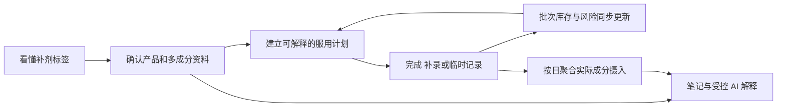

# 小补Q PRD

| 字段 | 内容 |
| --- | --- |
| 产品类型 | 个人补剂记录、执行、库存与摄入理解 H5 |
| 版本 | v0.1 |
| 日期 | 2026-09-13 |
| 状态 | 草稿 |

## 修改记录

| 日期 | 版本 | 变更 | 修改人 |
| --- | --- | --- | --- |
| 2026-09-13 | v0.1 | 初始化 PRD | [待确认] |

---

## 0. 文档基线

### 0.1 文档目的

本 PRD 定义小补Q完整产品目标，以及该目标在 `uni/` 正式工程上的实现合同。它用于统一产品、设计、前端、后端、测试和上线验收，不用于记录某一轮代码已经完成了什么。

本 PRD 与仓库内其他文档的关系如下：

- `uni/prd/PRD.md`：从本轮开始逐模块生成的完整目标 PRD，是未来需求评审的主文档。
- `uni/PRD.md`：Uni launch-beta 的历史范围和当前工程基线，不覆盖、不删除，也不再作为完整产品范围上限。
- `mvp/PRD.md`：完整产品思想、旧业务规则与交互设计的重要输入，但其中“药剂/药物/处方药”等历史表达不自动进入本 PRD。
- `uni/shaping/`：用户已确认的产品定型、版本裁决、功能差距和视觉基线，是本 PRD 的直接上游。

### 0.2 产品名称与当前形态

| 项目 | 当前定义 | 状态 |
| --- | --- | --- |
| 产品名 | 小补Q / Supp Q | `CONFIRMED` 暂用名；尚未完成公开品牌核验 |
| 产品类别 | 个人补剂记录、执行、库存与摄入理解产品 | `CONFIRMED` |
| 首发载体 | 移动优先 H5，桌面浏览器可用 | `CONFIRMED` |
| 后续载体 | 微信小程序可作为后续扩展，但当前不宣称可用 | `DEFERRED-ORDER` |
| 当前产品边界 | 只做补剂；不提供处方药能力或不可用的假入口 | `CONFIRMED` |
| 正式工程目录 | `uni/` | `CONFIRMED` |

### 0.3 证据状态

| 标签 | 使用条件 | PRD 中的处理方式 |
| --- | --- | --- |
| `CONFIRMED` | 用户已经明确确认 | 可写入产品合同；修改前必须重新确认 |
| `CODE-VERIFIED` | 已从当前代码、测试或可观察行为核对 | 可描述为当前实现事实，但不能自动等同于生产可用 |
| `DOCUMENTED` | 仅由已有文档声明 | 作为输入；落地前仍需代码或验收证据 |
| `DRAFT` | 为推进评审提出的方案 | 不能当作用户已经接受 |
| `OPEN` | 会改变范围、规则、数据或安全边界的问题 | 保留明确问题，不能自行补写答案 |
| `DEFERRED-ORDER` | 完整目标中的后续交付项 | 只改变顺序，不等于取消 |

### 0.4 来源裁决顺序

| 优先级 | 来源 | 本 PRD 中的用途 |
| --- | --- | --- |
| S1 | 用户明确确认 | 裁决最终意图、产品边界和冲突 |
| S2 | MVP 当前实现 | 完整用户功能、页面行为和交互母版 |
| S3 | `mvp/PRD.md` | 业务规则、对象、场景和历史边界 |
| S4 | MVP/Web 样式与页面 | 用户认可的视觉语言、信息层级和密度 |
| S5 | Uni 当前代码、契约和迁移 | 正式工程能力、数据权威及当前实现事实 |
| S6 | `uni/PRD.md` 与 `uni/docs/` | launch-beta 历史范围、架构和验收记录 |
| S7 | README、历史测试报告等 | 解释演进，不作为当前生产可用证明 |

发生冲突时遵循以下规则：

1. 用户已确认的当前决定覆盖旧目录名和旧文档表达。
2. MVP 代码与 MVP PRD 一致的能力进入完整目标候选；不一致的内容必须单独评审。
3. Uni 当前未实现的目标能力记为产品差距，不能据此删除。
4. Uni 已具备的更强工程语义原则上保留，除非它改变了用户已确认的产品行为。
5. 历史测试、健康检查、截图和 Mock/Fake 流程不能被表述为线上生产证明。

### 0.5 核心术语

| 术语 | 定义 |
| --- | --- |
| 补剂 | 用户主动记录的营养补充产品；当前产品不以药品分类、处方管理或治疗用途为目标 |
| 产品 | 药剂柜中的一项补剂主档，包含已确认资料、成分、计划、图片及状态 |
| 识别候选 | OCR/视觉/文本结构化产生、尚未经过用户确认的字段集合；不是产品事实 |
| 已确认资料 | 用户在确认页接受或编辑后保存的产品、成分、计划与初始库存数据 |
| 计划 | 决定指定日期是否产生待执行任务，以及时段/餐食提示的规则集合 |
| 今日任务 | 由指定日期有效计划派生的执行项，不单独成为第二套计划事实 |
| 服用记录 | 用户确认已经发生的摄入事实，包括计划完成、历史补录和临时服用 |
| 批次 | 一次初始库存或补货形成的独立库存单位，保留数量、有效期和成本信息 |
| FEFO | 优先从有效期更早的可用批次扣减，可按一次服用跨批次拆分 |
| 精确撤销 | 使用原服用记录的批次分配逐笔恢复库存，而不是重新推测应恢复哪个批次 |
| 摄入聚合 | 从有效服用记录、当时适用的已确认成分及手工成分记录派生的每日汇总 |
| 站内提醒 | 在小补Q界面内呈现的计划、漏服、低库存或临期提醒，不等于系统级消息已经送达 |
| 受控 AI | 只读取用户授权的已确认数据和明确参考资料，负责汇总解释而不拥有确定性规则的 AI 能力 |

## 1. 项目背景

### 1.1 用户问题

多补剂长期使用并不是单次“识别一张标签”的问题，而是一条持续变化的管理链路：

1. 新产品标签可能是英文，产品名、成分、每份含量、建议用法、总数量和有效期散落在不同位置。
2. 用户拥有多个产品时，周规则、间隔周期、服停周期、时段和餐食条件会形成持续记忆负担。
3. 实际生活中会发生按计划服用、漏记后补录、临时服用、误操作后撤销，静态清单无法保持真实历史。
4. 一项服用可能跨多个批次扣减；补货、余量、有效期和成本若不与记录联动，会迅速失真。
5. 同一成分可能来自多个产品，名称和单位不同，用户难以凭肉眼回答“某天实际摄入了多少、分别来自哪里”。
6. 搜索、通用 AI、相册、闹钟、备忘录和表格各自解决一个碎片，用户仍需重复录入和人工对账。

因此，单纯提升 OCR 准确率、增加一个产品列表或制作更漂亮的首页，都不能独立解决核心问题。产品必须让一份经过用户确认的数据在计划、今日执行、历史、库存、成分和解释中持续复用，并保持一致。

### 1.2 产品机会

小补Q的机会在于把当前分散在多个工具中的工作连成一个闭环：

这条链路的产品价值不来自功能数量本身，而来自四个连续性：

- **数据连续**：识别结果只确认一次，之后成为计划、库存和成分分析的共同输入。
- **时间连续**：计划变化保留版本，过去事实不会被未来设置改写。
- **操作连续**：完成、补录、临时服用和撤销都进入同一账本。
- **证据连续**：候选值、用户确认值、来源图片和后续修改可以区分并追溯。

### 1.3 为什么不是继续维护 MVP 或 Web

| 版本 | 已证明的价值 | 不能承担正式产品的原因 | 在目标方案中的角色 |
| --- | --- | --- | --- |
| MVP | 功能和页面最完整；承载用户的完整产品思想 | 主要是单机/localStorage 原型，无法成为可信的多设备和服务端数据基础 | 产品功能、交互和视觉母版 |
| Web | 与 MVP 保持相同主要前端和样式；证明旧界面可以运行在 Web 环境 | 核心仍是客户端状态加整包 JSON 同步，身份、并发、私有文件与领域事务不足 | 视觉/交互参照，不继续独立演进 |
| Uni | 已形成 H5、Go API/Worker、PostgreSQL、私有文件、身份隔离和事务化账本 | 当前用户侧能力比 MVP 窄，视觉也不是用户认可的目标 | 唯一正式工程底座，承接完整产品重建 |

所以，本项目不是“给 Uni 换皮”，也不是“把 MVP 搬到服务器”。正确任务是：在不退化 Uni 工程能力的前提下，恢复并重构 MVP 的完整用户价值和 MVP/Web 的视觉体验。

### 1.4 当前工程起点

根据当前代码和 Uni 历史文档，可把起点分为三类：

| 类型 | 当前事实 | 本 PRD 的处理 |
| --- | --- | --- |
| 可复用骨架 | 身份与邀请、隔离 Demo、服务端产品/计划/批次、异步识别任务、私有文件、FEFO、幂等、精确撤销、账户清理和运行监控已有基础 | 后续功能必须在这些能力上扩展，不退回客户端整包状态 |
| 明显产品差距 | 多成分确认、完整计划视图、成分日历/导出、成本账本界面、补剂 AI、笔记和健康上下文尚未完整覆盖 | 作为完整目标模块逐项定义，不因当前缺失而延期到“无计划” |
| 仍需外部验收 | 真实标签识别质量、生产域名/基础设施、真实邮件和通知送达、生产备份恢复等 | 在上线模块定义证据门槛；不得用历史 Fake/Mock 流程代替 |

### 1.5 本轮建设目标

本轮 PRD 要建立的是完整目标合同，而不是立即承诺一次性交付所有模块。后续研发可以按依赖关系分阶段，但必须满足：

- 每项完整目标能力都能追溯到明确模块、状态和验收标准。
- 阶段性版本明确说明“已实现、未实现、Mock/Fake、依赖外部条件”的区别。
- 用户侧体验以 MVP/Web 为基线，工程与数据语义以 Uni 为基础。
- 确定性计划、库存、聚合和风险规则由代码与数据保证，不能交给 LLM 猜测。
- 修改已经确认的范围、安全边界、公式、权限或状态流转前，必须重新评审。

### 1.6 高层非目标

以下内容不进入当前产品合同：

- 处方药管理、处方合理性判断、诊断、治疗建议或自动剂量推荐。
- 为未来药品能力放置不可用的假入口。
- 由 AI 输出确定服用计划、库存数字、单位换算或风险结论。
- 医生端、家庭成员协作、社区内容流、电商购买闭环和支付会员体系。
- 在当前阶段声称微信小程序、系统级外部推送或生产环境已经可用。
- 为追求视觉一致而复制 MVP/Web 的 localStorage、整包同步或其他旧工程限制。

### 1.7 本模块确认结果

- 本模块没有新增产品范围；它只把用户已经确认的版本关系、补剂边界和工程方向写成 PRD 基线。
- 本模块没有把 Uni 历史 launch-beta 的 Deferred 清单当成完整产品范围。
- 本模块无新增待决问题。

## 2. 用户、JTBD 与核心场景

### 2.1 用户定义原则

小补Q不以年龄、性别或消费水平划分核心用户，而以用户正在承担的管理复杂度划分。真正决定产品价值的变量是：同时管理的补剂数量、计划差异、持续周期、标签理解成本、库存批次数量，以及用户是否需要回看实际摄入。

因此，“买过补剂的人”过于宽泛；“同时长期管理多种补剂，并希望记录与库存保持一致的人”才是本产品应优先优化的对象。

### 2.2 用户优先级

| 层级 | 用户类型 | 行为特征 | 主要问题 | 小补Q承担的任务 | 证据状态 |
| --- | --- | --- | --- | --- | --- |
| P0 核心用户 | 多补剂长期自我管理者 | 同时使用多个补剂；计划、时段或周期不同；需要持续执行和回看 | 靠记忆容易漏记；计划、记录、库存和成分信息彼此分散 | 建档后持续生成今日任务，把实际记录与库存、摄入聚合联动 | `DOCUMENTED`，尚无真实用户研究或行为数据 |
| P1 进入型用户 | 外文/复杂标签补剂使用者 | 新购产品标签为英文，关键信息分布在正面、成分表和有效期区域 | 手工录入慢，翻译与字段理解容易出错 | 三槽采集、识别、翻译、证据和一次人工确认 | `DOCUMENTED`，已有产品流程，无真实转化基线 |
| P1 深度用户 | 库存与批次敏感使用者 | 有多瓶或多批次；关心余量、临期、补货和成本 | 只记总数会丢失批次、消耗顺序与真实成本 | FEFO、精确撤销、预计耗尽、临期和成本账本 | `CODE-VERIFIED` 有领域基础，使用价值待验证 |
| 使用情境 | 首次 Demo 体验者 | 尚未注册或不愿立即上传真实资料 | 无法在空白状态理解完整产品价值 | 使用隔离示例数据体验主流程，随后决定是否注册 | `CODE-VERIFIED` Uni 已有隔离 Demo；不是独立商业客群 |

### 2.3 非优先用户

| 用户/场景 | 当前处理 |
| --- | --- |
| 只偶尔服用一种简单补剂、无需提醒或回看的人 | 可以使用基础记录，但其痛点不足以驱动完整产品设计 |
| 处方药管理者 | 当前不服务，不展示入口；未来若扩展必须重新评审记录和 AI 边界 |
| 医生、药师、营养师等专业工作者 | 当前没有专业端、患者管理、处方审核或协作工作流 |
| 家庭负责人替多人管理 | 当前没有成员、代理操作和成员级权限模型 |
| 只想获得购买推荐或完成交易的人 | 当前不做商品推荐、电商导购和支付闭环 |

“非优先”不等于技术上必须阻止使用，而是不得为了这些场景牺牲 P0 用户的执行效率和数据一致性。

### 2.4 核心 Job Story

> 当我开始或持续使用多种补剂时，我想用尽可能少的手工操作建立产品资料、服用计划和库存，并在每天的真实变化中持续校正，从而确信自己今天做对了、过去有记录、接下来不会毫无准备。

核心工作不是“保存产品”，而是维持一个随时间变化、仍然可信的个人补剂事实系统。

### 2.5 Job Map

| 阶段 | 触发情境 | 用户想完成的工作 | 期望进展 | 可观察成功状态 |
| --- | --- | --- | --- | --- |
| 看懂 | 拿到一瓶新补剂，标签复杂或为英文 | 快速获得可检查的结构化资料 | 不必逐项抄写，也不会被识别结果强迫接受错误信息 | 原文、中文、结构字段和证据可对照；错误可改；失败可手工继续 |
| 建档 | 确认产品资料后准备开始使用 | 同时建立计划和初始库存 | 一次输入可以支撑之后的执行、库存和聚合 | 产品、多成分、计划和批次在一次确认后保持关联 |
| 规划 | 多个产品的日期、周期、时段或餐食条件不同 | 把复杂规则表达清楚 | 以后只需查看今天，而不是每天重新计算 | 指定日期产生稳定、可解释的任务；修改未来不改写过去 |
| 执行 | 到达某个时段或打开今日页 | 快速知道该做什么并记录事实 | 低注意力成本完成当天动作 | 一次操作创建服用记录并更新对应批次库存 |
| 修正 | 忘记记录、临时服用或误点完成 | 补记真实发生的事情或撤销错误 | 历史、库存和成分结果重新一致 | 补录归属正确日期；临时服用进入同一账本；撤销精确恢复原批次 |
| 持续 | 新开一瓶、库存减少或接近有效期 | 保持供应连续并降低浪费 | 在断货或过期前获得可执行信号 | 新批次可追加；FEFO 消耗；耗尽和临期风险可解释 |
| 理解 | 想回看某天实际摄入了哪些成分 | 跨产品汇总并追溯来源 | 不再逐瓶心算或混淆不同单位 | 可兼容单位正确合并；不可兼容单位分开展示；来源可展开 |
| 沉淀 | 对某产品有体验、疑问或需要解释 | 将个人记录与资料解释留在同一上下文 | 下次无需重新描述整个背景 | 笔记可持续编辑；AI 区分用户事实、参考资料和解释 |
| 控制 | 换设备、导出或停止使用 | 保留对个人数据的控制 | 不被单一浏览器状态锁定 | 登录后数据连续；可以导出；删除账户后相关数据和文件按合同清理 |

### 2.6 任务分层

| 任务类型 | 用户目标 | 产品含义 |
| --- | --- | --- |
| 功能任务 | 建档、规划、提醒、执行、补录、临时服用、撤销、批次管理、成本记录、临期管理、成分聚合、导出、笔记和解释 | 必须形成可执行流程和可验收状态，不能只作为信息展示 |
| 情感任务 | 降低“是不是漏了、记错了、快没了、信息是否可信”的持续不确定感 | 可编辑、证据、明确反馈、精确撤销和风险说明是核心体验，不是附属文案 |
| 社会任务 | 在需要向未来的自己或可信任的人说明时，能拿出整洁、可追溯的事实记录 | 当前只要求记录和导出，不因此扩张到家庭协作或专业工作台 |

### 2.7 核心场景

#### 场景 A：用三类资料建立一个新产品

用户购买一瓶英文补剂，通过产品正面、成分表和有效期区域提供资料。系统分别处理图片，保留识别原文、中文、结构化候选、置信状态与证据。用户可以替换某一张图、手工填写某一部分，并在一个确认页完成产品、多成分、计划与初始批次的检查。

成功不是“模型返回了 JSON”，而是用户在可理解、可修正的情况下完成了可信建档；识别失败时，手工路径仍可完成相同结果。

#### 场景 B：每天按时段完成计划

用户打开今日页，先看到指定日期、完成进度、下一时段和需要处理的产品。列表只展示完成当前决策所需的名称、服用量、时段/餐食、状态、余量和风险。用户点击完成后，系统在同一事务语义下创建记录并扣减批次库存。

这个场景决定长期使用价值。页面的首要目标是快速扫描与低摩擦执行，不是展示完整产品配置。

#### 场景 C：补录、临时服用和撤销

用户事后想起昨天已经服用，选择历史日期补录；或今天临时服用一个未命中计划的产品，从药剂柜选择并记录；若误操作，再撤销最近记录。三种操作都进入同一服用账本，并同步影响库存和成分聚合。

成功标准是“修正后重新一致”，而不是简单地在界面上增删一行。

#### 场景 D：补货、换批次和提前处理风险

用户新开一瓶或补货时追加批次，而不是覆盖总库存。系统按 FEFO 消耗，在库存不足、预计耗尽早于下一补货时间或批次可能过期时给出明确提示。撤销历史服用时恢复原先使用过的批次。

#### 场景 E：回看某日实际摄入

用户进入成分日历，选择某天查看实际摄入。系统从有效服用记录和产品成分派生汇总，并合并手工成分记录。用户可以展开每个成分的产品来源、次数和换算过程，也能识别哪些单位不能直接合并。

#### 场景 F：基于确认数据获取解释并沉淀笔记

用户从产品或成分进入 AI，对已确认标签、实际摄入或个人笔记提出问题。系统只能做机械汇总、资料解释和来源提示；不得判断用户应该改变剂量、给出诊断或形成相互作用结论。用户可以把有价值的解释保存为带来源的笔记。

#### 场景 G：先用 Demo 理解，再建立自己的空白账户

首次访问者进入彼此隔离的 Demo 工作区，以示例产品体验今日、记录、库存和识别确认。注册或登录后进入独立真实工作区，Demo 数据不自动迁移，避免把示例或试验数据混入个人记录。

### 2.8 用户旅程与价值递进

| 旅程阶段 | 用户判断 | 产品必须证明什么 | 失败后果 |
| --- | --- | --- | --- |
| 进入 | “它是否值得我录入资料？” | Demo 能展示闭环；新增入口清晰 | 用户在空白页离开 |
| 首次建档 | “识别结果可信吗、改起来麻烦吗？” | 候选不是强制事实；错误可改；手工可完成 | 用户不敢保存或录入成本过高 |
| 首次执行 | “今天页面真的能替我记住吗？” | 任务与计划一致，完成反馈明确 | 产品退化为一次性 OCR 工具 |
| 真实修正 | “漏记或误点后会不会全乱？” | 补录、临时记录、撤销和库存保持一致 | 信任一旦破坏，很难恢复 |
| 长期使用 | “它能否提前告诉我问题并帮助回顾？” | 预测、临期、成分日历和导出可追溯 | 用户重新回到表格、闹钟和心算 |

### 2.9 替代方案与四力

用户当前并不是在小补Q与某一个直接竞品之间选择，而是在小补Q与“相册 + 翻译/搜索 + 备忘录 + 闹钟 + 表格 + 通用 AI + 记忆”这一组合之间选择。

| Push：旧方法的推力 | Pull：小补Q的吸引力 | Anxiety：采用顾虑 | Habit：维持现状的惯性 |
| --- | --- | --- | --- |
| 多瓶、多时段和多周期带来记忆负担；信息分散；库存靠感觉；历史难回看 | 拍照降低建档成本；今日一屏执行；记录和库存联动；摄入可聚合；解释连接个人上下文 | OCR/AI 是否会错；资料是否安全；误点能否恢复；计划和库存算法是否可信；迁移后原功能是否丢失 | 继续拍照不整理；使用系统闹钟；在备忘录或表格手工记；临时向通用 AI 提问 |

### 2.10 产品价值层级判断

`DRAFT`：本 PRD 建议采用以下价值层级，后续功能优先级和指标均以此为基础：

1. **进入引擎：拍照识别与翻译。** 它显著降低首次建档成本，是让用户愿意开始的关键，但使用频率天然较低。
2. **留存引擎：今日执行 + 记录/撤销 + 库存联动。** 它处理每天反复发生的任务，是产品能否持续使用的核心。
3. **信任底座：人工确认、证据、确定性规则、历史版本和精确恢复。** 它不一定直接获客，却决定用户是否敢长期依赖数据。
4. **长期增值：成分日历、成本、笔记、健康上下文和受控 AI。** 它让长期积累的数据产生复利，而不是停留在打卡工具。

这意味着产品对外可以用“拍照看懂并快速建档”降低理解门槛，但产品内部不能用 OCR 成功率代替长期价值。真正的核心结果是用户持续依赖今日清单，且在真实修正后仍相信记录与库存。

### 2.11 待验证假设

当前仓库没有真实用户访谈、行为分析或规模化使用数据。以下判断仍需通过用户研究或上线数据验证，不能写成已经成立：

| 编号 | 假设 | 失败信号 | 建议验证方式 |
| --- | --- | --- | --- |
| H1 | 用户愿意在首次建档时完成一次结构化确认，以换取后续低摩擦执行 | 大量用户在确认页退出或只保存极少字段 | 漏斗埋点 + 5–8 名目标用户可用性测试 |
| H2 | 今日执行与库存联动比单次识别更能驱动持续使用 | 建档后很少再次打开今日页，但反复使用识别 | 建档后 7/30 天分功能留存与访谈 |
| H3 | 证据、可编辑和精确撤销能够建立对自动化结果的信任 | 用户频繁线下复核或因一次错误弃用 | 错误修正任务测试 + 弃用原因访谈 |
| H4 | 成分聚合和来源追溯能为长期用户提供额外价值 | 用户很少打开成分页或不理解换算结果 | 概念测试 + 页面任务完成率 |
| H5 | 隔离 Demo 能帮助理解产品，而不会使用户误以为示例是自己的数据 | Demo 访问后无法理解如何开始真实建档 | 首次访问测试 + Demo 到注册/建档转化 |

样本数和目标阈值将在模块 3 与模块 17 中结合指标和埋点进一步定义；这里的 `5–8 名`仅是发现主要可用性问题的首轮研究建议，不是统计性结论。

### 2.12 本模块确认点

本模块需要确认一项产品判断：

> 是否接受“拍照识别是进入引擎，今日执行 + 记录/撤销 + 库存联动是留存引擎”这一价值优先级？

如不接受，后续目标指标、首页结构和交付优先级都需要相应调整。
