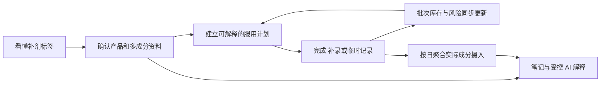
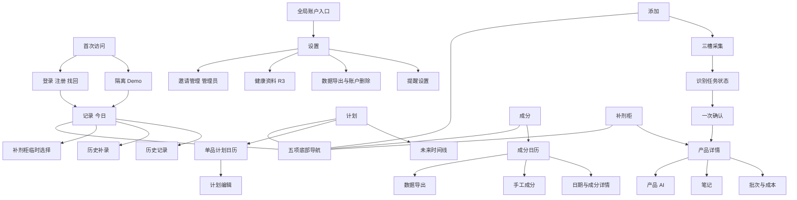
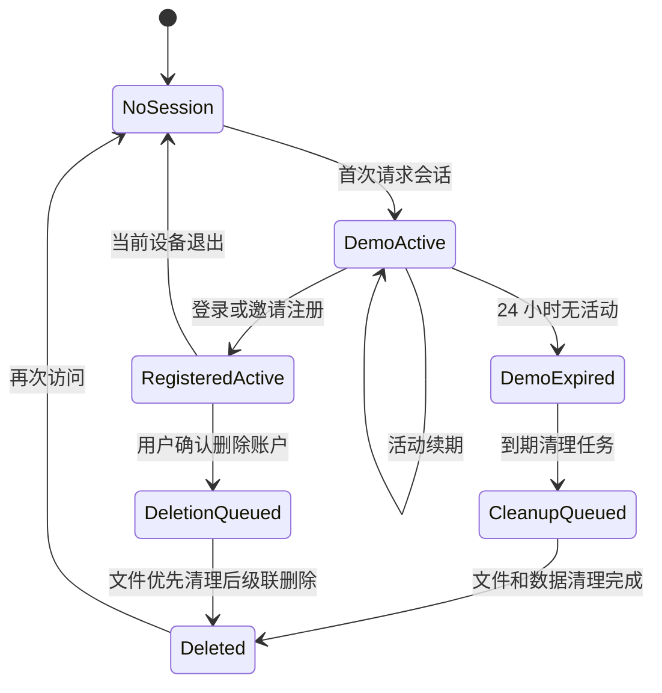
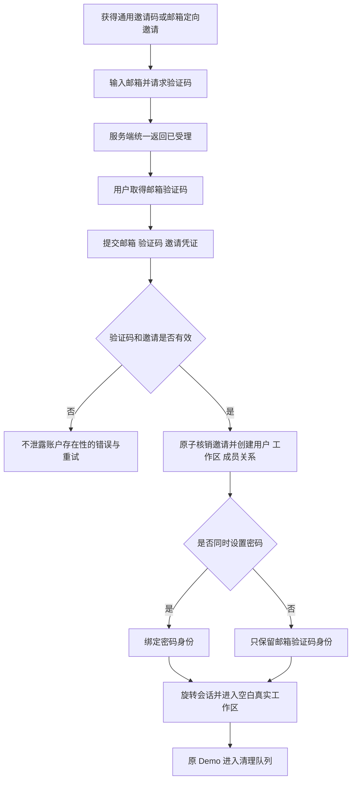

# 小补Q PRD

| 字段 | 内容 |
| --- | --- |
| 产品类型 | 个人补剂记录、执行、库存与摄入理解 H5 |
| 版本 | v0.1 |
| 日期 | 2026-09-13 |
| 状态 | 草稿 |

## 修改记录

| 日期 | 版本 | 变更 | 修改人 |
| --- | --- | --- | --- |
| 2026-09-13 | v0.1 | 初始化 PRD | [待确认] |

---

## 0. 文档基线

### 0.1 文档目的

本 PRD 定义小补Q完整产品目标，以及该目标在 `uni/` 正式工程上的实现合同。它用于统一产品、设计、前端、后端、测试和上线验收，不用于记录某一轮代码已经完成了什么。

本 PRD 与仓库内其他文档的关系如下：

- `uni/prd/PRD.md`：从本轮开始逐模块生成的完整目标 PRD，是未来需求评审的主文档。
- `uni/PRD.md`：Uni launch-beta 的历史范围和当前工程基线，不覆盖、不删除，也不再作为完整产品范围上限。
- `mvp/PRD.md`：完整产品思想、旧业务规则与交互设计的重要输入，但其中“药剂/药物/处方药”等历史表达不自动进入本 PRD。
- `uni/shaping/`：用户已确认的产品定型、版本裁决、功能差距和视觉基线，是本 PRD 的直接上游。

### 0.2 产品名称与当前形态

| 项目 | 当前定义 | 状态 |
| --- | --- | --- |
| 产品名 | 小补Q / Supp Q | `CONFIRMED` 暂用名；尚未完成公开品牌核验 |
| 产品类别 | 个人补剂记录、执行、库存与摄入理解产品 | `CONFIRMED` |
| 首发载体 | 移动优先 H5，桌面浏览器可用 | `CONFIRMED` |
| 后续载体 | 微信小程序可作为后续扩展，但当前不宣称可用 | `DEFERRED-ORDER` |
| 当前产品边界 | 只做补剂；不提供处方药能力或不可用的假入口 | `CONFIRMED` |
| 正式工程目录 | `uni/` | `CONFIRMED` |

### 0.3 证据状态

| 标签 | 使用条件 | PRD 中的处理方式 |
| --- | --- | --- |
| `CONFIRMED` | 用户已经明确确认 | 可写入产品合同；修改前必须重新确认 |
| `CODE-VERIFIED` | 已从当前代码、测试或可观察行为核对 | 可描述为当前实现事实，但不能自动等同于生产可用 |
| `DOCUMENTED` | 仅由已有文档声明 | 作为输入；落地前仍需代码或验收证据 |
| `DRAFT` | 为推进评审提出的方案 | 不能当作用户已经接受 |
| `OPEN` | 会改变范围、规则、数据或安全边界的问题 | 保留明确问题，不能自行补写答案 |
| `DEFERRED-ORDER` | 完整目标中的后续交付项 | 只改变顺序，不等于取消 |

### 0.4 来源裁决顺序

| 优先级 | 来源 | 本 PRD 中的用途 |
| --- | --- | --- |
| S1 | 用户明确确认 | 裁决最终意图、产品边界和冲突 |
| S2 | MVP 当前实现 | 完整用户功能、页面行为和交互母版 |
| S3 | `mvp/PRD.md` | 业务规则、对象、场景和历史边界 |
| S4 | MVP/Web 样式与页面 | 用户认可的视觉语言、信息层级和密度 |
| S5 | Uni 当前代码、契约和迁移 | 正式工程能力、数据权威及当前实现事实 |
| S6 | `uni/PRD.md` 与 `uni/docs/` | launch-beta 历史范围、架构和验收记录 |
| S7 | README、历史测试报告等 | 解释演进，不作为当前生产可用证明 |

发生冲突时遵循以下规则：

1. 用户已确认的当前决定覆盖旧目录名和旧文档表达。
2. MVP 代码与 MVP PRD 一致的能力进入完整目标候选；不一致的内容必须单独评审。
3. Uni 当前未实现的目标能力记为产品差距，不能据此删除。
4. Uni 已具备的更强工程语义原则上保留，除非它改变了用户已确认的产品行为。
5. 历史测试、健康检查、截图和 Mock/Fake 流程不能被表述为线上生产证明。

### 0.5 核心术语

| 术语 | 定义 |
| --- | --- |
| 补剂 | 用户主动记录的营养补充产品；当前产品不以药品分类、处方管理或治疗用途为目标 |
| 产品 | 补剂柜中的一项补剂主档，包含已确认资料、成分、计划、图片及状态 |
| 识别候选 | OCR/视觉/文本结构化产生、尚未经过用户确认的字段集合；不是产品事实 |
| 已确认资料 | 用户在确认页接受或编辑后保存的产品、成分、计划与初始库存数据 |
| 计划 | 决定指定日期是否产生待执行任务，以及时段/餐食提示的规则集合 |
| 今日任务 | 由指定日期有效计划派生的执行项，不单独成为第二套计划事实 |
| 服用记录 | 用户确认已经发生的摄入事实，包括计划完成、历史补录和临时服用 |
| 批次 | 一次初始库存或补货形成的独立库存单位，保留数量、有效期和成本信息 |
| FEFO | 优先从有效期更早的可用批次扣减，可按一次服用跨批次拆分 |
| 精确撤销 | 使用原服用记录的批次分配逐笔恢复库存，而不是重新推测应恢复哪个批次 |
| 摄入聚合 | 从有效服用记录、当时适用的已确认成分及手工成分记录派生的每日汇总 |
| 站内提醒 | 在小补Q界面内呈现的计划、漏服、低库存或临期提醒，不等于系统级消息已经送达 |
| 受控 AI | 只读取用户授权的已确认数据和明确参考资料，负责汇总解释而不拥有确定性规则的 AI 能力 |

## 1. 项目背景

### 1.1 用户问题

多补剂长期使用并不是单次“识别一张标签”的问题，而是一条持续变化的管理链路：

1. 新产品标签可能是英文，产品名、成分、每份含量、建议用法、总数量和有效期散落在不同位置。
2. 用户拥有多个产品时，周规则、间隔周期、服停周期、时段和餐食条件会形成持续记忆负担。
3. 实际生活中会发生按计划服用、漏记后补录、临时服用、误操作后撤销，静态清单无法保持真实历史。
4. 一项服用可能跨多个批次扣减；补货、余量、有效期和成本若不与记录联动，会迅速失真。
5. 同一成分可能来自多个产品，名称和单位不同，用户难以凭肉眼回答“某天实际摄入了多少、分别来自哪里”。
6. 搜索、通用 AI、相册、闹钟、备忘录和表格各自解决一个碎片，用户仍需重复录入和人工对账。

因此，单纯提升 OCR 准确率、增加一个产品列表或制作更漂亮的首页，都不能独立解决核心问题。产品必须让一份经过用户确认的数据在计划、今日执行、历史、库存、成分和解释中持续复用，并保持一致。

### 1.2 产品机会

小补Q的机会在于把当前分散在多个工具中的工作连成一个闭环：



这条链路的产品价值不来自功能数量本身，而来自四个连续性：

- **数据连续**：识别结果只确认一次，之后成为计划、库存和成分分析的共同输入。
- **时间连续**：计划变化保留版本，过去事实不会被未来设置改写。
- **操作连续**：完成、补录、临时服用和撤销都进入同一账本。
- **证据连续**：候选值、用户确认值、来源图片和后续修改可以区分并追溯。

### 1.3 为什么不是继续维护 MVP 或 Web

| 版本 | 已证明的价值 | 不能承担正式产品的原因 | 在目标方案中的角色 |
| --- | --- | --- | --- |
| MVP | 功能和页面最完整；承载用户的完整产品思想 | 主要是单机/localStorage 原型，无法成为可信的多设备和服务端数据基础 | 产品功能、交互和视觉母版 |
| Web | 与 MVP 保持相同主要前端和样式；证明旧界面可以运行在 Web 环境 | 核心仍是客户端状态加整包 JSON 同步，身份、并发、私有文件与领域事务不足 | 视觉/交互参照，不继续独立演进 |
| Uni | 已形成 H5、Go API/Worker、PostgreSQL、私有文件、身份隔离和事务化账本 | 当前用户侧能力比 MVP 窄，视觉也不是用户认可的目标 | 唯一正式工程底座，承接完整产品重建 |

所以，本项目不是“给 Uni 换皮”，也不是“把 MVP 搬到服务器”。正确任务是：在不退化 Uni 工程能力的前提下，恢复并重构 MVP 的完整用户价值和 MVP/Web 的视觉体验。

### 1.4 当前工程起点

根据当前代码和 Uni 历史文档，可把起点分为三类：

| 类型 | 当前事实 | 本 PRD 的处理 |
| --- | --- | --- |
| 可复用骨架 | 身份与邀请、隔离 Demo、服务端产品/计划/批次、异步识别任务、私有文件、FEFO、幂等、精确撤销、账户清理和运行监控已有基础 | 后续功能必须在这些能力上扩展，不退回客户端整包状态 |
| 明显产品差距 | 多成分确认、完整计划视图、成分日历/导出、成本账本界面、补剂 AI、笔记和健康上下文尚未完整覆盖 | 作为完整目标模块逐项定义，不因当前缺失而延期到“无计划” |
| 仍需外部验收 | 真实标签识别质量、生产域名/基础设施、真实邮件和通知送达、生产备份恢复等 | 在上线模块定义证据门槛；不得用历史 Fake/Mock 流程代替 |

### 1.5 本轮建设目标

本轮 PRD 要建立的是完整目标合同，而不是立即承诺一次性交付所有模块。后续研发可以按依赖关系分阶段，但必须满足：

- 每项完整目标能力都能追溯到明确模块、状态和验收标准。
- 阶段性版本明确说明“已实现、未实现、Mock/Fake、依赖外部条件”的区别。
- 用户侧体验以 MVP/Web 为基线，工程与数据语义以 Uni 为基础。
- 确定性计划、库存、聚合和风险规则由代码与数据保证，不能交给 LLM 猜测。
- 修改已经确认的范围、安全边界、公式、权限或状态流转前，必须重新评审。

### 1.6 高层非目标

以下内容不进入当前产品合同：

- 处方药管理、处方合理性判断、诊断、治疗建议或自动剂量推荐。
- 为未来药品能力放置不可用的假入口。
- 由 AI 输出确定服用计划、库存数字、单位换算或风险结论。
- 医生端、家庭成员协作、社区内容流、电商购买闭环和支付会员体系。
- 在当前阶段声称微信小程序、系统级外部推送或生产环境已经可用。
- 为追求视觉一致而复制 MVP/Web 的 localStorage、整包同步或其他旧工程限制。

### 1.7 本模块确认结果

- 本模块没有新增产品范围；它只把用户已经确认的版本关系、补剂边界和工程方向写成 PRD 基线。
- 本模块没有把 Uni 历史 launch-beta 的 Deferred 清单当成完整产品范围。
- 本模块无新增待决问题。

## 2. 用户、JTBD 与核心场景

### 2.1 用户定义原则

小补Q不以年龄、性别或消费水平划分核心用户，而以用户正在承担的管理复杂度划分。真正决定产品价值的变量是：同时管理的补剂数量、计划差异、持续周期、标签理解成本、库存批次数量，以及用户是否需要回看实际摄入。

因此，“买过补剂的人”过于宽泛；“同时长期管理多种补剂，并希望记录与库存保持一致的人”才是本产品应优先优化的对象。

### 2.2 用户优先级

| 层级 | 用户类型 | 行为特征 | 主要问题 | 小补Q承担的任务 | 证据状态 |
| --- | --- | --- | --- | --- | --- |
| P0 核心用户 | 多补剂长期自我管理者 | 同时使用多个补剂；计划、时段或周期不同；需要持续执行和回看 | 靠记忆容易漏记；计划、记录、库存和成分信息彼此分散 | 建档后持续生成今日任务，把实际记录与库存、摄入聚合联动 | `DOCUMENTED`，尚无真实用户研究或行为数据 |
| P1 进入型用户 | 外文/复杂标签补剂使用者 | 新购产品标签为英文，关键信息分布在正面、成分表和有效期区域 | 手工录入慢，翻译与字段理解容易出错 | 三槽采集、识别、翻译、证据和一次人工确认 | `DOCUMENTED`，已有产品流程，无真实转化基线 |
| P1 深度用户 | 库存与批次敏感使用者 | 有多瓶或多批次；关心余量、临期、补货和成本 | 只记总数会丢失批次、消耗顺序与真实成本 | FEFO、精确撤销、预计耗尽、临期和成本账本 | `CODE-VERIFIED` 有领域基础，使用价值待验证 |
| 使用情境 | 首次 Demo 体验者 | 尚未注册或不愿立即上传真实资料 | 无法在空白状态理解完整产品价值 | 使用隔离示例数据体验主流程，随后决定是否注册 | `CODE-VERIFIED` Uni 已有隔离 Demo；不是独立商业客群 |

### 2.3 非优先用户

| 用户/场景 | 当前处理 |
| --- | --- |
| 只偶尔服用一种简单补剂、无需提醒或回看的人 | 可以使用基础记录，但其痛点不足以驱动完整产品设计 |
| 处方药管理者 | 当前不服务，不展示入口；未来若扩展必须重新评审记录和 AI 边界 |
| 医生、药师、营养师等专业工作者 | 当前没有专业端、患者管理、处方审核或协作工作流 |
| 家庭负责人替多人管理 | 当前没有成员、代理操作和成员级权限模型 |
| 只想获得购买推荐或完成交易的人 | 当前不做商品推荐、电商导购和支付闭环 |

“非优先”不等于技术上必须阻止使用，而是不得为了这些场景牺牲 P0 用户的执行效率和数据一致性。

### 2.4 核心 Job Story

> 当我开始或持续使用多种补剂时，我想用尽可能少的手工操作建立产品资料、服用计划和库存，并在每天的真实变化中持续校正，从而确信自己今天做对了、过去有记录、接下来不会毫无准备。

核心工作不是“保存产品”，而是维持一个随时间变化、仍然可信的个人补剂事实系统。

### 2.5 Job Map

| 阶段 | 触发情境 | 用户想完成的工作 | 期望进展 | 可观察成功状态 |
| --- | --- | --- | --- | --- |
| 看懂 | 拿到一瓶新补剂，标签复杂或为英文 | 快速获得可检查的结构化资料 | 不必逐项抄写，也不会被识别结果强迫接受错误信息 | 原文、中文、结构字段和证据可对照；错误可改；失败可手工继续 |
| 建档 | 确认产品资料后准备开始使用 | 同时建立计划和初始库存 | 一次输入可以支撑之后的执行、库存和聚合 | 产品、多成分、计划和批次在一次确认后保持关联 |
| 规划 | 多个产品的日期、周期、时段或餐食条件不同 | 把复杂规则表达清楚 | 以后只需查看今天，而不是每天重新计算 | 指定日期产生稳定、可解释的任务；修改未来不改写过去 |
| 执行 | 到达某个时段或打开今日页 | 快速知道该做什么并记录事实 | 低注意力成本完成当天动作 | 一次操作创建服用记录并更新对应批次库存 |
| 修正 | 忘记记录、临时服用或误点完成 | 补记真实发生的事情或撤销错误 | 历史、库存和成分结果重新一致 | 补录归属正确日期；临时服用进入同一账本；撤销精确恢复原批次 |
| 持续 | 新开一瓶、库存减少或接近有效期 | 保持供应连续并降低浪费 | 在断货或过期前获得可执行信号 | 新批次可追加；FEFO 消耗；耗尽和临期风险可解释 |
| 理解 | 想回看某天实际摄入了哪些成分 | 跨产品汇总并追溯来源 | 不再逐瓶心算或混淆不同单位 | 可兼容单位正确合并；不可兼容单位分开展示；来源可展开 |
| 沉淀 | 对某产品有体验、疑问或需要解释 | 将个人记录与资料解释留在同一上下文 | 下次无需重新描述整个背景 | 笔记可持续编辑；AI 区分用户事实、参考资料和解释 |
| 控制 | 换设备、导出或停止使用 | 保留对个人数据的控制 | 不被单一浏览器状态锁定 | 登录后数据连续；可以导出；删除账户后相关数据和文件按合同清理 |

### 2.6 任务分层

| 任务类型 | 用户目标 | 产品含义 |
| --- | --- | --- |
| 功能任务 | 建档、规划、提醒、执行、补录、临时服用、撤销、批次管理、成本记录、临期管理、成分聚合、导出、笔记和解释 | 必须形成可执行流程和可验收状态，不能只作为信息展示 |
| 情感任务 | 降低“是不是漏了、记错了、快没了、信息是否可信”的持续不确定感 | 可编辑、证据、明确反馈、精确撤销和风险说明是核心体验，不是附属文案 |
| 社会任务 | 在需要向未来的自己或可信任的人说明时，能拿出整洁、可追溯的事实记录 | 当前只要求记录和导出，不因此扩张到家庭协作或专业工作台 |

### 2.7 核心场景

#### 场景 A：用三类资料建立一个新产品

用户购买一瓶英文补剂，通过产品正面、成分表和有效期区域提供资料。系统分别处理图片，保留识别原文、中文、结构化候选、置信状态与证据。用户可以替换某一张图、手工填写某一部分，并在一个确认页完成产品、多成分、计划与初始批次的检查。

成功不是“模型返回了 JSON”，而是用户在可理解、可修正的情况下完成了可信建档；识别失败时，手工路径仍可完成相同结果。

#### 场景 B：每天按时段完成计划

用户打开今日页，先看到指定日期、完成进度、下一时段和需要处理的产品。列表只展示完成当前决策所需的名称、服用量、时段/餐食、状态、余量和风险。用户点击完成后，系统在同一事务语义下创建记录并扣减批次库存。

这个场景决定长期使用价值。页面的首要目标是快速扫描与低摩擦执行，不是展示完整产品配置。

#### 场景 C：补录、临时服用和撤销

用户事后想起昨天已经服用，选择历史日期补录；或今天临时服用一个未命中计划的产品，从补剂柜选择并记录；若误操作，再撤销最近记录。三种操作都进入同一服用账本，并同步影响库存和成分聚合。

成功标准是“修正后重新一致”，而不是简单地在界面上增删一行。

#### 场景 D：补货、换批次和提前处理风险

用户新开一瓶或补货时追加批次，而不是覆盖总库存。系统按 FEFO 消耗，在库存不足、预计耗尽早于下一补货时间或批次可能过期时给出明确提示。撤销历史服用时恢复原先使用过的批次。

#### 场景 E：回看某日实际摄入

用户进入成分日历，选择某天查看实际摄入。系统从有效服用记录和产品成分派生汇总，并合并手工成分记录。用户可以展开每个成分的产品来源、次数和换算过程，也能识别哪些单位不能直接合并。

#### 场景 F：基于确认数据获取解释并沉淀笔记

用户从产品或成分进入 AI，对已确认标签、实际摄入或个人笔记提出问题。系统只能做机械汇总、资料解释和来源提示；不得判断用户应该改变剂量、给出诊断或形成相互作用结论。用户可以把有价值的解释保存为带来源的笔记。

#### 场景 G：先用 Demo 理解，再建立自己的空白账户

首次访问者进入彼此隔离的 Demo 工作区，以示例产品体验今日、记录、库存和识别确认。注册或登录后进入独立真实工作区，Demo 数据不自动迁移，避免把示例或试验数据混入个人记录。

### 2.8 用户旅程与价值递进


| 旅程阶段 | 用户判断 | 产品必须证明什么 | 失败后果 |
| --- | --- | --- | --- |
| 进入 | “它是否值得我录入资料？” | Demo 能展示闭环；新增入口清晰 | 用户在空白页离开 |
| 首次建档 | “识别结果可信吗、改起来麻烦吗？” | 候选不是强制事实；错误可改；手工可完成 | 用户不敢保存或录入成本过高 |
| 首次执行 | “今天页面真的能替我记住吗？” | 任务与计划一致，完成反馈明确 | 产品退化为一次性 OCR 工具 |
| 真实修正 | “漏记或误点后会不会全乱？” | 补录、临时记录、撤销和库存保持一致 | 信任一旦破坏，很难恢复 |
| 长期使用 | “它能否提前告诉我问题并帮助回顾？” | 预测、临期、成分日历和导出可追溯 | 用户重新回到表格、闹钟和心算 |

### 2.9 替代方案与四力

用户当前并不是在小补Q与某一个直接竞品之间选择，而是在小补Q与“相册 + 翻译/搜索 + 备忘录 + 闹钟 + 表格 + 通用 AI + 记忆”这一组合之间选择。

| Push：旧方法的推力 | Pull：小补Q的吸引力 | Anxiety：采用顾虑 | Habit：维持现状的惯性 |
| --- | --- | --- | --- |
| 多瓶、多时段和多周期带来记忆负担；信息分散；库存靠感觉；历史难回看 | 拍照降低建档成本；今日一屏执行；记录和库存联动；摄入可聚合；解释连接个人上下文 | OCR/AI 是否会错；资料是否安全；误点能否恢复；计划和库存算法是否可信；迁移后原功能是否丢失 | 继续拍照不整理；使用系统闹钟；在备忘录或表格手工记；临时向通用 AI 提问 |

### 2.10 产品价值层级判断

`CONFIRMED`：采用以下价值层级，后续功能优先级和指标均以此为基础：

1. **进入引擎：拍照识别与翻译。** 它显著降低首次建档成本，是让用户愿意开始的关键，但使用频率天然较低。
2. **留存引擎：今日执行 + 记录/撤销 + 库存联动。** 它处理每天反复发生的任务，是产品能否持续使用的核心。
3. **信任底座：人工确认、证据、确定性规则、历史版本和精确恢复。** 它不一定直接获客，却决定用户是否敢长期依赖数据。
4. **长期增值：成分日历、成本、笔记、健康上下文和受控 AI。** 它让长期积累的数据产生复利，而不是停留在打卡工具。

这意味着产品对外可以用“拍照看懂并快速建档”降低理解门槛，但产品内部不能用 OCR 成功率代替长期价值。真正的核心结果是用户持续依赖今日清单，且在真实修正后仍相信记录与库存。

### 2.11 待验证假设

当前仓库没有真实用户访谈、行为分析或规模化使用数据。以下判断仍需通过用户研究或上线数据验证，不能写成已经成立：

| 编号 | 假设 | 失败信号 | 建议验证方式 |
| --- | --- | --- | --- |
| H1 | 用户愿意在首次建档时完成一次结构化确认，以换取后续低摩擦执行 | 大量用户在确认页退出或只保存极少字段 | 漏斗埋点 + 5–8 名目标用户可用性测试 |
| H2 | 今日执行与库存联动比单次识别更能驱动持续使用 | 建档后很少再次打开今日页，但反复使用识别 | 建档后 7/30 天分功能留存与访谈 |
| H3 | 证据、可编辑和精确撤销能够建立对自动化结果的信任 | 用户频繁线下复核或因一次错误弃用 | 错误修正任务测试 + 弃用原因访谈 |
| H4 | 成分聚合和来源追溯能为长期用户提供额外价值 | 用户很少打开成分页或不理解换算结果 | 概念测试 + 页面任务完成率 |
| H5 | 隔离 Demo 能帮助理解产品，而不会使用户误以为示例是自己的数据 | Demo 访问后无法理解如何开始真实建档 | 首次访问测试 + Demo 到注册/建档转化 |

样本数和目标阈值将在模块 3 与模块 17 中结合指标和埋点进一步定义；这里的 `5–8 名`仅是发现主要可用性问题的首轮研究建议，不是统计性结论。

### 2.12 本模块确认点

本模块的产品判断已于 2026-09-13 确认：

> 是否接受“拍照识别是进入引擎，今日执行 + 记录/撤销 + 库存联动是留存引擎”这一价值优先级？

后续目标指标、首页结构和交付优先级均按此推进。

## 3. 产品目标、成功指标、完整范围与交付顺序

### 3.1 已确认的价值优先级

模块 2 已确认以下产品判断：

1. 拍照识别与翻译是**进入引擎**，负责降低首次建档门槛。
2. 今日执行、记录/撤销与库存联动是**留存引擎**，负责日常重复价值。
3. 人工确认、证据、确定性规则、历史版本与精确恢复是**信任底座**。
4. 成分、成本、笔记、健康上下文与受控 AI 是**长期增值层**。

后续目标、指标和交付顺序必须服务这一层级，不能只因为识别更容易演示，就把项目重新缩成 OCR 工具。

### 3.2 产品目标

| 编号 | 产品目标 | 用户结果 | 产品必须做到 | 不等于 |
| --- | --- | --- | --- | --- |
| G1 | 降低可信建档成本 | 用户可以从中英文、多区域标签建立完整产品，而不必逐字段抄写 | 三槽混合输入、异步处理、原文/译文/证据、多成分编辑、手工兜底和一次确认 | 模型能返回 JSON |
| G2 | 让复杂计划变成每日明确行动 | 用户打开今日页即可知道指定日期要做什么 | 计划组合可解释、版本不追溯改写、按时段扫读、补录和临时服用可达 | 只保存一个提醒时间 |
| G3 | 保持记录与库存长期一致 | 真实操作和修正不会让库存、历史与风险互相矛盾 | 幂等记录、事务化 FEFO、精确撤销、批次调整和可审计事件 | 页面数字看起来合理 |
| G4 | 让累计数据产生理解价值 | 用户能知道某天实际记录了哪些成分、来自哪里、如何换算 | 成分标准化、版本、按日聚合、来源明细、手工记录和一致导出 | AI 生成一段总结 |
| G5 | 提前暴露持续使用风险 | 用户在断货或过期前看到可解释信号 | 预计耗尽、最晚启用、低库存、临期及站内提醒 | 无条件发送更多通知 |
| G6 | 形成受控的个人补剂上下文 | 用户的笔记和解释可以积累，但不会覆盖事实或越过边界 | 字段授权、事实快照、引用、拒答、模型失败降级和 AI 转笔记 | 自动决定剂量、诊断或相互作用结论 |
| G7 | 保证个人数据可控 | 用户能跨设备连续使用，并能导出或删除自己的数据 | 服务端权威、租户隔离、私有文件、导出和可验证清理 | 浏览器里有一份 localStorage |

### 3.3 目标约束

所有产品目标同时受以下约束：

- 当前产品只处理补剂，不设置处方药或药品假入口。
- 用户确认值和确定性业务规则高于识别/AI 候选。
- 计划、库存、成本、单位换算和风险计算必须可重复验证。
- H5 是当前第一载体；小程序和外部通知未实现前不得宣称可用。
- 用户侧体验向 MVP/Web 对齐，工程和数据语义在 Uni 上演进。
- 完整目标与交付批次分别管理；任何批次不得把未完成写成“不需要”。

### 3.4 成功指标设计原则

当前没有经过验证的真实用户基线。旧 MVP PRD 中的建档完成率、识别接受率和 7 日使用率数字属于历史提案，并非已经达成或经样本验证的正式目标。

本 PRD 采用两类不同指标：

1. **产品效果指标**：必须先埋点、采集基线，再确认目标值；当前只确认定义、分母、观察窗口和决策用途。
2. **正确性与安全门槛**：属于系统不变量，可以在没有用户基线时要求 100% 或零越权。

禁止用识别请求数、注册数、页面浏览量等规模数字代替用户是否完成可信管理闭环。

### 3.5 核心结果指标

#### 3.5.1 主指标：有效管理周

`CONFIRMED` 定义：一个注册用户在一个连续 7 日窗口内，至少存在一个会在该窗口生成任务的有效计划，并在窗口内对自己的补剂执行过有效管理动作。有效管理动作包括：创建有效服用记录、补录、临时服用、撤销错误记录、调整计划、补货或修正产品资料。

主指标同时展示两个数，不压缩成单一百分比：

| 指标 | 公式 | 解释限制 |
| --- | --- | --- |
| 有效管理用户周数 | 满足上述条件的 user-week 去重计数 | 衡量产品是否进入真实管理过程，不等于医学依从性 |
| 有效管理周占比 | 有效管理用户周数 ÷ 当周拥有有效计划的 eligible user-week | 分母排除没有任何生效计划的账户，但不能排除失败或零动作用户 |

选择“周”而不是“日”，是因为补剂计划可能包含间隔日、每周特定日期或服停周期；日活会错误惩罚合法的非每日计划。

#### 3.5.2 辅助结果指标

| 编号 | 指标 | 严格定义 | 用途 | 当前目标状态 |
| --- | --- | --- | --- | --- |
| M1 | 建档激活率 | 首次进入新增流程的注册用户中，在 24 小时内完成“已确认产品 + 至少一个成分或明确确认暂无结构化成分 + 有效计划 + 初始批次”的比例 | 判断用户是否建立了可执行的个人数据，而不只完成识别 | `DRAFT`；先测基线 |
| M2 | 首次执行激活率 | 首个有效计划实际生成任务的用户中，在规定记录/补录窗口内形成首条有效计划服用记录的比例 | 判断用户是否从建档进入日常执行；窗口在模块 9 定义 | `DRAFT`；先测基线 |
| M3 | 识别辅助完成率 | 成功上传至少一个识别槽且最终确认产品的流程中，至少一个确认字段沿用识别候选的比例 | 衡量识别是否实际降低输入，不把“请求成功”当价值 | `DRAFT`；先测基线 |
| M4 | 手工兜底完成率 | 出现任一识别失败/超时的添加流程中，最终仍确认产品的比例 | 验证失败是否阻断建档 | `DRAFT`；先测基线 |
| M5 | 计划周记录覆盖率 | 有效计划在 7 日内生成的任务中，存在有效计划服用记录的任务比例 | 观察用户是否依赖今日执行；不得对外解释为真实服用率 | `DRAFT`；按计划类型分层看基线 |
| M6 | 修正成功率 | 发起撤销、补录或产品/计划修正后，操作成功且相关派生视图一致的比例 | 衡量产品在真实变化中的可恢复性 | 产品操作目标待基线；数据一致性受 100% 门槛约束 |
| M7 | 4 周持续管理率 | 完成闭环激活的用户中，第 4 个 7 日窗口仍形成有效管理周的比例 | 衡量是否从进入转为持续使用 | `DRAFT`；先测基线 |
| M8 | 风险行动率 | 打开低库存/临期提醒的用户中，在定义窗口内完成补货、调整或确认忽略的比例 | 判断提醒是否促成处理，而非只产生点击 | `DRAFT`；动作和窗口在提醒模块确定 |
| M9 | 成分理解使用率 | 形成有效管理周的用户中，在 28 日内查看成分日详情、来源或完成导出的比例 | 验证长期增值层 | `DRAFT`；功能完成后建立基线 |
| M10 | AI 有效沉淀率 | 完成 AI 会话的用户中，将内容保存为笔记或继续查看引用来源的会话比例 | 避免只用消息量衡量 AI 价值 | `DRAFT`；AI 上线后建立基线 |

### 3.6 正确性、安全与信任门槛

以下不是“优化方向”，而是发布门槛：

| 编号 | 门槛 | 目标 | 验证方式 |
| --- | --- | --- | --- |
| Q1 | 库存账本可重放一致率 | 100% | 从 opening/restock/adjustment/intake/undo 事件重算并与批次当前值对账 |
| Q2 | 精确撤销恢复正确率 | 100% | 自动化覆盖单批次、跨批次、重复撤销、并发和失败回滚 |
| Q3 | 重复请求副作用 | 0 个重复记录、0 次重复扣减 | 幂等键、事务测试和 API 重试测试 |
| Q4 | 跨租户数据可见或可修改事件 | 0 | API、文件、任务、导出和管理操作的权限测试 |
| Q5 | 未经确认的识别候选成为产品事实 | 0 | 确认事务测试、状态机测试和审计字段核对 |
| Q6 | AI 写入确定性计划/库存/聚合结果 | 0 | 工具权限、接口权限和端到端拒绝测试 |
| Q7 | AI 对剂量、诊断或相互作用给出裁决性结论 | 0 个评测集违规结果 | 安全评测集、拒答断言与人工复核 |
| Q8 | 账户删除完成后仍可访问的所属文件或业务数据 | 0 | 清理任务、对象存储核对与删除后访问测试 |
| Q9 | 不兼容单位被静默相加 | 0 | 单位矩阵测试与成分详情显示测试 |

识别字段准确率、假高置信率、未识别率、人工修正率和延迟是单独的模型/供应商质量门槛，将在模块 6 和模块 18 定义；不能只用“任务成功”判定识别可上线。

### 3.7 基线与目标设定流程

`CONFIRMED` 采用以下流程，避免继续沿用没有证据的百分比：

1. 在内部和受控测试阶段先验证事件是否完整、分母是否可重放、Demo/测试数据是否被排除。
2. 开放小规模真实用户试用，至少覆盖完整建档、一个有效管理周和一次真实修正场景。
3. 先报告分布、分层与失败原因，不只报告总平均值；至少按新老用户、计划类型、识别/手工路径区分。
4. 获得稳定基线后，再为下一阶段确认改善目标和观察窗口。
5. 每个目标同时配置护栏，防止通过强制提醒、隐藏失败或减少可编辑字段制造表面提升。

在基线形成前，产品效果指标统一标为 `UNMEASURED`；只有 Q1–Q9 等系统不变量可以直接作为硬门槛。

### 3.8 完整目标范围

| 领域 | 完整目标能力 | 当前 Uni 起点 | 是否属于最终范围 |
| --- | --- | --- | --- |
| 采集与识别 | 三槽独立输入、拍摄/相册/手工混用、中英文识别、翻译、证据、置信度、重试和一次确认 | 异步集合与证据基础较强，槽位独立和完整确认不足 | 是 |
| 产品与补剂柜 | 搜索筛选、状态、完整资料/图片/多成分编辑、停用/删除和风险入口 | 基础列表、详情、编辑和补货已存在 | 是 |
| 计划 | 周规则、间隔天、长期服停、时段、餐食、历史版本、计划总览和单品日历 | 三层规则和部分历史已存在，完整视图不足 | 是 |
| 今日与记录 | 指定日期任务、时段分组、完成、补录、临时服用、历史筛选、幂等和精确撤销 | 基础今日、记录、补录和服务端 intake 已存在 | 是 |
| 库存与成本 | 多批次 FEFO、调整、精确撤销、预计耗尽、最晚启用、低库存、临期及成本账本 | 事务账本与预测较强，成本与完整管理 UI 不足 | 是 |
| 成分与导出 | 多成分、别名、单位/IU 换算、版本、日历、来源、手工摄入和 CSV | 数据表有基础，完整聚合产品层缺失 | 是 |
| 提醒 | 全局/单品设置、时段、遗漏、低库存、临期和站内状态 | 有 reminder time 与摘要基础 | 是；外部通知为后续交付 |
| AI 与沉淀 | 产品/成分受控 AI、引用、拒答、AI 转笔记、健康上下文授权 | 当前完整产品能力缺失 | 是；必须晚于数据和安全合同 |
| 身份与数据控制 | 邀请、登录、隔离 Demo、多设备、私有文件、导出和账户删除 | 大部分工程基础已存在，完整导出不足 | 是 |
| 运营与可靠性 | 管理邀请、任务监控、错误码、指标、备份恢复、部署与生产验收 | Uni 已有较强基础，真实外部环境仍待验证 | 是 |
| 多端扩展 | 微信小程序、外部通知渠道 | 当前未实现或明确延后 | 是，`DEFERRED-ORDER` |

### 3.9 当前明确不做

- 处方药管理、药品假入口、处方判断、诊断、治疗建议和自动剂量推荐。
- 由 AI 给出相互作用结论或替用户修改确定性数据。
- 家庭成员、医生端、社区、电商购买、支付和订阅商业化。
- 日文、韩文及其他语言的标签识别，除非后续单独扩展语言范围。
- 没有成分特定依据的 IU 强制换算，以及不可兼容单位的静默合并。
- 在本地或 Fake/Mock 验收完成后直接宣称生产可用。

### 3.10 交付原则

完整目标不等于一次性大爆炸上线。交付批次按“先建立可信事实，再让事实日常运转，再产生长期增值，最后扩大渠道”的依赖顺序组织。


### 3.11 建议交付批次

#### R0：产品合同与视觉基线

当前 PRD 阶段完成：冻结来源优先级、完整范围、视觉原则、规则合同、页面和验收方法。R0 不以新增用户功能作为完成标准。

#### R1：可信建档与日常核心闭环

目标：让真实用户可以在 Uni 上完成一条不丢字段、可持续执行、出错可恢复的主链路。

- 统一视觉壳、五入口和核心组件基线。
- 保留身份、邀请、Demo 隔离和服务端权威数据。
- 补齐三槽独立输入、混合手工、识别状态、字段证据和多成分确认。
- 补齐产品完整编辑和必要的产品状态。
- 完成可解释计划设置、指定日期今日任务、时段/餐食展示。
- 完成计划记录、补录、临时服用、幂等、FEFO 与精确撤销。
- 展示基本低库存、预计耗尽和临期风险。

R1 退出条件：用户可以从空白账户完成“建档—计划—今日执行—库存扣减—撤销恢复”，且 Q1–Q6、Q8 的适用门槛全部通过。

#### R2：完整管理与摄入理解

目标：恢复完整产品思想中的计划、库存、成本、成分和数据控制能力。

- 计划总览、未来时间线和单品日历。
- 完整记录筛选与历史查看。
- 批次管理、库存调整、风险解释和成本账本。
- 成分标准化、别名、单位/IU 规则和成分版本。
- 成分日历、来源明细、手工成分记录和 CSV 导出。
- 全局/单品站内提醒与权限模型。
- 产品笔记。健康资料此阶段不采集，只完成后续用途和字段授权方案评审。
- 完整用户数据导出。

R2 退出条件：计划、记录、库存、成本和成分聚合可从同一事实链重放；Q1–Q6、Q8–Q9 全部通过。

#### R3：受控智能与个人沉淀

目标：在可靠数据和明确边界之上开放补剂产品/成分 AI。

- 产品级与成分级会话。
- 用户授权的确认数据快照和参考资料引用。
- 机械汇总工具、拒答边界、供应商失败降级和成本控制。
- AI 内容保存为带来源笔记。
- 健康资料的最小必要字段、用途说明、字段级授权和撤回机制；没有已上线用途的字段不采集。
- 专门安全评测集与人工审阅流程。

R3 退出条件：AI 不写入确定性事实，Q6–Q7 通过；无引用、越界、供应商失败和费用上限场景均有可验收结果。

#### R4：外部通知与多端扩展

目标：在 H5 闭环稳定后扩展触达和载体。

- 选择并实现外部通知渠道，单独验证权限、到达率和退订。
- 微信登录/绑定、上传与小程序界面。
- 多端行为一致性、文件能力差异和端到端验收。

R4 退出条件：目标渠道的真实授权、真实送达和关键主流程通过；未实现渠道继续明确显示为不可用，而不是假入口。

### 3.12 依赖与禁止并行关系

| 后置能力 | 必须先完成 | 原因 |
| --- | --- | --- |
| 成分日历 | 多成分确认、成分版本、有效 intake | 否则历史聚合会随产品编辑漂移 |
| 成本账本 | 批次、allocation 和库存事件 | 否则无法追溯实际消耗成本 |
| 受控 AI | 确认数据、聚合工具、引用和权限 | 否则模型会用不可靠上下文回答 |
| 健康上下文进入 AI | 字段级授权和用途说明 | 敏感字段不能仅因“未来可能用”就默认上传 |
| 外部通知 | 站内提醒规则和权限模型 | 先证明提醒内容与触发正确，再扩大触达 |
| 小程序 | H5 API 契约和文件流程稳定 | 避免在两端同时复制尚未收敛的状态机 |

识别、今日和库存不能被三个互不相干的团队平行实现后再对接；它们共享产品确认、计划版本、intake 和 allocation 合同，必须先固定跨模块数据流。

### 3.13 本模块确认点

本模块的两项决策已于 2026-09-19 确认：

1. 产品效果指标先建立真实基线再定百分比；账本、撤销、隔离和 AI 越界等系统不变量直接要求 100%/0 违规。
2. 采用 R1 可信闭环 → R2 完整管理与摄入理解 → R3 受控 AI → R4 外部通知与多端的交付顺序。

确认后，模块 4 将在这一范围和顺序上定义体验原则、信息架构与五入口导航。

## 4. 体验原则、信息架构与全局导航

### 4.1 体验目标

小补Q的界面不是用来“展示系统有多少能力”，而是帮助用户在当前时刻完成一个明确判断或动作。每个页面首先回答三个问题：

1. 我现在处于什么状态？
2. 我现在最需要处理什么？
3. 完成或修改后，哪些记录、库存或后续任务会受到影响？

视觉延续 MVP/Web 已确认方向，信息与状态能力由 Uni 工程承载。目标不是逐行复制旧 HTML/CSS，而是在不丢失信息密度和用户心智的前提下，补齐真实网络、异步任务、权限和失败恢复状态。

### 4.2 全局体验原则

| 编号 | 原则 | 产品要求 | 反例 |
| --- | --- | --- | --- |
| UX-01 | 行动先于装饰 | 今日首屏先展示日期、进度、下一项和风险；空白页先给下一步 | 欢迎语、插画或品牌占据首屏，任务被推到下方 |
| UX-02 | 先扫读，再展开 | 高频列表使用稳定列位；复杂规则、证据和历史渐进披露 | 每张卡片结构不同；所有细节一次性展开 |
| UX-03 | 空间服从任务复杂度 | 简单动作紧凑；确认、周期和成分换算获得足够纵深 | 用相同大卡片包装所有信息，既松散又难比较 |
| UX-04 | 一屏一个主动作 | 页面只设置一个明确的最高优先级动作，其余降级 | “保存、确认、下一步、完成”同时使用同等视觉权重 |
| UX-05 | 状态必须说清楚 | 颜色必须配合文字、图标或数值；等待和失败给出原因与下一步 | 只用红绿颜色表达风险；错误只显示“失败” |
| UX-06 | 结果必须可追溯 | 识别、库存、风险和聚合结果能进入证据或计算来源 | 把 AI/OCR 候选直接当事实；只展示一个无法解释的总数 |
| UX-07 | 错误可以恢复 | 手工兜底、重试、补录和精确撤销是主流程的一部分 | 失败后要求从头开始；撤销只改界面不恢复账本 |
| UX-08 | 系统不得假装成功 | 服务端尚未确认时显示提交中；失败时保留用户输入 | 先显示“已完成”，后台失败后静默回滚 |
| UX-09 | 高频入口稳定 | 五个一级入口位置、名称和选中态跨页面保持一致 | 不同页面改变底栏顺序或把设置塞进高频入口 |
| UX-10 | 敏感能力按需出现 | 健康资料和 AI 授权只在有明确用途时呈现 | 提前要求填写一套当前功能不使用的健康档案 |

### 4.3 视觉基线

| 维度 | 已确认基线 | 实现约束 |
| --- | --- | --- |
| 整体气质 | 白/米白、平静、克制、高信息价值，接近 Notion-like 工具感 | 不使用大面积高饱和渐变、玻璃拟态或“泛健康 App”装饰模板 |
| 页面背景 | 外层 `#f7f7f5`，主要内容面 `#ffffff`，辅助面 `#fafafa` | 颜色变量化，禁止页面内散落近似但不一致的色值 |
| 主文字 | `#191919`；弱文字 `#6f6f6f` | 弱文字仍需可读，不用过浅灰制造“高级感” |
| 分隔 | `#e3e3e0` 细边界，阴影克制 | 主要靠排版和边界分层，不用重阴影堆卡片 |
| 圆角 | 基础半径 4px | 输入、按钮和卡片保持同一低圆角体系；特殊控件需说明理由 |
| 字体 | Inter/SF/PingFang 优先；正文基准 14px、行高 1.5 | 系统字体降级稳定；数值、单位和中文不能错位 |
| 标题 | 主标题约 28px/700；eyebrow 约 13px | 主标题只定位页面，不挤压高频操作 |
| 页面间距 | 左右 16px、顶部约 24px，底部为导航和安全区留空间 | 避免因为组件默认 padding 造成无效空白 |
| 主动作 | 黑色/近黑；弱动作使用中性浅底 | 同屏主按钮不超过一个；危险操作使用独立红色语义 |
| 语义色 | 蓝/琥珀/橙/紫/绿/红均使用文字、soft 背景和 border 三阶 | 颜色只表达时段、周期、状态和风险，不作为无意义装饰 |

语义色的目标用途：

- 蓝：早晨、周规则、普通信息。
- 琥珀：中午、日周期、待处理或注意。
- 橙：下午、临近风险。
- 紫：晚上或特定长期阶段。
- 绿：成功、有效、长期周期或库存健康。
- 红：错误、过期、高风险和危险操作。

同一语义必须跨页面复用同一颜色；例如“临期”不能在补剂柜使用橙色、在详情页又变成绿色。

### 4.4 响应式壳层

`CONFIRMED`：核心产品继续采用移动优先、最大约 430px 的单列 AppShell。桌面浏览器显示居中的移动产品壳，外侧使用米白背景，不为核心产品另造一套宽屏信息架构。

| 视口 | 布局行为 |
| --- | --- |
| ≤ 430px | 内容占满可用宽度；处理刘海、底部安全区和软键盘遮挡 |
| > 430px | AppShell 居中，最大约 430px；不拉伸卡片和表单，不改成左侧栏 |
| 管理员页面 | 邀请列表等确有表格需求的内部页面可以使用独立宽屏布局，但不得影响普通用户壳层 |

当前 Uni 的桌面左侧导航不是目标视觉基线。R1–R3 先统一移动壳，未来若真实桌面使用数据证明有必要，再单独设计桌面增强版，而不是提前维护两套 IA。

### 4.5 一级导航

普通用户登录后使用五个固定一级入口：

| 顺序 | 导航名 | 默认落点 | 核心任务 | 不放入的内容 |
| --- | --- | --- | --- | --- |
| 1 | 记录 | 今日执行页 | 看今天、完成、撤销、切日期、补录、临时服用、进入历史 | 完整计划编辑、账户设置 |
| 2 | 计划 | 计划总览 | 查看未来安排、阶段、单品日历并进入编辑 | 实际摄入成分统计 |
| 3 | 添加 | 新增产品 | 三槽采集、手工录入、识别进度和一次确认 | 补货；补货属于已有产品 |
| 4 | 成分 | 成分日历 | 按日查看实际摄入、来源、手工成分和导出 | 产品原始成分编辑 |
| 5 | 补剂柜 | 产品列表 | 查找产品、查看详情、计划、库存、批次、成本、笔记和 AI | 今日批量执行 |

导航规则：

1. 五项顺序和名称全局固定；`添加`保持居中且视觉可识别，但不使用与整体风格冲突的悬浮大圆按钮。
2. `记录`是登录后的默认入口，其默认子视图是今天；历史是记录域内的次级视图，不再独占一级导航。
3. 当前 Uni 的“我的”移出底栏，通过全局账户入口进入设置；当前 Uni 的“服用记录”与“今日”合并到记录域。
4. 计划和成分恢复为一级入口，因为它们分别承担未来安排与实际摄入理解，不能藏在产品详情或设置中。
5. 识别任务在后台运行时，用户可以切换一级入口；底栏或添加入口显示明确状态，但不得阻塞整个应用。
6. 未保存表单离开前提示；已上传的识别草稿和任务状态由服务端持久化，返回时继续。

### 4.6 全局信息架构



### 4.7 页面层级

| 层级 | 页面类型 | 导航表现 | 返回规则 |
| --- | --- | --- | --- |
| L0 | 登录、注册、找回、Demo 说明 | 不显示普通底栏 | 完成身份动作进入记录；取消返回合法上一页 |
| L1 | 记录、计划、添加、成分、补剂柜 | 显示固定五项底栏 | 切换入口保留当前会话内的筛选、日期和滚动位置 |
| L2 | 历史、补录、计划日历、产品详情、成分详情、设置 | 视任务决定隐藏底栏，顶部提供明确返回 | 返回发起页面及其上下文，不一律跳回首页 |
| L3 | 编辑、确认、批次、成本、导出、AI、笔记 | 隐藏底栏，专注单任务 | 保存后回到来源详情；取消不产生业务副作用 |
| 系统层 | 全局提示、任务状态、权限、账户清理 | 不改变导航层级 | 允许查看详情、重试或安全退出 |

### 4.8 一级入口的首屏合同

| 入口 | 首屏必须出现 | 次级内容 | 禁止占据首屏的内容 |
| --- | --- | --- | --- |
| 记录 | 日期、完成进度、下一项/当前时段、待处理任务、风险摘要 | 已完成、临时服用、补录和历史入口 | 大面积欢迎语、完整周期说明、无行动价值的统计图 |
| 计划 | 当前阶段、近期安排、下一次变化、进入单品日历 | 12 周时间线、过滤和历史版本 | 实际摄入统计与库存账本明细 |
| 添加 | 三个资料槽及各自状态、手工继续方式 | 拍照说明、示例和识别证据 | 强制用户先阅读长教程或等待单槽完成 |
| 成分 | 当前选择日期、当日成分摘要、异常单位提示 | 日历、来源、手工记录和导出 | 泛化健康建议或无来源风险评分 |
| 补剂柜 | 搜索/筛选、产品状态、余量和风险 | 分类、批次、成本和详情入口 | 把每个产品全部字段塞进列表卡片 |

### 4.9 全局账户与辅助入口

账户头像或简洁文字入口位于 TopBar 右侧，并在所有 L1 页面保持位置一致。进入后包含：

- 账户身份、退出和会话管理。
- 全局提醒设置。
- 数据导出、隐私说明和账户删除。
- R3 启用后的健康资料与 AI 授权。
- 管理员可见的邀请管理入口。

低频辅助能力不进入底栏，但不能深藏到无法发现；设置首页需直接展示数据控制与提醒状态摘要。

### 4.10 跨页面导航与草稿规则

| 场景 | 规则 |
| --- | --- |
| 切换一级入口 | 保留当前会话内各入口最后选择的日期、筛选和滚动位置；服务端事实重新校验 |
| 添加过程中切走 | 本地未上传文件不得假装已保存；已上传文件、草稿 ID 和任务状态可恢复；入口显示处理中/待确认 |
| 编辑未保存离开 | 若存在用户修改，必须询问继续编辑或放弃；放弃只丢弃草稿，不回滚已确认事实 |
| 服务端提交中离开 | 显示可理解的处理中状态；禁止重复提交；完成后可从任务入口查看结果 |
| 从列表进入详情再返回 | 恢复原筛选、日期和滚动位置 |
| 身份失效 | 保留不含敏感内容的安全返回信息，引导重新登录；不得继续显示缓存的私有内容 |
| Demo 登录/注册 | 明确说明 Demo 数据不迁移；进入新的空白真实工作区 |

### 4.11 通用页面状态

每个读取或写入页面至少定义以下适用状态：

| 状态 | 展示要求 | 允许操作 |
| --- | --- | --- |
| 初始加载 | 保留页面结构的骨架或明确加载文案，避免布局跳动 | 返回；不允许对未知数据执行动作 |
| 空状态 | 说明为什么为空，并给一个与当前任务直接相关的下一步 | 添加、调整筛选或返回；不只展示插画 |
| 正常 | 关键信息与主动作优先 | 按权限操作 |
| 提交中 | 标明正在处理的对象，防止重复操作 | 安全离开或取消仅在业务允许时提供 |
| 后台处理中 | 显示排队/处理/部分成功/失败，并允许继续浏览其他页面 | 查看详情、重试、手工继续 |
| 部分失败 | 成功数据与失败项分开，不能整页只显示失败 | 重试失败项或采用手工路径 |
| 网络失败 | 保留用户输入；说明尚未保存 | 重试、复制内容或安全返回；不得显示成功 |
| 权限不足 | 说明需要的身份/角色，不泄露目标资源是否存在 | 登录、返回或联系管理员 |
| 数据已变化 | 提示当前视图过期并重新获取，避免静默覆盖 | 刷新、对比或重新应用修改 |
| 危险确认 | 明确对象、影响范围和不可逆部分 | 二次确认；账户删除等高风险动作使用精确输入确认 |

### 4.12 核心组件体系

| 组件 | 责任 | 禁止承载 |
| --- | --- | --- |
| `AppShell` | 430px 壳、外层背景、安全区和页面高度 | 具体业务数据请求 |
| `TopBar` | eyebrow、标题、返回、账户或唯一辅助动作 | 多个同权重操作 |
| `BottomNav` | 五入口、选中态、添加/任务状态提示 | 低频设置和管理入口 |
| `SectionHeader` | 区块标题、摘要与一个辅助动作 | 大段说明文字 |
| `CompactCard` | 可扫描的状态和动作组合 | 用大面积留白隐藏信息不足 |
| `ProductRow` | 名称、服用信息、余量、状态和风险的稳定列位 | 完整周期或所有产品字段 |
| `TimeSlotGroup` | 早/中/下午/晚分组和完成进度 | 任意自定义颜色体系 |
| `StatusChip` | 文字 + 语义色表达单一状态 | 单独依赖颜色 |
| `MetricPair` | 数值、单位、标签和必要来源入口 | 无口径的装饰性大数字 |
| `EvidenceDisclosure` | 原图、原文、译文、置信度和字段来源 | 把候选包装成权威结论 |
| `IngredientRows` | 多成分增删、名称、含量、单位和验证反馈 | 把整段识别文本塞进一行成分 |
| `InlineNotice` | 降级、错误、权限和恢复建议 | 无操作建议的泛化警告 |
| `EmptyState` | 空因、下一步和必要示例 | 大型无关插画 |
| `ConfirmBar` | 移动端固定主动作、安全区和提交状态 | 多个主按钮或遮挡表单错误 |

组件只统一表现和交互模式，不创建第二套业务状态；所有业务状态仍来自对应领域对象和服务端结果。

### 4.13 可用性与无障碍底线

- 主要触控目标至少 44 × 44 CSS px；相邻危险操作需要足够间距。
- 所有表单具有可见标签、错误定位、必填/选填说明和提交后的焦点反馈。
- 颜色不能成为唯一信息通道；状态至少同时包含文字或图标语义。
- 支持系统字体缩放后的关键流程，不因文字变大遮挡确认按钮或字段值。
- 键盘操作可到达 Web 端交互元素，焦点样式可见，弹层关闭后焦点回到触发点。
- 图片具有用途说明；识别证据缩略图可进入原图查看，但私有 URL 不长期暴露。
- 动画只用于状态关系和反馈，并尊重减少动态效果设置；不得延迟高频操作。
- 错误文案说明“发生了什么、数据是否已保存、下一步是什么”，不直接展示内部堆栈或供应商错误。

### 4.14 视觉迁移与验收方法

每个页面组开发前建立三栏对比：MVP/Web 基线、Uni 当前实现、拟实现稿；开发后追加实际实现截图。评审不以“看起来差不多”结束，而按以下四类逐项确认：

| 类别 | 验收问题 |
| --- | --- |
| 信息完整 | MVP 目标功能和字段是否保留；Uni 的真实状态是否补入 |
| 层级一致 | 高频信息是否在首屏；主次操作是否清楚；复杂内容是否渐进展开 |
| 视觉一致 | 字体、颜色、圆角、边界、间距和语义色是否使用统一 token |
| 行为可靠 | 等待、失败、重试、离开、返回、重复提交和服务端冲突是否可验证 |

页面迁移顺序：

1. AppShell、TopBar、BottomNav 和基础 token。
2. 记录/今日、补剂柜与通用列表组件。
3. 添加、识别状态和一次确认。
4. 产品详情、计划、批次与成本。
5. 成分、导出、笔记、设置和 R3 AI 页面。

禁止直接全局替换 CSS 后宣称迁移完成。每个页面组必须有页面状态清单、对比证据和关键触控路径验收。

### 4.15 当前 Uni 导航迁移

| 当前 Uni 入口 | 目标处理 |
| --- | --- |
| 今日 | 合并进“记录”默认视图 |
| 服用记录 | 合并进“记录”域的历史视图 |
| 添加产品 | 保留为居中“添加”一级入口，扩展为完整三槽流程 |
| 补充柜 | 更名并对齐为“补剂柜” |
| 我的 | 移出底栏，改为全局账户/设置入口 |
| 邀请管理 | 只对管理员显示在设置中 |
| 缺失的计划 | 恢复为一级入口 |
| 缺失的成分 | 恢复为一级入口 |

迁移时不能只调整菜单：深链接、返回来源、权限判断、草稿恢复和埋点名称必须同步更新。

### 4.16 本模块确认点

本模块没有引入新的功能范围，但把已确认的 MVP/Web 视觉方向落实成两个全局界面合同：

1. 普通用户采用“记录 / 计划 / 添加 / 成分 / 补剂柜”五项固定底栏；今日和历史合并在记录域，账户设置移出底栏。
2. 核心产品在桌面浏览器仍使用居中的约 430px 移动壳，不继承 Uni 当前桌面左侧栏；仅管理员表格页可以使用独立宽屏布局。

上述两个全局界面合同已于 2026-09-19 确认，术语统一为“补剂柜”。

## 5. 身份、注册、Demo 与数据控制

### 5.1 模块目标

身份系统的目标不是增加登录步骤，而是同时满足四件事：

1. 首次访问者无需注册即可理解产品价值。
2. 每个 Demo 访问者拥有独立、可清理的数据空间，不共享可写账户。
3. 注册用户在多设备上访问同一份服务端权威数据。
4. 用户能够知道数据存在哪里、何时发送给第三方，并能够导出或删除自己的数据。

身份、工作区和权限必须由服务端判定。浏览器 device ID、前端路由隐藏和不可猜测 UUID 都不能充当授权机制。

### 5.2 参与者

| 参与者 | 定义 | 数据范围 | 主要能力 | 明确限制 |
| --- | --- | --- | --- | --- |
| 匿名 Demo 访客 | 未登录浏览器获得的临时身份 | 仅自己的隔离 Demo 工作区 | 使用示例产品，体验记录、计划、补剂柜和受配额限制的识别 | 不能管理邀请；不能访问其他 Demo 或注册用户数据；不迁移数据 |
| 注册用户 | 通过邀请注册或已有身份登录的个人 | 自己的 registered 工作区 | 完整产品能力、跨设备会话、导出和删除账户 | 不能读取其他用户数据或管理邀请 |
| 管理员 | 被授权管理封闭测试访问的注册用户 | 自己的工作区 + 邀请元数据 | 创建、查看、撤销邀请 | 管理员身份不自动获得用户产品、图片、记录或 AI 内容读取权限 |
| 后台 Worker | 处理识别、清理、导出等受控任务的系统身份 | 任务明确引用且通过服务端授权的数据 | 执行异步任务、记录状态、重试失败 | 不使用普通用户 Cookie；不能任意遍历或导出用户内容 |

角色与数据所有权分离：`admin`是管理邀请的权限，不是读取所有用户内容的“超级用户”。若未来确需客服代查，必须另行设计授权、审计和用户知情机制。

### 5.3 访问模式

`DRAFT`：R1–R3 维持“Demo 可直接体验、真实账户邀请制注册、已有账户可直接登录”的封闭访问模式。当前不把公开自助注册加入完整产品范围。

理由：

- 真实识别供应商、隐私文本、成本和质量门槛尚未完成生产验收。
- 邀请制能控制测试规模，并让问题调查对应到明确账户。
- 当前产品没有支付、配额套餐、公开获客或滥用处置体系；开放注册会提前扩大运营责任。

邀请制不是把邀请码做成永久商业壁垒。若后续决定公开发布，应另行确认注册策略、滥用防护、供应商成本和隐私条款，再移除邀请要求。

### 5.4 首次访问与 Demo 生命周期



Demo 规则：

| 编号 | 规则 |
| --- | --- |
| DEMO-01 | 无有效会话时，服务端创建唯一 `demo_ephemeral` 用户、Demo 工作区和 HttpOnly 会话 |
| DEMO-02 | 每个 Demo 工作区独立；禁止使用全站共享可写 Demo 账户 |
| DEMO-03 | Demo 预置少量示例补剂和计划，服用记录初始为空，使用户能亲自完成动作 |
| DEMO-04 | 用户对 Demo 的编辑、记录和识别结果在该 Demo 有效期内保留，不因刷新自动复位 |
| DEMO-05 | Demo 工作区在 24 小时无活动后到期；活动只延长当前 Demo，不改变注册账户策略 |
| DEMO-06 | Demo 对识别、AI、文件数量和总存储设置可配置配额；达到配额时说明限制并允许注册或等待，不伪装供应商故障 |
| DEMO-07 | 登录或注册成功后，原 Demo 会话立即失效并进入清理队列；真实账户打开独立工作区 |
| DEMO-08 | Demo 数据不迁移到真实账户；登录前明确说明，避免示例、试验记录污染真实数据 |
| DEMO-09 | 到期或转正清理先删除私有对象，再删除数据库元数据；失败任务持久化并重试 |
| DEMO-10 | Demo 内容必须有持续可见的“演示”标识，示例数值不得被误认为用户自己的记录 |

Demo 的产品入口不是传统营销落地页。用户进入后直接看到带示例数据的记录/今日页面，并能从明确入口查看“这是演示数据、何时清理、如何建立真实账户”。

### 5.5 注册与登录方式

#### 5.5.1 新用户邀请注册



注册规则：

- 新账户必须提供有效邀请；已有账户请求邮箱验证码时可以不提供邀请。
- 邮箱在比较和存储前进行一致规范化，但界面仍显示用户可识别的地址。
- 验证码单用途、短时有效、限制尝试次数和请求频率；服务端存储摘要而非明文。
- 邀请核销和账户创建必须在同一事务中完成，避免一次性邀请被并发重复使用。
- 设置密码是可选项；未设置密码的用户仍可使用邮箱验证码登录。
- 密码必须满足服务端规则；前端不得声称“安全”而与服务端规则不一致。
- 注册成功后进入空白真实工作区，不复制 Demo 产品、图片、计划或记录。

#### 5.5.2 已有账户登录

| 方式 | 用户输入 | 成功结果 | 失败原则 |
| --- | --- | --- | --- |
| 邮箱验证码 | 邮箱 + 单次验证码 | 旋转会话，进入该用户工作区 | 请求阶段不暴露邮箱是否注册；验证阶段使用可行动但不过度泄露的信息 |
| 密码 | 邮箱 + 密码 | 旋转会话，进入该用户工作区 | 错误不区分“邮箱不存在”和“密码错误” |

界面默认展示邮箱验证码与密码两个清晰选项，不把“注册”和“登录”拆成重复表单：邮箱验证码流程根据账户与邀请状态决定是登录还是注册。

#### 5.5.3 密码重置

1. 用户输入邮箱并请求重置验证码。
2. 服务端返回统一受理结果，避免枚举账户。
3. 用户提交验证码与新密码。
4. 成功后旧密码失效，所有现有注册会话全部失效。
5. 用户使用新密码或新邮箱验证码重新登录。

密码重置不是“只改一列密码”；全设备会话失效属于不可省略的安全结果。

### 5.6 邀请生命周期

| 邀请类型 | 适用场景 | 核心约束 |
| --- | --- | --- |
| 通用邀请码 | 小范围测试、线下分发 | 配置最大使用次数和到期时间；每次核销原子递增 |
| 邮箱定向邀请 | 邀请特定邮箱 | 绑定规范化邮箱、单次使用、到期和可撤销 |

管理员能力：

- 创建两种邀请，设置到期时间和通用码最大使用次数。
- 创建时只显示一次明文 secret；之后列表只显示类型、绑定邮箱、使用次数、状态、到期和创建时间。
- 查看有效、已耗尽、已过期和已撤销状态。
- 撤销尚未使用完的邀请；撤销不影响已经注册的账户。
- 邀请列表不展示用户补剂、记录或文件内容。

当前邮箱定向邀请由管理员取得一次性链接/secret 后自行发送。自动邀请邮件只有在生产邮件服务、模板、退信和滥用处理完成后才可宣称可用。

### 5.7 会话规则

| 编号 | 规则 |
| --- | --- |
| SES-01 | H5 使用服务端会话和 HttpOnly Cookie；前端 JavaScript 不读取原始会话 token |
| SES-02 | 生产 Cookie 使用 Secure、HttpOnly、SameSite=Lax；跨域和可信代理配置必须受控 |
| SES-03 | 登录、注册和权限提升后旋转会话，旧会话不能继续使用 |
| SES-04 | 注册用户可在多个设备保持各自会话，所有设备读取同一服务端工作区 |
| SES-05 | 普通退出只结束当前设备会话；密码重置和账户删除结束全部会话 |
| SES-06 | 会话过期后不继续展示缓存的私有内容；保留安全返回地址，引导重新登录 |
| SES-07 | 状态修改请求只接受约定内容类型和同源凭证；CORS 不允许任意来源携带 Cookie |
| SES-08 | 会话有效期由服务端配置和安全策略决定；界面不得硬编码与服务端不一致的天数 |

### 5.8 权限矩阵

| 能力 | Demo | 注册用户 | 管理员 | Worker |
| --- | --- | --- | --- | --- |
| 查看/修改自己的产品、计划、记录 | 是，限 Demo 工作区 | 是 | 是，仅自己的普通工作区 | 仅任务处理所需 |
| 上传私有标签图片 | 是，受配额 | 是 | 是 | 否；只处理已授权对象 |
| 使用真实识别供应商 | 可配置并受严格配额/环境限制 | 是，需满足隐私与供应商配置 | 同注册用户 | 代表已授权任务调用 |
| 使用 R3 AI | 默认不开放或严格示例化 | 是，需单独授权上下文 | 同注册用户 | 代表已授权任务调用 |
| 导出账户数据 | 否；Demo 可查看自身示例和变化 | 是 | 是，仅自己的账户 | 生成用户发起的导出 |
| 删除当前身份数据 | Demo 允许重置/结束 Demo | 是，执行账户删除 | 是，仅删除自己的账户 | 执行清理任务 |
| 创建/撤销邀请 | 否 | 否 | 是 | 否 |
| 查看其他用户业务数据 | 否 | 否 | 否 | 否；只有明确任务引用的数据例外 |

所有资源读取和写入都必须同时校验有效用户与工作区。资源 ID 难以猜测不构成授权，404/403 的选择不得泄露其他租户资源存在性。

### 5.9 数据归属与类别

| 数据类别 | 示例 | 权威位置 | 用户控制 |
| --- | --- | --- | --- |
| 身份数据 | 邮箱、登录身份、会话、角色 | 服务端身份库 | 登录、重置密码、退出、删除账户 |
| 业务主数据 | 产品、成分、计划、批次、提醒配置 | PostgreSQL | 查看、编辑、导出、删除账户 |
| 行为事实 | 服用记录、allocation、库存事件、撤销 | PostgreSQL 账本 | 查看、补录、受规则约束的撤销、导出 |
| 私有文件 | 标签正面、成分表、有效期图片 | 私有对象存储 + 授权元数据 | 查看、替换/删除规则、账户删除 |
| 识别证据 | OCR 原文、译文、候选、供应商/模型/时间信息 | 服务端识别记录 | 确认、查看来源、导出、账户删除 |
| 用户沉淀 | 笔记、健康资料、AI 会话和引用 | PostgreSQL/受控对象 | 字段授权、编辑、导出、删除 |
| 运维元数据 | 请求 ID、任务状态、错误类别、指标 | 受限日志/指标系统 | 不记录原图、Cookie、完整提示词或不必要的健康内容 |

浏览器缓存只能保存渲染和草稿所需的最小数据，不能成为注册用户业务事实的唯一来源。

### 5.10 第三方处理与用户知情

在首次把真实用户图片或健康上下文发送给外部供应商前，界面必须明确说明：

- 将发送什么数据，例如标签图片、OCR 文本或用户选择的健康字段。
- 发送给哪一类服务及具体服务方名称。
- 用于什么目的，例如标签转录、结构化或受控解释。
- 是否保存、保存多久，以及产品侧保留哪些证据。
- 用户拒绝后的替代路径；识别拒绝后仍可手工建档，AI 拒绝后核心记录功能不受影响。

OCR/识别授权与 R3 AI 健康上下文授权分开，不得用一次笼统同意永久覆盖不同数据和目的。供应商、目的或数据范围发生实质变化时重新提示。

### 5.11 账户数据导出

账户级导出属于 R2 完整目标，与成分页 CSV 导出区分：

| 项目 | 账户级导出要求 |
| --- | --- |
| 范围 | 产品、成分、计划及版本、批次、库存事件、服用记录、提醒、笔记、健康资料授权状态、AI 会话与引用元数据 |
| 文件 | 机器可读的 JSON/CSV 清单；原始私有图片是否包含由导出选项明确决定 |
| 生成 | 大数据量采用异步 ExportJob；用户可查看状态，失败可重试 |
| 下载 | 短时授权、私有、不可公开猜测；过期后删除导出文件 |
| 一致性 | 标明导出时间、时区、版本和撤销状态；不能与界面统计采用不同口径 |
| 排除 | 密码摘要、会话/邀请/验证码摘要、内部密钥、其他用户或内部安全字段 |

导出不是数据库表直接倾倒。字段名称、单位、日期和关联 ID 要稳定且有版本说明。

### 5.12 删除账户

#### 用户流程

1. 用户从设置进入“删除账户”，先看到影响范围和不可恢复说明。
2. 用户完成近期身份再验证，并准确输入账户邮箱确认。
3. 服务端接受后立即使该用户全部会话失效，返回删除任务已受理。
4. 后台先删除私有对象，再级联删除产品、记录、身份和账户数据。
5. 失败任务持久化、记录非敏感错误并自动重试；不能因页面关闭而丢失。

#### 删除规则

| 编号 | 规则 |
| --- | --- |
| DEL-01 | 删除账户不得只做前端隐藏、软删除标记或停止登录 |
| DEL-02 | 所有设备会话在请求受理时立即失效 |
| DEL-03 | 私有对象先于数据库最终级联删除，避免丢失对象定位信息形成孤儿文件 |
| DEL-04 | 清理任务具备 pending/running/failed/completed 状态、租约和重试 |
| DEL-05 | 删除完成后，该邮箱如再次通过有效邀请注册，按全新账户处理，不恢复旧数据 |
| DEL-06 | 备份中的过期策略必须在生产隐私说明中披露；备份数据不得恢复进线上账户供日常访问 |
| DEL-07 | 删除任务和运维日志只保留完成清理所需的最少标识，不长期保存已删除内容 |

当前 Uni 已实现“精确邮箱确认 + 立即注销所有会话 + 持久化对象优先清理”。目标版本增加近期身份再验证及完整用户文案，不能降低现有清理保证。

### 5.13 设置与身份页面

| 页面/区域 | 核心信息 | 主要操作 | 关键状态 |
| --- | --- | --- | --- |
| Demo 说明 | 演示标识、独立性、24 小时无活动清理、不迁移 | 继续体验、登录/注册 | 正常、接近到期、配额达到 |
| 登录/注册 | 邮箱、邀请码、验证码或密码 | 请求验证码、验证、密码登录 | 发送中、已发送、频率限制、过期、错误 |
| 密码重置 | 邮箱、验证码、新密码 | 请求、验证并重置 | 发送中、过期、尝试过多、成功后需重登 |
| 设置首页 | 当前身份、提醒、数据控制、隐私摘要 | 进入子页、退出 | Demo、member、admin、会话失效 |
| 邀请管理 | 类型、邮箱、使用数、状态、到期 | 创建、一次复制、撤销 | 有效、耗尽、过期、撤销 |
| 数据导出 | 范围、格式、状态、过期 | 创建、下载、重试 | 排队、生成中、完成、失败、过期 |
| 删除账户 | 影响范围、邮箱、再验证 | 提交永久删除 | 未验证、确认中、已受理、失败 |

身份页面继续使用模块 4 的 430px 壳和视觉 token；管理员邀请列表可以使用独立宽屏表格，但权限和状态语义必须一致。

### 5.14 异常与防滥用

| 异常 | 用户结果 | 系统要求 |
| --- | --- | --- |
| 邮件供应商不可用 | 告知暂时无法发送，不声称验证码已送达 | 不创建无法交付的成功假象；记录依赖错误并告警 |
| 验证码过期或错误 | 保留邮箱和邀请输入，允许重新请求 | 尝试次数、请求频率和用途隔离 |
| 邀请过期/耗尽/撤销 | 说明邀请不可使用，提供联系邀请方的下一步 | 原子核销；并发只有一个请求成功 |
| 已有账户带邀请码登录 | 正常登录，不重复创建账户或错误消耗邀请 | 先解析现有身份，再按契约处理邀请 |
| Cookie 失效 | 转到登录并保留安全返回地址 | 清理私有页面缓存，不循环重试 |
| Demo 清理与用户仍在操作冲突 | 已到期身份停止写入，重新创建新 Demo | 清理任务租约、事务与明确的到期提示 |
| 导出生成失败 | 保留任务和选择，允许重试 | 不生成部分文件冒充完整导出 |
| 删除账户清理失败 | 用户仍保持已注销；后台继续重试 | 不恢复旧会话，不把失败任务标成完成 |
| 频率或配额达到 | 说明何时可重试或如何进入真实账户 | API、身份、邮件和供应商配额分别计数 |

### 5.15 当前实现与目标差距

| 能力 | 当前 Uni | 目标处理 |
| --- | --- | --- |
| 隔离 Demo | 已实现并有本地隔离测试 | 保留，补齐产品文案、配额状态和可见生命周期 |
| 邀请注册 | 通用码和邮箱定向邀请已实现 | 保留；自动邀请邮件在真实供应商验收后再宣称可用 |
| 邮箱验证码/密码 | 已实现 | 保留，统一页面状态和账户枚举防护 |
| 会话 | HttpOnly 服务端会话已实现 | 保留，补充完整过期/重认证体验 |
| 管理权限 | 邀请管理已实现 | 明确管理员无权读取用户业务内容 |
| 删除账户 | 对象优先、持久重试已实现 | 保留，并增加近期身份再验证与用户可理解文案 |
| 账户导出 | 当前未完整实现 | R2 新增 ExportJob 和私有短时下载 |
| 第三方处理知情 | 取决于最终供应商和隐私文本 | 上线前必须显示实际服务方、数据和目的 |
| 公开注册 | 当前未实现且历史范围明确延后 | 暂不纳入 R1–R3；是否长期保持邀请制待本模块确认 |

### 5.16 验收标准

- Given 两个全新浏览器上下文，When 分别首次访问，Then 获得不同 Demo 用户、工作区和会话，互相无法读取产品、文件、任务或记录。
- Given Demo 已有编辑和记录，When 用户刷新或在有效期内返回，Then 变化仍存在；When 超过 24 小时无活动，Then 旧数据进入清理且不会出现在新 Demo。
- Given Demo 用户通过邀请完成注册，When 进入真实账户，Then 真实工作区为空，Demo 数据不迁移且原 Demo 进入清理队列。
- Given 一次性邮箱邀请遭到并发核销，When 两个请求同时提交，Then 只有一个创建账户，另一个得到不泄露内部状态的失败结果。
- Given 已有账户，When 使用邮箱验证码或正确密码登录，Then 会话旋转并进入同一工作区；不创建第二账户。
- Given 用户重置密码，When 重置成功，Then 所有旧设备会话失效，新密码可登录，旧密码不可登录。
- Given 普通用户直接调用管理员邀请接口，Then 返回无权限且不产生邀请。
- Given 管理员身份，When 查询邀请，Then 只能看到邀请元数据，不能据此读取任何用户业务数据。
- Given 用户 A 的产品、文件、识别任务、服用记录和导出 ID，When 用户 B 或 Demo 请求，Then 不返回任何私有内容且不泄露资源存在性。
- Given 用户发起账户导出，When 任务完成，Then 下载只对该用户短时可用，内容口径、时区和撤销状态与界面一致。
- Given 用户完成再验证并准确输入邮箱删除账户，When 请求受理，Then 全部会话立即失效；对象和数据库清理可重试直至完成。
- Given 外部识别或 R3 AI 尚未获得对应知情授权，When 用户拒绝，Then 不发送数据，手工建档和确定性核心流程仍可使用。

### 5.17 本模块确认点

本模块将“Demo 即开即用 + 真实账户邀请制”作为 R1–R3 的访问合同。需要确认：

> 是否接受当前完整产品阶段继续保持邀请制，不加入公开自助注册；未来公开发布时再单独评审注册、滥用、成本与隐私合同？

确认后，模块 6 将进入三槽采集、异步识别与人工确认，这是 R1 最大的用户侧功能缺口。

## 6. 三槽采集、异步识别与人工确认

### 6.1 模块目标与边界

本模块定义用户如何从包装图片或纯手工输入，得到一份可核对、可修改、可追溯的补剂资料，并一次性创建产品、初始计划和初始库存。识别只负责降低录入成本，不能成为业务事实的直接写入者。

本模块遵循以下边界：

| 项目 | 产品合同 | 状态 |
| --- | --- | --- |
| 识别对象 | 仅补剂包装正面、成分表和有效期证据 | `CONFIRMED`，不扩展到处方药 |
| 输入方式 | 拍照、相册/截图、手工录入可混合使用 | `DRAFT`，本模块待确认 |
| 识别结果 | 只生成候选；用户确认后才成为产品事实 | `CONFIRMED` |
| 外部处理 | 首次发送前说明数据、服务方、目的和保留方式；拒绝后仍可手工建档 | 继承模块 5 |
| AI 边界 | 可转录、翻译和结构化包装文字；不得生成个性化用量、疗效或用药建议 | `CONFIRMED` |
| 保存边界 | 不创建字段残缺的“半个产品”；未完成内容保留在建档草稿中 | `DRAFT`，本模块建议 |
| 完成结果 | 一次确认原子创建产品主档、成分、计划版本和初始库存事实 | `DRAFT`，本模块待确认 |

这里的“三槽”是采集和证据组织方式，不是三张图片的强制门槛。用户只拍一张正面图、其余字段手填，也必须能够完成建档。

### 6.2 完整用户流程

1. 用户从今日页或补剂柜进入“添加补剂”。
2. 若工作区已有未完成建档草稿，先提供“继续上次建档”或“放弃并新建”；不得静默覆盖。
3. 页面同时展示产品正面、成分表、有效期三个固定槽位，以及“全部手工填写”入口。
4. 用户在任一槽位选择拍照或相册图片后，该槽位立即进入上传与识别；不等待另外两个槽位。
5. 用户可以继续处理其他槽位、查看识别进度，或直接进入确认表单补充字段。
6. 每个已启动槽位独立完成、失败和重试；一个槽位失败不阻断其他槽位。
7. 候选字段逐步进入确认表单，但只填充尚未被用户修改的空字段；冲突和低置信度单独提示。
8. 用户核对产品资料、完整成分、包装建议、个人计划与初始库存。
9. 所有已启动任务进入终态且必填项有效后，用户执行一次“确认并加入补剂柜”。
10. 服务端成功提交后进入新产品详情；失败则留在原页并保留图片、候选和人工输入。

纯手工路径使用同一确认表单和同一产品校验规则，但不创建外部识别任务，也不要求用户先上传占位图片。

### 6.3 三个固定槽位

| 槽位 | 主要目标字段 | 支持输入 | 缺失时的处理 |
| --- | --- | --- | --- |
| 产品正面 `front` | 产品名、品牌、剂型/管理单位、包装数量 | 拍照、相册/截图、跳过后手填 | 不阻断；产品名等必填项由用户补齐 |
| 成分表 `facts` | Serving Size、每份成分数组、包装建议、警示原文及翻译 | 拍照、相册/截图、跳过后手填 | 不阻断；允许显式确认“本次未录入成分” |
| 有效期 `expiry` | 有效期原文、解析值、日期精度和证据 | 拍照、相册/截图、跳过后手填 | 不阻断；产品显示“有效期未录入”，不生成虚假日期 |

R1 每个槽位保留一张当前有效图片。替换图片只更新该槽位的版本和候选，不清空其他槽位，也不覆盖用户已经编辑的字段。一个成分表由多张图片拼接的能力保留为后续增强，不作为 R1 三槽闭环的前置条件。

### 6.4 槽位与任务状态

每个槽位独立维护以下用户可见状态：

| 内部状态 | 用户文案 | 允许操作 | 约束 |
| --- | --- | --- | --- |
| `empty` | 未添加 | 拍照、从相册选择、跳过 | 不创建文件或任务 |
| `selected` | 已选择，待上传 | 预览、替换、删除 | 只存在本地临时选择，不得显示“已保存” |
| `uploading` | 正在上传 | 查看进度、取消 | 页面离开前说明是否已持久化 |
| `queued` | 已保存，等待识别 | 继续其他槽位 | 文件已在私有存储，任务可后台继续 |
| `running` | 正在识别 | 继续填写表单 | 不允许第二次重复启动同一版本 |
| `succeeded` | 已识别，请核对 | 查看候选和证据、替换 | 高置信度仍需用户确认 |
| `partial` | 部分识别，请补充 | 查看缺失/低置信字段、重试或手填 | 已识别字段保留，不把整槽判为失败 |
| `failed` | 识别失败 | 重试、替换、改为手填 | 图片和用户输入保留 |
| `skipped` | 已跳过，手工填写 | 恢复上传 | 不调用外部供应商 |
| `cancelled` | 已停止 | 重新开始、替换 | 旧任务结果不得再合并 |
| `stale` | 已被新图片替代 | 无普通用户操作 | 仅用于审计；不能覆盖当前版本 |

识别集的聚合状态由槽位派生：任一当前槽位仍在上传、排队或运行时为 `processing`；全部已启动槽位进入终态后为 `awaiting_confirmation`；创建产品成功后为 `confirmed`；用户放弃草稿后为 `cancelled`。

“未添加”和“手工跳过”语义不同：前者表示用户尚未决定，后者表示用户已选择不发送该类图片。

### 6.5 异步处理与证据优先管线

每个槽位的目标处理链路为：

```text
选择当前槽位图片
→ 本地格式与大小校验
→ 上传私有对象并持久化 File/SlotVersion
→ 创建该槽位 RecognitionJob
→ 视觉/OCR 只做包装文字转录
→ 先提交 OCR 原文、供应商、模型与耗时证据
→ 文本质量门禁
→ Kimi 等文本模型只读取已落库文本并结构化/翻译
→ 提交候选、字段置信度、来源和阶段 trace
→ 合并到建档草稿
→ 用户逐字段核对
```

硬性规则：

1. OCR 证据未成功落库时，不调用后续文本结构化模型。
2. 空白、只有标点或明显不可读的结果不能伪装成成功候选。
3. 供应商返回的说明文字视为待解析数据，不能作为系统指令执行。
4. 失败任务采用有上限的自动重试与退避；达到上限后进入可手工恢复的失败态。
5. 用户只重试失败槽位，不重新上传另外两个已成功槽位。
6. 用户替换图片后生成新槽位版本；旧任务即使晚到，也只能写入旧版本，不能影响当前草稿。
7. 用户离开页面后，已持久化任务继续运行；再次进入时从服务端恢复状态，不依赖前端轮询进程存活。
8. 生产环境不得使用 Fake 结果；开发 Fake 必须在界面和证据中显示“开发假识别”。

当前 Uni 已具备私有文件、任务租约、有界重试、OCR 证据先落库和 Kimi 文本结构化的工程基础；目标改造重点是把“三图一次上传”拆成可增量持久化的独立槽位，而不是重写已成立的证据管线。

### 6.6 建档草稿与恢复

建档草稿是用户确认前的临时对象，包含：

- 当前三个槽位版本、文件引用和任务状态。
- 识别候选、字段来源、置信度和冲突。
- 用户已经输入或修改的字段及其 `user_edited` 标记。
- 当前确认进度、最后活动时间和草稿归属工作区。

R1 每个工作区只保留一个活动建档草稿。再次点击“添加补剂”时必须先继续或放弃，不允许悄悄创建第二份并丢失上一份。注册用户的未确认草稿在最后活动 7 天后清理；Demo 草稿不超过 Demo 工作区生命周期。界面显示到期时间，用户可主动放弃并触发文件清理。

草稿不是产品：它不出现在补剂柜、今日、库存和统计中，也不会生成提醒。只有确认事务成功后，数据才进入业务主表。

### 6.7 候选字段合同

识别层必须支持以下候选，而不是只返回一个自由文本：

| 分组 | 字段 | 要求 |
| --- | --- | --- |
| 产品基础 | `productName`、`brand`、`productForm`、`packageCount`、`managementUnit` | 未看到就留空；不能从品牌猜产品名 |
| 每份口径 | `servingQuantity`、`servingUnit`、`servingsPerContainer` | Serving Size 与单个成分含量分开 |
| 成分 | `ingredients[]` | 每项保留原文名、中文名、含量、单位、每份口径、置信度和证据引用 |
| 包装建议 | `suggestedUseRaw`、`suggestedUseZh`、显式频次、`withFood` 三态 | 只转录包装，不转换成个性化建议；未写餐食关系时保持未知 |
| 警示 | `warningRaw`、`warningZh` | 原文与翻译并存；翻译不得覆盖原文 |
| 有效期 | `expiryRaw`、解析年月日、`expiryPrecision` | 支持 `day`、`month`、`year`、`unknown`；不得为月/年精度编造日期 |
| 证据 | 槽位版本、任务、图片、OCR 片段、供应商/模型、时间、字段置信度 | 能从确认页回看，不把整段 OCR 当成唯一来源说明 |

多成分必须以数组进入确认表单和产品 payload。不能把整张成分表拼成一个 80 字符的“成分名”，不能只保留第一项，也不能因为某项缺少含量而静默删除整表；缺失含量的项目应单独标记待补充或由用户删除。

若包装只显示 `03/2027`，候选保存为 `2027-03 + month` 并保留原文，不得转换成 `2027-03-01` 或 `2027-03-31` 冒充精确日。临期计算如何使用非日精度数据在模块 10 统一定义。

### 6.8 候选合并与冲突规则

字段优先级不是“最后一个任务返回就覆盖”，而是：

```text
用户已确认/编辑的值
> 当前槽位版本的明确候选
> 其他槽位的同字段候选
> 空值
```

具体规则：

1. 候选只自动填充尚为空且从未被用户编辑的字段。
2. 用户一旦编辑字段，该字段锁定为 `user_edited`；晚到任务只能作为旁侧建议显示。
3. 同一字段出现不同候选时展示来源和差异，由用户选择或手填；不得按槽位顺序静默覆盖。
4. 正面图优先贡献品名、品牌和包装数量；成分表优先贡献 Serving Size、成分、建议和警示；有效期图优先贡献日期，但“优先”不替代冲突展示。
5. 更换某槽位图片后，只撤销该槽位旧候选的自动填充值；若用户已经修改或确认，必须保留。
6. 低置信度、解析不完整、单位异常和跨槽冲突进入“待核对”清单。
7. 原文、译文和标准化值是三个不同层次；任何自动翻译或未来标准化都不得覆盖原文。
8. 未识别字段保持空白并显示“未识别/请填写”，不得用 `30`、`1`、`09:00`、`粒`等静默默认值冒充包装信息。

界面若提供计划模板或常用单位，必须标注为“预设”或“你上次使用”，与“从包装识别”视觉区分；用户明确选择后才写入。

### 6.9 确认页信息结构

确认页保持一个最高优先级动作“确认并加入补剂柜”，内容分为四个连续区块：

| 区块 | 展示与编辑内容 | 核对重点 |
| --- | --- | --- |
| 1. 产品资料 | 正面图、产品名、品牌、剂型/管理单位、包装数量 | 名称与库存单位是否正确；来源是否冲突 |
| 2. 成分与翻译 | Serving Size、完整成分数组、原文/中文、含量与单位、警示 | 是否漏项、单位是否错位、翻译是否需要修正 |
| 3. 包装建议与有效期 | 建议用法原文/翻译、餐食关系、有效期原文/精度/图片 | 包装事实与个人计划不可混为一谈 |
| 4. 我的计划与初始库存 | 开始日期、每次量、频次、星期/周期、提醒时间、初始数量、批次有效期与成本 | 这是用户管理决定，不是 AI 建议 |

每个候选字段提供紧凑来源标识；点击后展开图片缩略图、OCR 片段和识别阶段。低置信度与冲突字段在页首汇总，并可逐项跳转。高置信度字段仍可编辑，但不要求用户逐个点击“确认”制造无效操作。

页面底部在主按钮附近固定显示：

> 识别和翻译可能不准确，请以包装原文和专业建议为准。小补Q只用于记录、提醒和信息整理，不提供个性化用量或治疗建议。

### 6.10 保存必填与草稿策略

为了让建档完成后立即进入“计划—执行—库存”闭环，R1 不创建缺少核心规则的产品。确认时要求：

- 产品名非空。
- 管理单位明确。
- 每次服用数量大于 0。
- 至少有一条有效日期规则，并至少有一个提醒时间。
- 初始库存数量明确；允许用户显式选择“当前无库存”，此时数量为 0、产品初始状态为 `depleted`，不得自动创建数量为 0 的库存批次。

品牌、成分、包装建议、警示、有效期和成本允许为空，但界面必须把“未识别”“用户跳过”“用户已核对为空”区分开。缺少必填项时，主按钮定位到第一个问题并保留为建档草稿，而不是填入假默认值或创建残缺产品。

`paused` 表示资料和计划完整但用户主动暂停执行，不用来容纳字段缺失；未完成内容只存在于建档草稿。

### 6.11 确认事务与幂等

“确认并加入补剂柜”是一次服务端权威事务，目标步骤为：

1. 校验当前用户和工作区拥有该草稿、文件和识别集。
2. 锁定识别集并确认未被取消、未被其他产品使用。
3. 校验所有已启动槽位已进入终态；进行中的任务不能在确认后继续改写结果。
4. 校验必填字段、数值、单位、计划规则和初始库存。
5. 在同一事务内创建 Product、IngredientVersion、ScheduleVersion、初始 Batch/InventoryEvent，并写入识别来源关联。
6. 同一事务把识别集标记为 `confirmed` 并关联唯一 `productId`。
7. 提交成功后返回完整产品；任一步失败则不产生对用户可见的部分产品。

客户端为每次确认提交稳定的幂等键；重复点击、网络重试或服务端响应丢失只能得到同一个产品，不能重复创建批次或计划。若库存数量为 0，只创建产品和计划，不创建零数量批次或伪库存事件。

当前 Uni 已通过 `source_recognition_set_id` 唯一约束支持重复确认返回同一产品，产品内部创建也是事务性的；但识别集 `confirmed` 状态更新发生在产品事务之后。目标版本应将两者放入同一事务，或提供等价的持久恢复机制并以测试证明不会出现“产品已创建、识别集仍待确认”的长期不一致。

纯手工建档不需要伪造识别集，但必须调用同一产品创建领域服务、校验和幂等规则。

### 6.12 隐私与文件生命周期

- 图片上传前在客户端校验允许的 MIME、文件大小和最小可用分辨率；服务端重新校验，不能信任扩展名。
- 所有原图使用私有对象存储；下载按工作区授权并返回 `private, no-store`。
- 首次外部识别前完成模块 5 的具体知情说明；用户拒绝时不上传给供应商，手工路径仍完整可用。
- 任务日志、指标和错误不得记录图片字节、完整 OCR 文本、Cookie 或不必要的产品健康信息。
- 已确认图片作为产品证据受账户删除、产品图片替换和数据导出规则控制。
- 未确认草稿到期或用户放弃时，先删除对象，再删除定位元数据；失败进入持久清理任务。
- 不同用户、工作区和 Demo 之间不能通过文件 ID、任务 ID、识别集 ID 或缩略图 URL 读取彼此数据。

### 6.13 异常与恢复

| 异常 | 用户结果 | 系统要求 |
| --- | --- | --- |
| 本地文件不支持或过大 | 当前槽位说明格式/大小限制，可重新选择 | 不开始上传，不影响其他槽位 |
| 上传中断 | 当前槽位显示失败并允许原图重试 | 已成功槽位和表单输入不回退 |
| 单槽任务失败 | 展示可理解原因、重试和手填 | 文件保留；有界自动重试后停止 |
| 供应商超时/限流 | 说明暂时无法识别，可稍后重试或手填 | 不无限轮询；错误类别、重试时间可观测 |
| OCR 无有效文字 | 标记未识别，展示原图并引导重拍 | 不调用结构化模型，不生成空成功 |
| 结构化失败 | 保留 OCR 原文，可重试结构化或手填 | 不要求重新上传图片 |
| 任务长期处理中 | 显示后台状态和最后更新时间，可停止并手填 | 租约超时可回收；前端关闭不丢任务 |
| 用户替换图片 | 新图立即成为当前版本 | 旧任务取消或变 stale，晚到结果不合并 |
| 跨槽候选冲突 | 显示差异和证据，要求用户裁决 | 不按返回顺序覆盖 |
| 确认校验失败 | 定位到字段并保留全部内容 | 不创建部分产品 |
| 确认响应丢失 | 重试后进入同一产品详情 | 幂等返回，不能重复库存和计划 |
| 外部处理未授权 | 直接切换手工路径 | 不上传或调用供应商，不阻断建档 |

### 6.14 当前实现与目标差距

| 能力 | 当前 Uni（代码核对） | 目标处理 |
| --- | --- | --- |
| 槽位启动 | 必须正面、成分表、有效期三图齐全后一次上传 | 任一槽位独立上传和识别，支持拍照/相册/手工混合 |
| 任务模型 | 服务端已有三个独立 Job、状态、重试和证据 | 保留任务基础，增加空识别集/增量槽位与版本替换能力 |
| 页面恢复 | 当前页面轮询最多约 60 秒；没有完整草稿恢复体验 | 服务端持久草稿、后台继续、返回页面恢复 |
| 候选合并 | 后返回字段按对象合并，可能静默覆盖 | 用户编辑锁定、版本检查、冲突展示 |
| 成分 | `ingredientsZh/Raw` 被压成一个最多 80 字的名称；含量不完整时不入库 | 完整 `ingredients[]` 逐项确认，缺失项显式处理 |
| 默认值 | 缺失时预填数量 30、每次 1、每日 1 次、09:00、单位“粒” | 未识别保持空白；预设与识别来源严格区分 |
| 包装建议 | 包装频次可能直接进入个人计划字段 | 包装事实与个人计划分区，用户主动设置计划 |
| 有效期 | 当前产品入口只接受精确日期 | 支持原文与精度，不为月/年证据编造日 |
| 证据 | 已有 OCR 原文、供应商/模型/耗时和 route trace | 在确认页映射到字段并支持查看来源 |
| 确认幂等 | 识别来源唯一约束可避免重复产品 | 保留并补齐识别集状态与产品创建的一致事务/恢复 |
| 手工建档 | 已有手工模式，但仍使用同一套静默默认值 | 使用空白、可验证的同一确认表单，无外部调用 |

### 6.15 指标与识别质量门禁

#### 产品漏斗

| 指标 | 口径 |
| --- | --- |
| 建档启动数 | 创建建档草稿的唯一工作区/会话数；Demo 与注册用户分开 |
| 槽位使用率 | 至少启动该槽位的草稿数 ÷ 建档启动数 |
| 建档完成率 | 成功创建产品的草稿数 ÷ 建档启动数 |
| 建档耗时 | 从首个槽位选择或首个手工字段输入，到产品事务提交成功 |
| 手工兜底率 | 存在失败/跳过槽位且最终成功建档的草稿数 ÷ 完成建档数 |
| 字段修正率 | 用户修改过的有值候选字段数 ÷ 呈现给用户的有值候选字段数 |
| 放弃率 | 主动放弃或到期清理的草稿数 ÷ 建档启动数；两类原因分开 |

#### 生产识别门禁

真实供应商连通不等于识别质量通过。上线前使用用户明确授权、覆盖三类槽位、中英文、反光、模糊、裁切、低对比和月/年有效期的 30–50 张私有标签集，按当前固定初始阈值验收：

- 字段准确率 ≥ 90%。
- 图片修正率 ≤ 25%。
- 未识别率 ≤ 15%。
- 高置信误判率 ≤ 5%。
- 供应商失败率 ≤ 5%。
- 端到端 P95 ≤ 45 秒。

样本必须包含 `front`、`facts`、`expiry` 三种角色；缺角色、样本格式错误、生产集合不足 30 张或超过 50 张均判门禁失败。阈值只能通过记录明确产品决定调整，不能为迁就供应商临时降低。私有图片和报告只进入受控目录，不提交到公开仓库。

### 6.16 验收标准

- Given 三个槽位均为空，When 用户只选择正面图，Then 正面图立即上传并启动识别，另外两个槽位仍可操作，页面不要求凑齐三图。
- Given 正面图正在识别，When 用户继续选择成分表并手工跳过有效期，Then 两个任务独立推进，有效期不产生外部调用。
- Given 用户拒绝外部识别授权，When 选择手工建档，Then 可完成同一产品、计划和库存闭环，且没有图片或文本发送给供应商。
- Given 用户已修改产品名，When 任一槽位的晚到候选包含不同产品名，Then 表单保留用户值，并把新候选作为冲突提示。
- Given 用户替换成分表图片，When 旧任务晚于新任务返回，Then 旧结果标记 stale，不能覆盖当前成分。
- Given 成分表包含多项成分，When 识别成功，Then 确认页逐项显示名称、含量、单位、原文/翻译和证据，不截断成单一字符串。
- Given 某成分名称可见但含量不可见，When 进入确认页，Then 该项显示待补充，不被静默删除，也不自动填 `1 mg`。
- Given 有效期图片只显示 `03/2027`，When 识别和确认，Then 保存月精度及原文，不生成虚假日。
- Given 包装写有“每日一粒”，When 候选生成，Then 该内容出现在包装建议区；个人计划仍由用户明确确认，不自动生成 09:00 提醒。
- Given 任一任务失败，When 用户重试该槽位，Then 其他成功槽位、图片和人工输入保持不变。
- Given 用户在任务处理中离开页面，When 稍后返回，Then 可恢复同一草稿和最新服务端任务状态。
- Given 已启动任务仍在运行，When 用户尝试最终确认，Then 系统阻止提交并提供等待、停止该槽位后手填的下一步。
- Given 必填项缺失，When 用户提交，Then 页面定位到问题并保留草稿，不写入假默认值，不创建产品。
- Given 用户显式选择当前无库存，When 其余必填项有效并确认，Then 创建 `depleted` 产品，不创建零数量批次。
- Given 用户双击确认或在超时后重试，Then 只产生一个产品、一套初始计划和至多一个有效初始批次。
- Given 创建成分或库存事件失败，Then 整个确认回滚，补剂柜不出现半完成产品。
- Given 用户 A 获取用户 B 的文件、任务、草稿或识别集 ID，When 发起请求，Then 不返回私有内容且不泄露对象是否存在。
- Given 生产环境配置 Fake provider，Then readiness 或部署门禁失败，不能以假结果对真实用户提供识别。
- Given 30–50 张授权私有评测集，When 任一固定质量指标未达阈值，Then 真实识别不能标记为生产验收通过；手工路径仍可上线。

### 6.17 本模块确认点

本模块建议采用以下产品判断：

1. 三个图片槽位独立、可混合使用，任何一个槽位都不是建档硬门槛。
2. 未完成数据保留为可恢复建档草稿，不把字段残缺的内容创建成产品。
3. 未识别值保持空白；禁止用默认数量、剂量、频次、提醒时间或单位伪装成识别结果。
4. 多成分、证据、原文/译文和有效期精度都必须保留，用户确认是进入业务主数据的唯一边界。
5. 初始库存允许显式为 0，此时创建 `depleted` 产品但不创建零数量批次；其余核心计划字段仍需完整。

请确认模块 6。确认后，模块 7 将定义补剂柜列表、搜索筛选、产品详情、图片与资料编辑、状态以及删除规则。
