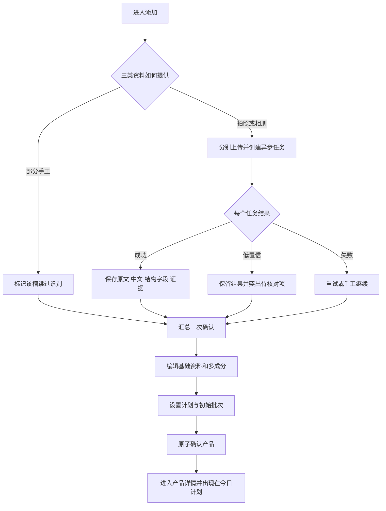
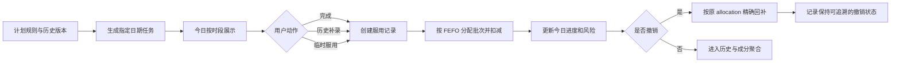
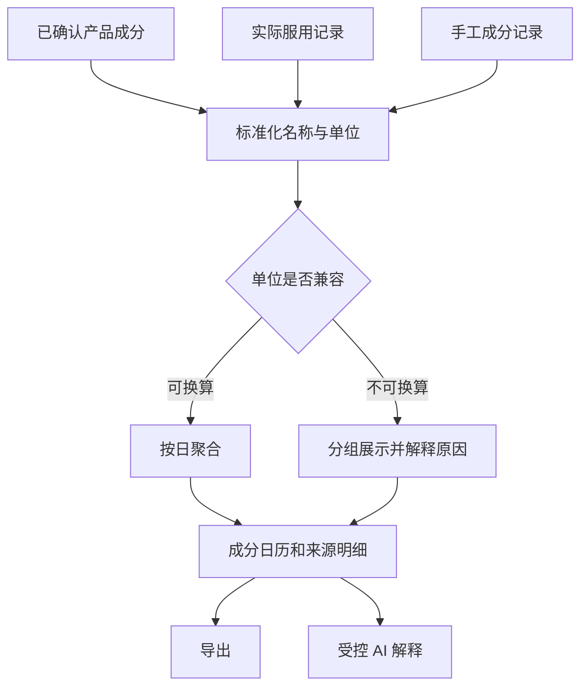

# 页面与流程

## 信息架构

目标产品保持 MVP 的五个高频入口，但用 Uni 的登录、服务端数据和异步任务承载：

| 一级入口 | 用户任务 | 目标子页面/能力 | Uni 当前状态 |
| --- | --- | --- | --- |
| 记录 | 完成今天、回看历史、补录或临时记录 | 今日、历史记录、日期切换、药剂柜选取、补录 | 基础今日/记录已实现；临时选取缺失 |
| 计划 | 查看与调整未来安排 | 计划总览、未来时间线、单品日历、计划编辑 | 计划编辑部分已实现；总览/日历缺失 |
| 添加 | 从图片或手工建立产品 | 三图槽、处理状态、确认编辑、初始库存/计划 | 三图异步识别已实现；混合输入与多成分确认不完整 |
| 成分 | 理解实际摄入 | 日历、日详情、手工摄入、导出、成分 AI | 目标能力整体缺失 |
| 药剂柜 | 管理产品与库存 | 列表、详情/编辑、批次、成本、笔记、产品 AI | 基础列表/详情/补货已实现；其余部分缺失 |

账户登录、个人设置、健康资料、提醒设置、邀请管理是辅助入口，不应抢占上述五个日常任务的位置。

## 目标页面清单

| 页面 | 用户任务 | 核心信息 | 主要操作 | 入口/出口 |
| --- | --- | --- | --- | --- |
| 登录/注册 | 建立或恢复身份 | 邀请、邮箱、会话状态 | 登录、注册、退出 | 进入产品前 / 今日 |
| Demo 入口 | 无真实数据体验闭环 | 隔离标识、示例说明 | 进入 Demo、清空 Demo | 登录页 / 今日 |
| 今日 | 执行当日计划 | 日期、时间段、餐食提示、余量、进度、异常 | 完成、撤销、切日、补录、临时记录 | 默认首页 / 记录或详情 |
| 历史记录 | 回看服用事实 | 日期、类型、来源、数量、撤销状态 | 筛选、查看、撤销、补录 | 底栏“记录” / 今日或产品详情 |
| 药剂柜选取 | 临时记录非计划项目 | 可用产品、批次与余量 | 选择产品和数量 | 今日 / 记录结果 |
| 历史补录 | 为过去日期补记 | 日期、当日计划、已有记录 | 选择项目、确认数量 | 今日/记录 / 记录结果 |
| 计划总览 | 理解未来安排 | 12 周时间线、计划状态、冲突/空档 | 查看、筛选、进入编辑 | 底栏“计划” / 单品日历 |
| 单品计划日历 | 查看一个产品的生效日 | 月历、周期命中、历史版本 | 切月、进入设置 | 计划总览/详情 / 计划编辑 |
| 计划编辑 | 配置可执行规则 | 周规则、间隔周期、长期区间、时段、餐食 | 修改、暂停、保存 | 详情/计划 / 今日 |
| 添加产品 | 收集三类资料 | 正面、成分表、有效期槽位及各自状态 | 拍摄、相册、替换、重试、手工继续 | 底栏“添加” / 处理中或确认 |
| 识别处理中 | 查看异步进度和降级 | 分槽状态、任务进度、错误、证据 | 退出后台处理、重试、手工继续 | 添加 / 确认 |
| 确认产品 | 一次检查所有识别结果 | 原文/中文、成分数组、剂量、数量、日期、警示、证据 | 编辑、增删成分、设计划/库存、确认 | 处理中 / 产品详情 |
| 药剂柜 | 查找和管理产品 | 状态、余量、预计耗尽、临期 | 搜索、筛选、新增、进入详情 | 底栏“药剂柜” / 详情 |
| 产品详情/编辑 | 管理单一产品 | 基础资料、图片、计划、成分、批次、风险 | 编辑、补货、停用/删除、进入 AI/笔记 | 药剂柜/今日 / 各子页 |
| 批次与成本 | 管理补货及财务信息 | 批次、有效期、数量、单价、消耗、库存价值 | 新增/调整批次、查看账本 | 产品详情 / 产品详情 |
| 产品 AI | 基于产品资料获得解释 | 已确认事实、引用、会话 | 提问、追问、保存为笔记 | 产品详情 / 笔记 |
| 产品笔记 | 沉淀原因和反应 | 笔记列表、来源、时间 | 新增、编辑、删除 | 产品详情/AI / 笔记编辑 |
| 成分日历 | 按日查看实际摄入 | 月历、总量、异常单位、来源 | 切月、进入日详情、手工新增、导出 | 底栏“成分” / 日详情 |
| 成分日详情 | 理解某日某成分 | 聚合量、来源产品/手工记录、单位 | 展开来源、进入成分 AI、修改手工项 | 成分日历 / AI或编辑 |
| 手工成分记录 | 记录产品外摄入 | 成分、数量、单位、时间、备注 | 新增、修改、删除 | 成分页 / 日详情 |
| 数据导出 | 取得自己的记录 | 日期范围、字段、格式、预览 | 使用预设、自定义、导出 CSV | 成分/设置 / 下载结果 |
| 设置 | 管理账户和产品行为 | 账户、提醒、隐私、数据 | 配置、导出、删除账户、退出 | 个人入口 / 子设置 |
| 提醒设置 | 配置行动触达 | 全局时间、单品覆盖、低库存、临期、渠道 | 开关、设时间、测试 | 设置/详情 / 原页面 |
| 健康资料 | 管理 AI 可用上下文 | 基本资料、目标、过敏/禁忌、用户声明 | 编辑、选择是否供 AI 使用 | 设置/AI / 原页面 |
| 邀请管理 | 控制封闭注册 | 邀请码、使用状态、到期时间 | 创建、停用、查看 | 管理员入口 / 设置 |

## 主流程：新产品建档

## 主流程：每日执行与精确撤销

## 主流程：成分聚合与解释

## 关键状态

| 对象 | 状态 | 触发条件 | 可执行操作 |
| --- | --- | --- | --- |
| 识别槽 | 未提供、待上传、排队、处理中、低置信、成功、失败、手工跳过 | 上传、Worker 运行、超时或用户选择 | 替换、重试、查看证据、手工继续 |
| 产品 | 草稿、在用、暂停、耗尽、删除中/已删除 | 确认、用户操作、库存变化、账户清理 | 编辑、启停、补货、删除 |
| 计划版本 | 待生效、生效、已结束、暂停 | 保存新规则、日期推进、用户暂停 | 查看历史、复制修改、恢复 |
| 今日任务 | 待完成、已完成、已补录、不适用 | 日期规则命中、记录、撤销 | 完成、补录、撤销、查看来源 |
| 服用记录 | 有效、已撤销 | 记录事务成功、撤销事务成功 | 查看、撤销；已撤销记录不可再次扣库存 |
| 批次 | 未启用、使用中、耗尽、临期、过期 | FEFO 排序、数量或日期变化 | 调整、补货、查看消耗与成本 |
| 账户清理 | 未请求、排队、执行中、完成、失败可重试 | 用户确认删除、后台作业 | 查询状态、重试失败任务 |

## 跨页面一致性约束

1. 今日、记录、产品详情、库存和成分日历必须读取同一笔服用事实，不能各自维护副本。
2. 产品编辑修改未来计划时，不重写过去日期使用过的计划版本。
3. 撤销必须基于原始批次分配，不能重新运行一次 FEFO 反向猜测。
4. 识别输出在用户确认前是候选；确认后形成产品事实，同时保留原始证据以便追溯。
5. 页面视觉可重构，但五个高频任务入口和主要信息层级不得因套用 Uni 现有组件而丢失。
